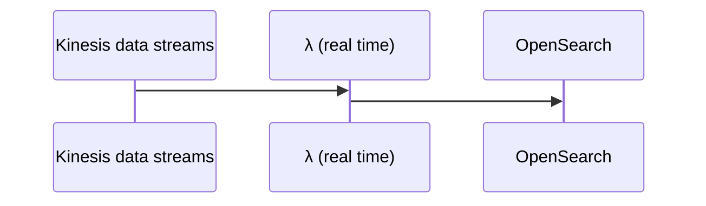
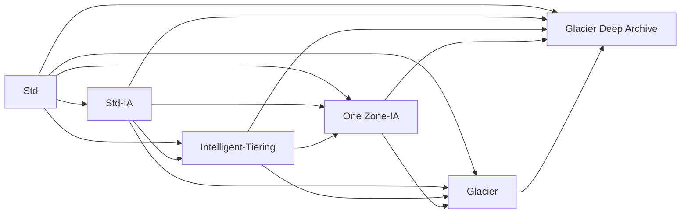
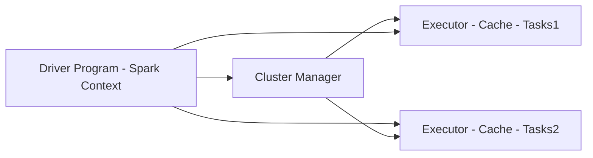
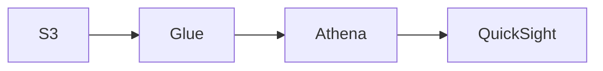

## AWS-MLS-C01-Study-Guide

Note these are my own personal notes and are a work in progress as I study torwards passing this exam.  If this helps someone great, but I make no guarantees/promises.  

## Table of Contents
1. <a href="#introduction">Introduction</a>
2. <a href="#data-engineering">Data Engineering</a>
3. <a href="#exploratory-data-analysis">Exploratory Data Analysis</a>
4. <a href="#modeling">Modeling</a>
5. <a href="#machine-learning-implementation-and-operations">Machine Learning Implementation and Operations</a>
6. <a href="#acronyms">Acronyms</a>

## Introduction
<a href="https://d1.awsstatic.com/training-and-certification/docs-sa-pro/AWS-Certified-Solutions-Architect-Professional_Exam-Guide.pdf">AWS Certified Machine Learning – Specialty (MLS-C01) Exam Guide</a>
### Exam Content Breakdown:

| Domain  | % of Exam |
| ------------- | ------------- |
| Domain 1: Data Engineering | 20%  |
| Domain 2: Exploratory Data Analysis | 24%  |
| Domain 3: Modeling | 36% |
| Machine Learning Implementation and Operations | 20% |
| **Total** | **100%** |

## Data Engineering 

### Create data repositories for machine learning

#### Identify data sources (e.g., content and location, primary sources such as user data)(TBD)
#### Determine storage mediums (e.g., DB, Data Lake, S3, EFS, EBS)

##### Amazon Redshift:
  * fully managed, scalable cloud data warehouse, columnar instead of row based (no Multi-AZ, based on Postgres, No OLTP [row based], but OLAP [column based])
  * Offers parallel sql queries
  * Can be server less or use cluster(s)
  * Uses SQL to analyze structured and semi-structured data across data warehouses, operational DBs, and data lakes
  * Integrates with Quicksight or Tableau
  * Leader node for query planning, results aggregation
  * Compute node(s) for performing queries to be sent back to the leader
  * Provision node sizes in advance
  * Enhanced VPC Routing
  * Forces all COPY and UNLOAD traffic moving between your cluster and data repositories through your VPCs, otherwise over the internet routing, including to other AWS services
  * Can configure to automatically copy snapshots to other Regions
  * Large inserts are better (S3 copy, firehose)

##### Amazon Redshift Spectrum:
  * Resides on dedicated Amazon Redshift servers independent of your cluster
  * Can efficiently query and retrieve structured and semistructured data from files in S3 into Redshift Cluster tables (points at S3) without loading data in Redshift tables
  * Pushes many compute intensive tasks such as predicate filtering (ability to skip reading unnecessary data at storage level from a data set into RAM) and aggregation, down to the Redshift Spectrum layer
  * Redshift Spectrum queries use much less of the formal cluster's processing capacity than other queries

##### AWS RDS:
  * Autoscaling when running out of storage
  * OLTP based
  * Must be provisioned
  * Max read replicas: 5
  * Read replicas are not equal to a DB
  * Read replicas cross region/AZ incur $
  * IAM Auth
  * Integrates with Secrets Manager
  * Supports MySQL, MariaDB, Postgres, oracle, aurora
  * Fully customized => MS SQL Server or RDS Custom for Oracle => can use ssh or SSM session manager; full admin access to OS/DB
  * At rest encryption via KMS
  * Use SSL for data in transit to ensure secure access
  * Use permission boundary to control the maximum permissions employees can grant to the IAM principals (eg: to avoid dropped/deleted tables)
  * Multi-AZ: 
    * Can be set at creation or live
    * Synchronous replication, at least 2 AZs in region, while Read replicas => asynchronous replication can be in an AZ, cross-AZ or cross Region

##### Aurora:
  * MySQL or Postgres
  * OLTP based
  * Better performance than RDS version
  * Lower price
  * At rest encryption via KMS
  * 2 copies in each AZ, with a minimum of 3 AZ => 6 copies
  * max read replica: 15 (autoscales)
  * Shareable snapshots with other accounts
  * Replicas: MySQL, Postgres, or Aurora
  * Replicas can autoscale
  * Cross region replication (< 1 second) support available 
    * Aurora Global: multi region (up to 5)
    * Aurora Cloning: copy of production (faster than a snapshot)
  * Aurora multimaster (for write failover/high write availability)
  * Aurora serverless for cost effective option (pay per second) for infrequent, intermittent or unpredictable workloads
  * Non-serverless option must be provisioned
  * Automated backups
  * Automated failover with Aurora replicas 
    * Fail over tiers: lowest ranking number first, then greatest size
  * Aurora ML: ML using SageMaker and Comprehend on Aurora

##### DynamoDB:
  * (Serverless) NoSQL Key-value and document DB that delivers single-digit millisecond performance at any scale.  It's a fully managed, multi-region, multi-master, durable DB with built-in security, backup and restore, and in-memory caching for internet scale applications
  * Stored on SSD
  * Good candidate to store ML model served by application(s)
  * Stored across 3 geographically distinct data centers
  * Eventual consitent reads (default) or strongly consistent reads (1 sec or less)
  * Session storage alternative (TTL)
  * IAM for security, authorization, and administration
  * Primay key possibilities could involve creation time
  * On-Demand (pay per request pricing) => $$$
  * Provisioned Mode (default) is less expensive where you pay for provisioned RCU/WCU
  * Backup: optionally lasts 35 days and can be used to recreate the table
  * Standard and IA Table Classes are available
  * Max size of an item in DynamoDB Table: 400KB
  * Can be exported to S3 as DynamoDB JSON or ion format
  * Can be imported from S3 as CSV, DynamoDB JSON or ion format

##### Amazon OpenSearch Service (Amazon ElasticSearch Service)
  * Service to search any field, even partial matches at petabyte scale
  * Common to use as a complement to another DB (conduct search in the service, but retrieve data based on indices from an actual DB)
  * Requires a cluster of instances (can also be Multi-AZ)
  * Doesn't support SQL (own query language)
  * Comes with Opensearch dashboards (visualization)
  * Built in integrations: Kinesis Firehose, AWS IOT, λ, Cloudwatch logs for data ingest
  * Security through Cognito and IAM, KMS encryption, SSL and VPC
  * Can help efficiently store and analyze logs (amongst cluster) for uses such as Clickstream Analytics
  * Patterns:
 ```mermaid
sequenceDiagram
    participant Kinesis data streams
    participant Kinesis data firehose (near real time)
    participant OpenSearch
    Kinesis data streams->>Kinesis data firehose (near real time): 
    Kinesis data firehose (near real time)->>OpenSearch: 
    Kinesis data firehose (near real time)->>Kinesis data firehose (near real time): data tranformation via λ
```


##### AWS Elasticache
  * Good to improve latency and throughput for read heavy applications or compute intensive workloads
  * Good for storing sessions of instances
  * Good for performance improvement of DB(s), though use of involves heavy application code changes
  * Must provision EC2 instance type(s)
  * IAM auth not supported
  * Redis versus Mem Cached:
    * Redis:
      * backup and restore features
      * read replicas to scale reads/HA
      * data durability using AOF persistence
      * multi AZ with failover 
      * Redis sorted sets are good for leaderboards
      * Redis Auth tokens enable Redis to require a token (password) before allowing clients to execute commands, thus improving security (SSL/Inflight encryption)
      * Fast in-memory data store providing sub-millisecond latency, Hippa compliant, replication, HA, and cluster sharding
    * Mem Cached:
      * Multinode partitioning of data (sharing)
      * No replication (HA)
      * Non persistence
      * No backup/restore
      * Multithreaded
      * Supports SASL auth
     
##### AWS DB Migration Service (AWS DMS):
  * Service to transition (no transformations) supported sources to relation DB, data warehouses, streaming platforms, and other data stores in AWS without new code (or any?)
  * Sources: 
    * On-premises and EC2 DBs: Oracle, MS SQL Server, MySQL, MariaDB, postgres, mongoDB, SAP, DB2
    * Azure: Azure SQL DB
    * Amazon RDS: all including Aurora
    * S3
  * Targets
    * On-premises and EC2 DBs: Oracle, MS SQL Server, MySQL, MariaDB, postgres, SAP
    * Amazon RDS: all including Aurora
    * Amazon Redshift
    * DynamoDB
    * S3
    * Elastic Search service
    * Kinesis Data Streams
    * DocumentDB
  * Homogenous migration: Oracle => Oracle
  * Heteregenous: Oracle => Aurora
  * EC2 server runs replication software, as well as continuous data replication using Change Data Capture (CDC) [for new deltas] and DMS 
  * Can pre-create target tables manually or use AWS Schema Conversion Tool (SCT) [runs on the same server] to create some/all of the target tables, indices, views, etc. (only necessary for heterogeneous case)

##### Data Lake
  * Offers centralized architecture within S3
  * Decouples storage (S3) from compute resources
  * Analagous to S3, any format is permitted, but typically they are: CSV, JSON, Parquet, Orc, Avro, and Protobuf

##### S3

###### Buckets:
  * Service to allow objects/files within a virtual "directory"
  * Bucket names must be *globally unique*
  * Buckets exist within AWS regions
  * Not a file system, and if a file system is needed, EBS/EFS/FSx should be considered
  * Not mountable as is a NFS
  * Supports any file format
  * Name formalities:
    * Must not start with the prefix 'xn--'
    * Must not end with the the suffix '-s3alias'
    * Not an IP address
    * Must start with a lowercase letter or number
    * Between 3-63 characters long
    * No uppercase
    * No underscores

###### Objects/Files
   * Each has a key, it's full path within the s3 bucket including the object/file separated by backslashes ("/")
   * Each has a value, it's content
   * Note there is no such thing as a true directory within S3, but the convention effectively serves as a namespace
   * Compression is good for cost savings concerning persistence
   * Max size is 5 TB
   * If uploading > 100MB and absolutely for > 5 GB, use Multi-Part upload
   * S3 Transfer Acceleration also can be utilized to increase transfer rates (upload and download) by going through an AWS edge location that passes the object to the target S3 bucket (can work with Multi-Part upload)
   * Strong consistency model to reflect latest version/value upon write/delete to read actions
   * Version ID if versioning enabled at the bucket level
   * Metadata (list of key/val pairs)
   * Tags (Unicode key/val pair <= 10) handy for lifecycle/security
   * Endpoint offers HTTP (non encrypted) and HTTPS (encryption in flight via SSL/TLS)

###### Security (IAM principle can access if either of the policy types below allows it and there is no Deny present):
  * Types
    * User Based: governed by IAM policies (eg: which user,  within a given AWS account, via IAM should be allowed to access resources) 
    * Resource Based:
      * Bucket Policies (JSON based statements)
        * Governing such things as:
          * (Blocking) public access \[setting was created to prevent company data leaks, and can be set at the account level to ensure of inheritance]
          * Forced encryption at upload (necessitates encryption headers).  Can be alternatively be done by "default encryption" via S3, though Bucket Policies are evaluated first
          * Cross account access
        * Bucket policy statement attributes 
          * SID: statement id
          * Resources: per S3, either buckets or objects
          * Effect: Allow or Deny
          * Actions: The set of api action to apply the effect to
          * Principal: User/Account the policy applies to
      * Object Access Control List (ACL) - finer control of individual objects (eg: block public access)
      * Bucket Access Control List (ACL) - control at the bucket level (eg: block public access)
  * S3 Object(s) are owned by the AWS account that uploaded it, not the bucket owner
  * Settings to block public access to bucket(s)/object(s) can be set at the account level
  * S3 is accessible to other AWS resources via:
    * VPC endpoint (private connection)
      * bucket policy tied to AWS:SourceVpce (for one endpoint)
      * bucket policy tied to AWS:SourceVpc (for all possible endpoint(s))
    * Public internet via an IGW=>public ip tied to a bucket policy tied to AWS:SourceIP:
  * S3 Access Logs can be stored to another S3 bucket (not the same to prevent infinite looping)
  * Api calls can be sent to AWS CloudTrail
  * MFA Delete of object(s) within *only* versioned buckets to prevent accidental permanent deletions *[only enabled/disabled by bucket owner via CLI]*

###### S3 Storage Classes

| |Std|Intelligent Tiering|Std-IA|One Zone-IA|Glacier Instant Retrieval|Glacier Flexible Retrieval|Glacier Deep Archive|
| ------------- | ------------- | ------------- | ------------- | ------------- | ------------- | ------------- | ------------- |
| *Durability | 99.99999999999% | 99.99999999999% | 99.99999999999% | 99.99999999999% | 99.99999999999% | 99.99999999999% | 99.99999999999% |
| *Availability | 99.99% | 99.9% | 99.9% | 99.5% | 99.9% | 99.99% | 99.99% |
| *Availability SLA | 99.99% | 99% | 99% | 99% | 99% | 99.99% | 99.99% |
| *AZs | >= 3 | >= 3| >= 3 | 1 | >= 3 | >= 3 | >= 3 |
| *Min Storage Duration Charge | None | None| 30 days | 30 days | 90 days | 90 days | 180 days |
| *Min Billable Obj Size | None | None| 128 KB | 128 KB | 128 KB | 40 KB | 40 KB |
| *Retieval Fee | None | None| Per GB | Per GB | Per GB | Per GB | Per GB |
| *Storage Cost (GB per month) | .023 | .0025 - .023 | .0125 | .01 | .004 | .0036 | .00099 |
| *Retieval Cost (per 1000 requests) | GET: .0004<br />POST: .005 | GET: .0004<br />POST: .005 | GET: .001<br />POST: .01 | GET: .001<br />POST: .01 | GET: .01<br />POST: .02 | GET: .0004<br />POST: .03<br />Expediated: $10<br />Std: .05<br />Bulk: free| GET: .0004<br />POST: .05<br />Std: .10<br />Bulk: .025 |
| *Retieval Time | immediate | immediate | immediate | immediate | immediate (milliseconds) | Expediated (1-5 mins)<br />Std (3-5 hrs)<br />Bulk (5-12 hrs) | Std (12 hrs)<br />Bulk (48 hrs) |
| *Monitoring Cost (per 1000 requests) | 0 | .0025 | 0 | 0 | 0 | 0 | 0 |
\*Note: US-East-1 for the sake of example, entire table subject to change by AWS

  * Durability: How often a file is not to be lost
  * Availability: How readily S3 bucket/files are available

###### S3 Standard:
  * Used data frequently accessed
  * Provides high throughput and low latency
  * Good for mobile and gaming applications, pseudo cdn, big data/analytics

###### S3 Standard Infrequent Access
  * Good for data less frequently acessed that need immediate access
  * Cheaper than Standard
  * Good for Disaster Recovery and/or backups

###### S3 Intelligent-Tiering
  * Modest fee for monthly monitoring and auto-tiering
  * Moves objects between tiers based on usage
  * Access tiers include:
    * Frequent (automatic) default
    * Infrequent (automatic) not acessed for 30 days
    * Archive Instant (automatic) not accessed for 90 days
    * Archive (optional) configurable between 90 days to >= 700 days
    * Deep Archive (optional) configurable between 180 days to >= 700 days 

###### S3 One Zone-IA
  * Data lost when AZ is lost/destroyed
  * Good for recreateable data or on-prem data secondary backup copies

###### S3 Glacier
  * Never setup a transition to glacier classes if usage might need to be rapid
  * Good for archiving/backup
  * Glacier Instant Retrieval is a good option for accessing data once a quarter
  * Harness Glacier Vault Lock (WORM) to no longer allow future edits, which is great for compliance and data retention
  * Glacier or Deep Archive are good for infrequentyly accessed objects that don't need immediate access

###### S3 Lifecycle Transitions (can also be conducted manually via AWS Console)

###### S3 Lifecycle Rules
  * Transition Actions: rules for when to transtion objects between s3 classes (see S3 storage classed above)
  * Expiration Actions: rules for when to delete an object after some period of time
    * Good for deleting log files, deleting old versions of files (if versioning enabled), or incomplete multi-part uploads
  * Rules can be created for object prefixes (addresses) or associated object tags

###### S3 Data Partioning
  * Harnesses disparate key \[path] to speed up queries (eg: Athena)
  * Typical scenarios are:
    * time/date (eg: s3://bucket/datasetname/year/month/day/....)
    * product (eg: s3://bucket/datasetname/productid/...)
  * Partitioning handled by tools such as Kinesis, Glue, etc.

###### Encryption
  * SSE-S3:
    * Encryption (keys) managed by AWS (S3)
    * Encryption type of AES-256
    * Encrypted server side via HTTP/S and Header containing "x-amz-server-side-encryption":"AES256"
    * Enabled by default for new buckets and objects
  * SSE-KMS
    * Encryption (KMS Customer Master Key [CMK]) managed by AWS KMS
    * Encrypted server side via HTTP/S and Header containing "x-amz-server-side-encryption":"aws:kms"
    * Offers further user control and audit trail via cloudtrail
    * May be impacted by KMS limits, though you can increase them via Service Quotas Console
      * Upload calls the GenerateDataKey KMS API (counts towards KMS quota 5500, 10000, or 30000 req/s based upon region)
      * Download calls the Decrypt KMS API (also counts towards KMS quota)
  * SSE-C:
    * Server side encryption via *HTTPS only*, using a fully managed external customer key external to AWS that must be provided in the HTTP headers for every HTTP request (key isn't saved by AWS)
    * Objects encrypted with SSE-C are never replicated between S3 Buckets
  * Client Side Encryption:
    * Utilizes a client library such as Amazon S3 Encryption Client
    * Encrypted prior to sending to S3 and must be decrypted by clients when retrieving from S3 conducted over HTTP/S
    * Utilizes a fully managed external customer key external to AWS
    * S3 objects useing SSE-C not able to be replicated between buckets

###### Encryption in transit (SSL/TLS) vs none
  * HTTP Endpoint - non-encrypted
  * HTTPS Endpoint - encrypted
  * To force encryption, a bucket policy is in order, and the following is an HTTP Get version
    * { "Version": "2012-10-17",
       "Statement": [
         {
           "Effect":"Deny",
           "Principal":"\*",
           "Action":"s3:GetObject",
           "Resource":"arn:aws:s3:::random-bucket-o-stuff/*",
           "Condition":{
             "Bool":"aws:SecureTransport":"false"
           }

         }
       ]
      }
  * To force SSE-KMS encryption
    * { "Version": "2012-10-17",
       "Statement": [
         {
           "Effect":"Deny",
           "Principal":"\*",
           "Action":"s3:PutObject",
           "Resource":"arn:aws:s3:::random-bucket-o-stuff/*",
           "Condition":{
             "StringNotEquals":{"s3:x-amz-server-side-encryption":"aws-kms"}
           }

         }
       ]
      }
  * To force SSE-C encryption
    * { "Version": "2012-10-17",
       "Statement": [
         {
           "Effect":"Deny",
           "Principal":"\*",
           "Action":"s3:PutObject",
           "Resource":"arn:aws:s3:::random-bucket-o-stuff/*",
           "Condition":{
             "Null":{"s3:x-amz-server-side-encryption-customer-algorithm":"true"}
           }

         }
       ]
      }


##### EFS: 
  * Linux based only
  * Can mount on many EC2(s)
  * Use SG control access
  * Connected via ENI
  * 10GB+ throughput
  * *Performance mode* (set at creation time): 
    * General purpose (default); latency-sensitive; use cases (web server, CMS); 
    * Max I/O-higher latency, throughput, highly parallel (big data, media processing)
  * *Throughput mode*: 
    * Bursting (1 TB = 50 MiB/s and burst of up to 100 MiB/s)
    * Provisioned-set your throughput regardless of storage size (eg 1 GiB/s for 1 TB storage)
  * *Storage Classes*, Storage Tiers (lifecycle management=>move file after N days):
    * Standard: for frequently accessed files
    * Infrequent access (EFS-IA): cost to retrieve files, lower price to store
  * *Availability and durability*: 
    * Standard: multi-AZ, great for production
    * One Zone: great for development, backup enabled by default, compatible with IA (EFS One Zone-IA)

##### EBS:
  * Volumes exist on EBS => virtual hard disk
  * Snapshots exist on S3 (point in time copy of disk)
  * Snapshots are incremental-only the blocks that have changed since the last snapshot are move to S3
  * First snapshot might take more time
  * Best to stop root EBS device to take snapshots, though you don't have to
  * Provisioned IOPS (PIOPS [io1/io2])=> DB workloads/multi-attach
  * Multi-attach (EC2 =>rd/wr)=>attach the same EBS to multiple EC2 in the same AZ; up to 16 (all in the same AZ)
  * Can change volume size and storage type on the fly
  * Always in the same region as EC2
  * To move EC2 volume=>snapshot=>AMI=>copy to destination Region/AZ=>launch AMI
  * EBS snapshot archive (up to 75% cheaper to store, though 24-72 hours to restore)

##### AWS FSx:
  * Launch 3rd party high performance file system(s) on AWS
  * Can be accessed via FSx File Gateway for on-premises needs via VPN and/or Direct Connect
  * Fully managed
  * Accessible via ENI within Multi-AZ
  * Types include:
    * FSx for Windows FileServer
    * FSx for Lustre
    * FSx for Net App ONTAP (NFS, SMB, iSCSI protocols); offering:
     * Works with most OSs
     * ONTAP or NAS
     * Storage shrinks or grows
     * Compression, dedupe, snapshot replication
     * Point in time cloning
    * FSx for Open ZFS; offering:
     * Works with most OSs
     * Snapshots, compression
     * Point in time cloning

##### Amazon FSx for Windows:
  * Fully managed Windows file system share drive
  * Supports SMB and Windows NTFS
  * Microsoft Active Directory integration, ACLs, user quotas
  * Can be mounted on Linux EC2 instances
  * Scale up to 10s of GBps, millions IOPs, 100s of PB of data
  * Storage Options:
   * SSD - latency sensitive workloads (DB, data analytics)
   * HDD - broad spectrum of workloads (home directories, CMS)
  * On-premises accessible (VPN and/or Direct Connect)
  * Can be configured to be Multi-AZ
  * Data is backed up daily to S3
  * Amazon FSx File Gateway allows native access to FSx for Windows from on-premises, local cache for frequently accessed data via Gateway

##### Amazon FSx for Lustre ("Linux" "Cluster"):
  * High performance, parallel, distributed file system designed for Applications that require fast storage to keep up with your compute such as ML, high peformance computing, video processing, Electronic Design Automation, or financial modeling
  * Integrates with linked S3 bucket(s), making it easy to process S3 objects as files and allows you to write changed data back to S3
  * Provides ability to both process 'hot data' in parallel/distributed fashion as well as easily store 'cold data' to S3
  * Storage options include SSD or HDD
  * Can be used from on-premises servers (VPN and/or Direct Connect)
  * Scratch File System can be used for temporary or burst storage use
  * Persistent File System can be used for storage / replicated with AZ

##### AWS Datasync:
  * A schedulable online data movement and discovery service that simplifies and accelerates *data migration* to AWS or *moving data* between on-premises storage, edge locations, other clouds and AWS storage (AWS to AWS, too)
  * Deployed VM AWS Datasync Agent used to convey data from internal storage (via NFS, SMB, or HDFS protocols) to the DataSync service over the internet or AWS Direct Connect to within AWS.  Agent is unnecessary for AWS to AWS
  * Directly within AWS =>S3/EFS/FSx for Windows File Server/FSx for Lustre/FSx open zfs/FSx for NetAp ONTAP
  * File permissions and metadata are preserved
  * transfers encrypted and data validation conducted

### Identify and implement a data ingestion solution.

#### Data job styles/types (batch load, streaming)

##### Streaming:
  * Good scenarios include where timing is important such as Fraud Detection or IoT Streaming Sensors gathering readings (eg: weather)
  * A lot more technical to develop/maintain

##### Batch Load:
  * If there is an acceptable latency, run the batch load job(s) every n seconds/minutes/hours/days/weeks/etc.

#### Data ingestion pipelines (Batch-based ML workloads and streaming-based ML workloads)

##### Example Full Data Engineering Analytics pipeline

 ```mermaid
graph LR
    A[S3]-->B[AWS Glue Data Catalog]
    B---|Schema|C[Athena]
    A-->E["Redshift /(Redshift Spectrum)"]
    A-->D["EMR (Hadoop/Spark/Hive)"]
    E-->C
    E-->F[QuickSight]
    C-->F
```

##### AWS Data Pipeline (DP)
  * Data sources can be on-prem or AWS
  * Destinations: S3, RDS, DynamoDB, Redshift, EMR
  * Conducted with EC2 or EMR instances managed by DP
  * Manages task dependencies
  * Retries and notifies upon failure(s)
  * HA

##### AWS DP vs. Glue:
  * Glue: 
    * focused on ETL
    * resources all managed by AWS
    * Data Catalog is there to make the data available to Athena or Redshift Spectrum
    * Lambda based
  * DP:
    * Move data from one location to another
    * More control over environment, compute resources that run code and the code itself
    * EC2 or EMR instance based

##### Amazon Kinesis:
  * Platform to send stream data (eg: IoT, metrics and logs) making it easy to load and analyze as well as provide the ability to build your own custom applications for your business needs
  * Any mention of "streaming (system[s])" and/or "real time" (big) data is of importance, kinesis is likely the best fit as it makes it easy to collect, process, and analyze real-time, streaming data to allow quick reactions from information taken in.  
  * Output can be classic or enhanced fan-out consumers
  * Accessed via VPC
  * IAM access => Identity-based (used by users and/or groups)
  * Types:
    * Kinesis Data Streams
    * Kinesis Data Firehose
    * Kinesis Analytics
    * Kinesis Video Streams


##### Amazon Kinesis Data Streams:
  * Service to provide low latency, real-time streaming ingestion 
  * On-demand capacity mode
    * 4 MB/s input, ??? output?
    * Scales automatically to accommodate up to double its previous peak write throughput observed in the last 30 days
    * Pay per stream per hour and data/in/out per GB
  * Provisioned mode (if throughput exceeded exception => add shard[s] manually or programmatically)
    * Streams are divided into ordered shards
    * 1 MB/s or 1k messages input per shard else 'ProvisionedThroughputException'
    * 2 MB/s output per shard
    * Pay per shard per hour
  * Can have up to 5 parallel consumers (5 consuming api calls per second \[per shard])
  * Synchronously replicate streaming data across 3 AZ in a single Region and store between 24 hours and 365 days in shard(s) to be consumed/processed/replayed by another service and stored elsewhere
  * Use fan-out if lag is encountered by stream consumers (~200ms vs ~70ms latency)
  * Requires code (producer/consumer)
  * Shards can be split or merged
  * 1 MB message size limit
  * TLS in flight or KMS at-rest encryption
  * *Can't subscribe to SNS*
  * *Can't write directly to S3*
  * Can output to:
    * Kinesis Data Firehose
    * Kinesis Data Analytics
    * Containers
    * λ
    * AWS Glue

##### Amazon Kinesis Data Analytics:
  * Fully Managed (serverless; scales automatically)
  * Perform real-time analytics on stream via SQL
  * Can utilize λ for preprocessing (near real-time)
  * Input stream can be joined with a ref table in S3
  * Output results include streams/errors
  * Can use either Kinesis Data Streams or Kinesis Data Firehose to analyze data in kinesis
  * Pay only for resources used, though that can end up not being cheap
  * Schema discovery
  * IAM permissions to access input(s)/output(s)
  * For SQL Applications: Input/Output: Kinesis Data Streams or Kinesis Data Firehose to analyze data
  * For Apache Flink (on a cluster): 
    * Input: Kinesis Data Stream or Amazon MSK
    * Output: Sink (S3/Kinesis Data Firehose)
  * Use cases:
    * Streaming ETL (simple selections/translations)
    * Continuous metric generation (eg: leaderboard)
    * Responsive analytics to generate alerts when certain metrics encountered
  * ML use cases:
    * Random Cut Forest:
      * SQL function for anomaly detection on numeric columns in a stream
      * uses only recent history to generate model
    * HOTSPOTS:
      * locate and return info about relatively dense regions of data
      * uses more than only recent history

##### Amazon Kinesis Data Firehose:
  * Fully Managed (serverless) service, no administration, automatic scaling
  * Allows for custom code to be written for producer/consumer
  * Can use λ to filter/transform data prior to output (Better to use if filter/tranform with a λ to S3 over Kinesis Data Streams)
  * Near real time: 60 seconds latency minimum for non-full batches
  * Minimum 1 MB of data at a time
  * Pay only for the data going through
  * Can subscribe to SNS
  * No data persistence and must be immediately consumed/processed
  * Sent to (S3 as a backup \[of source records] or failed \[transformations or delivery] case[s]):
    * S3
    * Amazon Redshift (copy through S3)
    * Amazon Elastic Search
    * 3rd party partners (datadog/splunk/etc.)
    * Custom destination (http[s] endpoint)
  * S3 Destination(s) (Error and/or output) allow for bucket prefixes:
    * output/year=!{timestamp:yyyy}/month=!{timestamp:MM}/
    * error/!{firehose:random-string}/!{firehose:error-output-type}/!{timestamp:yyyy/MM/dd}/
  * Data Conversion from csv/json to Parquet/ORC using AWS Glue (only for S3)
  * Data Transformation through λ (eg: csv=>json)
  * Supports compression if target is S3 (GZIP/ZIP/SNAPPY)

##### Amazon Kinesis Video Streams 
  * Producers
    * used to capture, process and store video streams in real-time such as smartphone/security/body camera(s), AWS DeepLens, audio feeds, images, RADAR data; RTSP camera.
    * One producer per video streams
    * Video playback capability
  * Consumers
    * custom build server (MXNet, Tensorflow, etc.)
      * This may pass on the data to db (checkpoint stream per processing status), decode the input frames and pass onto SageMaker, or even inference results to Kinesis Streams=>λ for downstream notifications
    * EC2 instances
    * AWS SageMaker
    * Amazon Rekognition Video
  * retention between 1 hr to 10 years

##### MQTT
  * An IOT Standard messaging protocol
  * Sensor data transferred to your model
  * The AWS loT Device SDK can connect via MQTT

##### Job scheduling (TBD)

### Identify and implement a data transformation solution. 
  * Handle ML-specific data using map reduce (Hadoop, Spark, Hive) 
  * Transforming data transit (ETL: Glue, EMR, AWS Batch)

#### AWS Step Functions:
  * A visual workflow service that helps developers use AWS services with λ to build distributed applications, automate processes, orchestrate micro services, or create data (ML) pipelines
  * JSON used to declare state machines under the hood
  * Advanced Error Handling and retry mechanism outside the code
  * Audit history of workflows is available
  * Able to "wait" for any length of time, though the max execustion time of a state machine is 1 year
  * Great for orchestrating and tracking and ordered flow of resources

#### EMR:
  * Service to create a managed Hadoop framework clusters (Big Data) to analyze/process lots of data using (many) instances
  * Supports Apache Spark, HBase, Presto, Flink, Hive, etc.
  * Takes care of provisioning and configuration
  * Autoscaling and integrated with Spot Instances for cost savings
  * Use cases: Data processing, ML, Web Indexing, BigData
  * AWS Integration
    * Amazon EC2 for the instances that comprise the nodes in the
 cluster
    * Amazon VPC to configure the virtual network in which you launch your instances
    * Amazon S3 to store input and output data or HDFS (default)
    * Amazon CloudWatch to monitor cluster performance and configure alarms
    * AWS IAM to configure permissions
    * AWS CloudTrail to audit requests made to the service
    * AWS Data Pipeline to schedule and start your clusters
  * Node types: 
    * Master Node:
      * single EC2 instance to manage the cluster
      * coordinates distribution of data and tasks
      * manages health-long running process
    * Core Node:
      * Hosts HDFS data and runs tasks and store data-long running process
      * can spin up/down as needed
    * Task Node (optional):
      * only to run tasks-usually Spot Instances are a best option
      * no hosted data, so no risk of data loss upon removal
      * can spin up/down as needed
  * Deep Learning on EC2 / EMR
    * EMR supports Apache MXNet and GPU instance types
    * Appropriate instance types for deep learning:
      * P3: 8 Tesla V100 GPU's
      * P2: 16 K80 GPU's
      * G3: 4 M60 GPU's (all Nvidia chips)
      * G5g : AWS Graviton 2 processors / Nvidia T4G Tensor Core GPU's
        * Not (yet) available in EMR
        * Also used for Android game streaming
      * P4d - A100 "UltraClusters" for supercomputing
    * Deep Learning AMI's
    * Sagemaker can deploy a cluster using whatever architecture you want
    * Trn1 instances
      * "Powered by Trainium"
      * Optimized for training NN/LLM (50% savings)
      * 800 Gbps of Elastic Fabric Adapter (EFA) networking for fast clusters
    * Trn1n instances
      * Even more bandwidth (1600 Gbps)
    * Inf2 instances
      * "Powered by AWS Inferentia2"
      * Optimized for inference
  * Can have long-running cluster or transient (temporary) cluster
  * EMR Notebook
    * Similar concept to Zeppelin, with more AWS integration
    * Notebooks backed up to S3 only (not in within the cluster)
    * Provision clusters from the notebook!
    * Able to use multiple Notebooks to share the multi-tenant EMR clusters
    * Hosted inside a VPC
    * Accessed only via AWS console
    * build Apache Spark Apps and run queries against the cluter (python, pyspark, spark sql, spark r, scala, andor anaconda based open source graphical libs)
  * Purchasing options: 
    * On-demand: reliable, predictable, won't be terminated, good for long running cluster(s) \[though you need to manually delete]
    * Reserved: cost savings (EMR will use if available), good for long running cluster(s) \[though you need to manually delete]
    * Spot instances: 
      * cheaper, can be terminated, less reliable
      * Good choice for task nodes (temporary capacity)
      * Only use on core & master if you're testing or very cost-sensitive; you're risking partial data loss
  * At installation of the cluster you need to select frameworks and applications to install
  * Connect to the master node through an EC2 instance and run jobs from the terminal or via ordered steps submitted via the console
  * Instance Type(s) selection
    * Master node:
      * m4.large if < 50 nodes, m4 .xlarge if > 50 nodes
    * Core & task nodes:
      * m4.large is usually good
      * If cluster waits a lot on external dependencies (i.e. a web crawler), t2.medium
      * Improved performance: m4.xlarge
      * Computation-intensive applications: high CPU instances
      * Database, memory-caching applications: high memory instances
      * Network / CPU-intensive (NLP, ML) - cluster computer instances
      * Accelerated Computing / AI - GPU instances (g3, g4, p2, p3)
  * Storage
    * HDFS (distributed scalable file system for Hadoop)
      * distributes data that it stores across every instance in a cluster, as well as multiple copies of data on different instances to ensure no data is lost if instance(s) fail
      * each file stored as blocks
      * default block size is 128 MB
      * storage is ephemeral and is lost upon termination
      * performance benefit of processing data where stored to avoid latency
      * EBS serves as a backup for HDFS
    * EMRFS: access S3 as if it were HDFS
      * EMRFS Consistent View - Optional for S3 consistency
      * Uses DynamoDB to track consistency
    * Local file system
  * EMR promises
    * EMR charges by the hour
      * Plus EC2 charges
    * Provisions new nodes if a core node fails
    * Can add and remove tasks nodes on the fly
    * Can resize a running cluster's core nodes
  * Security
    * IAM policies: can be combined with tagging to control access on a cluster-by-cluster basis 
    * Kerberos
    * SSH can use kerboros or EC2 key pairs for client authentication
    * IAM roles:
      * Every cluster in EMR must have a service role and a role for EC2 instance profile(s).  These roles, attached via policies, will provide permission(s) to interact with other AWS Services
      * If a cluster uses automatic scaling, an autoscaling role is necessary
      * Service linked roles can be used if service for EMR has lost ability to clean up EC2 resources
      * IAM roles can also be sued for EMRFS requests to S3 to control user access to files with in EMR based on users, groups, or location(s) within S3
    * Security configurations may be specified for Lake Formation (JSON)
    * Native integration with Apache Ranger to provide security for Hive data metastore and Hive instance(s) on EMR
      * For data security on Hadoop/Hive
  * How to use EMR
    * Within EMR, select Create studio instance, which is your environment for running workspaces/notebooks
    * Requires:
      * VPC access
      * 1-5 subnets
      * Security group(s)
      * Service role (IAM/IAM Identity Center)
      * S3 bucket
    * Within the studio instance, create workspaces.  The workspace will need to create/attach an EMR cluster
    * A notebook must select a kernel at initialization (relative to the technology stack one is using)
    * Good practice delete your cluster if not using so it's not to be billed, though good to have a safeguard of the cluster shutting down, automatically to avoid paying for them
  
#### AWS Glue:
  * Managed ETL service (fully serverless) used to prepare/transform data for analysis
    * upper limit of 5 minutes as it is serverless
    * Utilizes Python (PySpark) or Scala (Spark) scripts, but run on serverless Spark platform
    * Targets: S3, JDBC (RDS, Redshift), or in Glue Data Catalog
    * Jobs scheduled via Glue Scheduler
    * Jobs triggered by events=>Glue Triggers
    * Transformations:
      * Bundled Transformations
        * DropFields/DropNullFields
        * Filter records
        * Join data to make more interesting data
        * Map/Reduce
      * ML Transformations
        * FindMatches ML: identify duplicate or matching data, even when the records lack a common unique identifier, and no fields exactly match
        * K-Means
      * Format conversions: CSV, JSON, Avro, Parquet, ORC, XML
      * Need an IAM role / credentials to access the TO/FROM data stores
  * Can be event driven (eg: λ triggered by S3 put object) to call Glue ETL
  * Glue Data Catalog:
    * Uses an AWS Glue Data Crawler scanning DBs/S3/data to write associated metadata utilized by Glue ETL, or data discovery on Athena, Redshift Spectrum or EMR
    * Can issue crawlers throughout a DP to be able to know what data is where in the flow
    * Metadata repo for all tables with versioned schemas and automated schema inference
  * Glue Crawlers go through your data to infer schemas and partitions (s3 based on organization \[see S3 Data Partitioning])
    * formats supported: ]SON, Parquet, CSV, relational store
    * Crawlers work for: S3, Amazon Redshift, Amazon RDS
    * Can be schedule or On-Demand
    * Need an IAM role / credentials to access the data stores
  * Glue Job bookmarks prevent reprocessing old data
  * Glue Databrew-clean/normalize data using pre-built transformation
  * Glue Studio-new GUI to create, run, and monitor ETL jobs in Glue
  * Glue Streaming ETL (built on Apache Spark Structured Streaming)-compatible with Kinesis Data Streaming, Kafka, MSK
  * Glue Elastic Views:
    * Combine and replicate data across multiple data stores using SQL (View)
    * No custom code, Glue monitors for changes in the source data, serverless
    * Leverages a "virtual table" (materialized view)

#### AWS Batch:
  * Fully managed (serverless) batch processing at any scale using dynamically launched *EC2 instances (spot or on-demand)* managed by AWS for which you pay
  * Job with a start and an end (not continuous)
  * Can run 100,000s of computing batch jobs
  * You submit/schedule batch jobs and AWS Batch handles it
    * Can be scheduled using CloudWatch Events 
    * Jobs can also be orchestrated using step functions 
  * Provisions optimal amount/type of compute/memory based on volume and requirements
  * Batch jobs are defined as *docker images and run on ECS*
  * Helpful for cost optimization and focusing less on infrastructure
  * No time limit
  * Any run time packaged in docker image
  * Rely on EBS/instance store for disk space
  * Advantage over λ=>time limit, limited runtimes, limited disk space
  * Good for any compute based job (must harness docker) and for any non-ETL based work, batch is likely best (eg: periodically cleaning up s3 buckets)

## Exploratory Data Analysis

### Data Distributions
  * Normal distribution: bell curve centered around 0
    * Probability density function: gives the probability of a data point falling within a given range of values (on a curve) with infinite possibilities (non-discrete)
  * Poisson distribution: series of discrete events that end in a success or failure, where the average number of successes over time is known.  As λ value approaches 0, distribution looks exponential
    * Probability mass function: discrete data example being a bell curve surrounding a histogram chart
  * Binomial Distribution: number of successes dealing with a binary result; discrete trials (n)
  * Bernouli Distribution: 
    * special binomial distribution
    * single trial (n=1)
    * Sum of bernouli=>binomial
   
### Types of Data
  * Numerical - quantitative measurement(s)
  * Categorical
    * yes/no, categories
    * can assign numbers to categories in order to represent them, though the numbers don't possess any real meaning
  * Ordinal
    * mix of numerical and categorical types (eg scale of 1 to 5), where 1 is worse than 2 and so forth and 5 being best

### Libraries to know at a high level:
  * Pandas:
    * used for slicing and mapping data (DataFrames, Series) and interoperates with numpy
    * Dataframe/Series are interchangeable with numpy arrays, though the former is often converted to the former to feed ML algorithms
  * Matplotlib (graphics might be good?)
    * boxplot (with whiskers)
    * histograms (binning: bins of results of similar measure)
  * Seaborn  (graphics might be good?)
    * essentially Matplotlib extended
    * heatmap: demonstrates another dimension within the given plot axes
    * pairplot: good for attribute correlations
    * jointplot: scatterplot with histograms adjoining each axis
  * scikit_learn
    * toolkit for/to make ML models
    * X=>attributes
    * y=>labels
    * X and y are utilized in conjunction with the fit function to train the model(s)
    * predict function harnesses the model to output inferences based on input
    * good for preprocessing data (input data=>normal distribution)
      * to avoid unequal weightings, scale to the around the mean for each column
  * Spark MLLib (see Apache Spark on EMR)


### Apache Spark on EMR
  * Hadoop consists largely of HDFS, YARN and Map Reduce
  * Hadoop Core or Hadoop - Common java archive (JAR) files/scripts used to boot Hadoop
  * YARN used to centrally manage cluster resources for different frameworks
  * Spark (faster alternative to Map Reduce)
    * Can be included within SageMaker
    * In memory cache
    * Optimized query execution on data of any size using directed acyclic graph adding efficiencies concerning dependencies/processing/scheduling
    * Java, Scala, Python, R apis available
    * Not used for OLTP or batch processing
    * Upon connecting acquires executors on nodes in the cluster that run computations and store data for your applications.  Code is sent to the executors and Spark context sends tasks to the executors to run

#### Spark Core: 
  * Foundation of the platform (memory management, fault recovery, scheduling, distributing, monitoring jobs and interactions with persistence stores)
    * Uses Resilient Distributed Dataset (RDD) at lowest level, representing a logical collection of data partitioned across nodes

##### Spark SQL
  * Up to 100x faster than Map Reduce including cost based optimizer, columnar storage and code generation for fast queries, JDBC/ODBC, JSON, HDFS, Hive, Orc, Parquet, or Hive Tables via HIVEQL
  * Exposes dataframe (python)/dataset (Scala) taking the place of RDD where input (SQL) to the spark cluster and transforms the initial query to a distributed query across the cluster

##### Spark Streaming: 
  * Data ingested via mini batches and analytics on the data is the same as application code for batch analytics for one application code for batch or streaming
  * Inputs include twitter, Kafka, Flume, HDFS, ZeroMQ, AWS Kinesis
  * Able to query unbounded table within windows of time, much like a database
  * Spark is able to query from Kinesis Data Streams via the Kinesis Client Library (KCL) 

##### Graph X: 
  * Distributed graph processing framework providing ETL, exploratory analysis, iterative graph computation to enable the building/transformation of graph data structures at scale

##### Spark MLLIB
  * Distributed and scalable via cluster nodes offering the following:
    * Classification: logistic regression, naive Bayes
    * Regression
    * Decision trees
    * Recommendation engine (ALS)
    * Clustering (K-Means)
    * LDA (topic modeling), extract topics from text input(s)
    * ML workflow utilities (pipelines, feature transformation, persistence)
    * SVD, PCA, statistics
    * ALS (Alternating Least Squares)

### Spark Workflow 

### Zeppelin + Spark 
  * Can run Spark code interactively (like you can in the Spark shell)
    * This speeds up your development cycle
    * And allows easy experimentation and exploration of your big data
  * Can execute SQL queries directly against SparkSQL
  * Query results may be visualized in charts and graphs
  * Makes Spark feel more like a data science tool!
  * Conducted via browser (Notebook)

### Jupyter Notebooks
  * runs in browser(s) to communicate with the python environment (eg: anaconda) server
 
*from sklearn import preprocessing*

*scaler = preprocessing.standardScaler()*

*new_data = scaler.fit_transform(input)*

### General flow for analyzing data import at first glance (note consider merging this with the next topic):
  * import data
  * head()
  * Does the data have column names?
  * Are certain rows attributes of the data type or na values?
    * Can drop rows potentially (*.dropna(inplace=True), though this might introduce bias if the missing values aren't evenly distributed
  * describe()=> are counts of all the columns equal?
  * If remapping the data, it is a good idea to check the mean/std of attributes from/to via describe()
  * To convert to the numpy array=>*.values()

### Sanitize and prepare data for modeling
  * Identify and handle missing data, corrupt data, stop words, etc.
  * Formatting, normalizing, augmenting, and scaling data
  * Labeled data (recognizing when you have enough labeled data and identifying mitigation
  * strategies [Data labeling tools (Mechanical Turk, manual labor)])

#### Imputing missing data
##### Mean Replacement 
  * Replace missing values with the mean value from the rest of the column (single feature)
  * Fast & easy, won't affect mean or sample size of overall data set
  * Median may be a better choice than mean when outliers are present
  * But it's generally pretty terrible.
    * Only works on column level, misses correlations between features
    * Can't use on categorical features (imputing, with most frequent value can work in this case, though)
    * Not very accurate
##### Dropping 
  * If not many rows contain missing Data
    * dropping those rows doesn't bias your data
    * you don't have a lot of time
    * maybe it's a reasonable thing to do?
  * But, it's never going to be the right answer for the "best" approach.
  * Almost anything is better. Can you substitute another similar field perhaps? (i.e., review summary vs. full text)
##### KNN: Find K "nearest" (most similar) rows and average their values
  * Assumes numerical data, not categorical
  * There are ways to handle categorical data (Hamming distance)
##### Deep Learning
  * Build a machine learning model to impute data for your machine learning model!
  * Works well for categorical data, though complicated.
##### Regression
  * Find linear or non-linear relationships between the missing feature and other features
  * Most advanced technique: MICE (Multiple Imputation by Chained Equations)
##### Get more data
  * What's better than imputing data? Getting more real data!

#### Unbalanced data
  * Large discrepancy between "positive" and "negative" cases
    * i.e., fraud detection. Fraud is rare, and most rows will be not-fraud
    * "positive" doesn't mean "good" it means the thing you're testing for happened.
      * If your machine learning model is made to detect fraud, then fraud is the positive case.
  * Mainly a problem with neural networks


#### Oversampling
  * Duplicate samples from the minority class
  * Can be done at random

#### Undersampling
  * Instead of creating more positive samples, remove negative ones
  * Throwing data away is usually not the right answer
    * Unless you are specifically trying to avoid "big data" scaling issues
   
#### SMOTE 
  * Artificially generate new samples of the minority class using nearest neighbors
    * Run K-nearest-neighbors of each sample of the minority class
    * Create a new sample from the KNN result (mean of the neighbors)
  * Both generates new samples and undersamples majority class
  * Generally better than just oversampling

#### Adjusting thresholds
  * When making predictions about a classification (fraud / not fraud), you have some sort of threshold of probability at which point you'll flag something as the positive case (fraud)
  * If you have too many false positives, one way to fix that is to simply increase that threshold.
    * Reduces false positives but, could result in more false negatives

### Perform feature engineering

  * Applying your knowledge of the data - and the model you're using - to identify and extract useful features to train your model with.  * 
  * Analyze/evaluate feature engineering concepts (binning, tokenization, outliers, synthetic features, 1 hot encoding, reducing dimensionality of data) to understand what features one should use  * Do I need to transform these features in some way?
    * How do I handle missing data?
    * Should I create new features from the existing ones?
    * You can't just throw in raw data and expect good results
    * This is the art of machine learning; where expertise is applied
    * Trim down feature data or create and combine new ones
    * Normalize or encode data
    * Handle missing data
   
### The Curse of Dimensionality
  * Too many features can be a problem - leads to sparse data
  * Every feature is a new dimension
  * Much of feature engineering is selecting the features most relevant to the problem at hand
    * This often is where domain knowledge comes into play
  * Unsupervised dimensionality reduction techniques can also be employed to distill many teatures into fewer features
    * РСА
    * K-Means

### Time Series Analysis:
  * Discrete samples taken over a period of time
  * trends
    * slope slant
    * can be seasonal, can superimpose curves vs the trends to decipher if this pattern is exhibited in month to month variations
    * can both be seasonal and have an overall trend, too.  To get the overall trend, subtract out noise and seasonality 
  * Noise: random variations
    * Additive model
      * Seasonal variation is constant => seasonality + trends + noise = TS model
    * Multiplicative model
      * seasonal variation increases as the trend increases => seasonality * trends * noise = TS model
     
### NLP

#### 
TF-IDF
  * Stands for Term Frequency and Inverse Document Frequency
  * Important data for search - figures out what terms are most relevant for a document
    * Compute TF-IDF for every word/n-gram in a corpus
    * For a given search word/n-gram, sort the documents by their TF-IDF score accordingly 
    * Display the results
  * Term Frequency just measures how often a word occurs in a document
    * A word that occurs frequently is probably important to that document's meaning
* Document Frequency is how often a word occurs in an entire set of documents, i.e., all of Wikipedia or every web page
  * This tells us about common words that just appear everywhere no matter what the topic, like "a", "the", "and", etc.
* So a measure of the relevancy of a word to a document might be:
  * Term Frequency/Document Frequency
  * Or: Term Frequency * Inverse Document Frequency
* That is, take how often the word appears in a document, over how often it just appears everywhere. That gives you a measure of how important and unique this word is for this document
  * We actually use the log of the IDF, since word frequencies are distributed exponentially. That gives us a better weighting of a words overall popularity
  * TF-IDF assumes a document is just a "bag of words"
    * Parsing documents into a bag of words can be most of the work
    * Words can be represented as a hash value (number) for efficiency
    * What about synonyms? Various tenses? Abbreviations? Capitalizations? Misspellings?
  * Doing this at scale is the hard part
    * That's where Spark comes in!


#### Unigrams, bigrams, etc.
  * An extension of TF-IDF is to not only compute relevancy for individual words (terms) but also for bi-grams or, more generally, n-grams.
  * "I love certification exams"
    * Unigrams: "l", "love", "certification", "exams"
    * Bi-grams: "I love", "love certification", "certification exams"
    * Tri-grams: "I love certification", "love certification exams"
  * The TF-IDF matrix will consist of the documents as rows and the selection of n-grams as columns

#### Modern Natural Language Processing
  * Transformer deep learning architectures are currently state of the art utilizing a mechanism of "self-attention"
    * Weighs significance of each part of the input data
    * Processes sequential data (like words, like an RNN), but processes entire input all at once.
    * The attention mechanism provides context, so no need to process one word at a time.
  * BERT, RoBERTa, T5, GPT-2, DistilBERT
  * DistilBERT: uses knowledge distillation to reduce model size by 40%

#### Transfer Learning
  * NLP models (and others) are too big and complex to build from scratch and re-train every time
    * The latest may have hundreds of billions of parameters!
  * Model zoos such as Hugging Face offer pre-trained models to start from
    * Integrated with Sagemaker via Hugging Face Deep Learning Containers
  * You can fine-tune these models for your own use cases
  * BERT transfer learning example:
    * Hugging Face offers a Deep Learning Container (DLC) for BERT
    * It's pre-trained on BookCorpus and Wikipedia
    * You can fine-tune BERT (or DistilBERT etc) with your own additional training data through transfer learning
      * Tokenize your own training data to be of the same format
      * Just start training it further with your data, with a low learning rate.

##### Transfer Learning approaches 
  * Continue training a pre-trained model (fine-tuning)
    * Use for fine-tuning a model that has way more training data than you ever have
    * Use a low learning rate to ensure you are just incrementally improving the model
  * Add new trainable layers to the top of a frozen model
    * Learns to turn old features into predictions on new data
    * Can do both: add new layers, then fine tune as well
  * Retrain from scratch
    * If you have a large amount of training data and it's fundamentally different from what the model was pre-trained with
    * And you have the computing capacity for it!
  * Use it as-is
    * When the model's training data is what you want already

### Analyze and visualize data for machine learning
  * Graphing (scatter plot, time series, histogram, box plot)
  * Interpreting descriptive statistics (correlation, summary statistics, p value)
  * Clustering (hierarchical, diagnosing, elbow plot, cluster size)

#### Amazon Athena:
  * Serverless ad-hoc query service enabling analysis and querying of data in S3 using standard SQL, while allowing more advanced queries (joins permitted)
  * Compress data for smaller retrieval
  * Use target files (> 128 MB) to minimize overhead and as a cost savings measure
  * $5.00 per TB scanned
  * Commonly used/integrated with Amazon Quicksight
  * Federated query allows SQL queries across relational, object, non-relational, custom (AWS or on-premisis) using Data Source Connectors that run on λ with results being returned and stored in S3
  * presto under the hood
  * supports: csv, json, orc, parquet, Auro
  * able to query unstructured, semi-structured or structured data with in the data lake
  * use cases
    * query web logs (CloudTrail, CloudFront, VPC, ELB)
    * query data prior to loading in DB
  * can integrate with Jupiter, Zepplin, or R-Studio notebooks
  * able to integrate with other visualization tools via ODBC/JDBC protocols
  * can harness Glue Data Catalog metadata for queries
  * Security:
    * Access control
      * IAM, ACLs, S3 bucket policies
      * AmazonAthenaFullAccess/AWSQuicksightAthenaAccess
    * Encrypt results at rest in S3 staging directory
      * Server-side encryption with S3-managed key (SSE-S3)
      * Server-side encryption with KMS key (SSE-KMS)
      * Client-side encryption with KMS key (CSE-KMS)
    * Cross-account access in S3 bucket policy possible
    * Transport Layer Security (TLS) encrypts in-transit (between Athena and S3)
  * anti-patterns:
    * Highly formatted reports / visualization=>That's what QuickSight is for
    * ETL=>Use Glue instead
   
##### Typical pipeline use case of Athena


#### Amazon Quicksight:
  * BI/analytics serverless ML service used to build interactive visualizations (dashboards, graphs, charts and reports), perform ad-hoc analysis without paying for integrations of data and leaving the data uncanned for exploration
  * Integrates with sources both in and out of AWS (RDS)
  * In memory computation using Spice Engine
    * Data sets are imported into SPICE
      * Super-fast, Parallel, In-memory Calculation Engine
      * Uses columnar storage, in-memory, machine code generation
      * Accelerates interactive queries on large datasets
    * Each user gets 10GB/month of SPICE
    * Highly available / durable
    * Scales to hundreds of thousands of users
  * Column-Level security (CLS)
  * Can share analysis (if published) or the dashboard (read only) with users or groups
  * Available as an application anytime on any device (browsers [mobile])
  * Data Sources
    * Redshift
    * Aurora / RDS
    * Athena
    * EC2-hosted databases
    * Files (S3 or on-premises)
      * Excel
      * CSV, TSV
      * Common or extended log format
    * AWS loT Analytics
    * Data preparation allows limited ETL
  * Quicksight Paginated Reports
    * Reports designed to be printed
    * May span many pages
    * Can be based on existing Quicksight dashboards
  * Q
    * Machine learning-powered
    * Answers business questions with NLP eg: "What are the top-selling items in Florida?"
    * Offered as an add-on for given regions
    * Personal training on how to use it is required
    * Must set up topics associated with datasets
      * Datasets and their fields must be NLP-friendly
      * How to handle dates must be defined
  * Security:
    * Multi-factor authentication on your account
    * VPC connectivity
      * Add QuickSight's IP address range to your database security groups
    * Row-level security
      * Column-level security too (CLS) - Enterprise edition only
    * Private VPC access (for on-prem access)
      * Elastic Network Interface, AWS DirectConnect
  * User Management
    * Users defined via IAM, or email signup
    * SAML-based single sign-on
    * Active Directory integration (Enterprise Edition)
    * MFA
  * Pricing
    * Annual subscription
      * Standard: $9 / user /month
      * Enterprise: $18 / user / month
      * Enterprise with Q: $28 / user / month
    * Extra SPICE capacity (beyond 10GB), otherwise more $
      * $0.25 (standard) $0.38 (enterprise) / GB / month
    * Month to month
      * Standard: $12 / user / month
      * Enterprise: $24 / user / month
      * Enterprise with Q: $34 / user / month
    * Additional charges for paginated reports, alerts & anomaly detection, Q capacity, readers, and reader session capacity.
    * Enterprise edition
      * Encryption at rest
      * Microsoft Active Directory integration
      * CLS
  * Use Cases:
    * Interactive ad-hoc exploration / visualization of data
    * Dashboards and KPI's
    * Analyze / visualize data from:
      * Logs in S3
      * On-premise databases
      * AWS (RDS, Redshift, Athena, S3)
      * SaaS applications, such as Salesforce
      * Any JDBC/ODBC data source
  * ML insights feature (only ML capabilties of Quicksight)
    * Anomaly detection (uses Random Cut Forest)
    * Forcasting to get rid of anomalies to make forcast (uses Random Cut Forest)
    * Autonarratives to build rich dashboards with embedded narratives
  * Anti-Patterns
    * Highly formatted canned reports
      * QuickSight is for ad ho queries, analysis, and visualization
      * No longer true with paginated reports!
    * ETL
      * Use Glue instead, although QuickSight can do some transformations
  * Visual Types
    * AutoGraph - automatically selects chart based on input features to best display the data and relationships.  Not 100% effective and might require intervention
    * Bar Charts
      * For comparison and distribution (histograms)
    * Line graphs
      * For changes/trends over time
      * \[stacked] area line charts - allows visualization of different components added up to a change/trend
    * Scatter plots, heat maps
      * For correlation
    * Pie graphs, tree maps - Heirarchical Aggregation chart (eg: npm package map)
      * For aggregation
    * Pivot tables
      * For tabular data to aggregate in certain ways into other tables
      * applying statistical functions applied to (multi-dimensional) data  
    * KPIs - chart detailing measurement(s) between current value(s) vs target(s)
    * Geospatial Charts (maps) - map with sized circles annotating certain amounts in certain areas
    * Donut Charts - when precision isn't important and few items in the dimension; show percentile/proportion of the total amount
    * Gauge Charts - compare values in a measure (eg: fuel left in a tank)
    * Word Clouds - word or phrase frequency within a corpus

## Modeling
### Frame business problems as machine learning problems. 
  * When to use/when not to use ML
    * Effective goal is to take the predictions (aka inference) to generalize well against new inputs
    * Use if: 
      * Good for problems that are:
        * either too complex for traditional programming approach
have no known algorithm
        * a fluctuating env, where ml can adapt to the new data
        * getting insights/patterns about complex problems and large amounts of data (data mining)
    * Don't use otherwise possibly in favor of a traditional programming approach

  * Know the difference between supervised and unsupervised learning
  * Selecting from among classification, regression, forecasting, clustering, recommendation, etc.
### Select the appropriate model(s) for a given machine learning problem
  * Xgboost, logistic regression, K-means, linear regression, decision trees, random forests, RNN, CNN, Ensemble, Transfer learning
  * Express intuition behind models

### Train machine learning models
#### Train validation test split, cross-validation (TBD)
#### Optimizer, gradient descent, loss functions, local minima, convergence, batches, probability, etc.(TBD)

##### Loss Functions (aka Cost Function): seek to calculate/minimize the error (difference between actual and predicted value)

#### Compute choice (GPU vs. CPU, distributed vs. non-distributed, platform [Spark vs. non-Spark]) (TBD)
#### Model updates and retraining (TBD)
##### Batch vs. real-time/online (TBD)
### Perform hyperparameter optimization. 
  * Regularization
    * Drop out
    * L1 /L2 
  * Cross validation
  * Model initialization
  * Neural network architecture (layers/nodes), learning rate, activation functions (see below as the notes need to be organized better w/ time)
  * Tree-based models (# of trees, # of levels)
  * Linear models (learning rate)
#### Activation functions: a gated function that verifies how an incoming value is higher than a threshold value to prevent linearity, used within internal/output layer cells in neural networks 
### Evaluate machine learning models.
  * Avoid overfitting/underfitting (detect and handle bias and variance)
  * Metrics (AUC-ROC, RMSE)
  * Outliers
    * Variance measures how "spread-out" the data is.
      * Variance (σ^2) is simply the average of the squared differences from the mean
      * Example: What is the variance of the data set (1, 4, 5, 4, 8)?
        * First find the mean: (1+4+5+4+8)/5 = 4.4
        * Now find the differences from the mean: (-3.4, -0.4, 0.6, -0.4, 3.6)
        * Find the squared differences: (11.56, 0.16, 0.36, 0.16, 12.96)
        * Find the average of the squared differences:
          * σ^2= (11.56 + 0.16 + 0.36 + 0.16 + 12.96) / 5 = 5.04

    * Standard Deviation σ is just the square root of the variance.
      * σ^2 = 5.04
      * σ = (5.04)^.5 = 2.24
      * So the standard deviation of (1, 4, 5, 4, 8) is 2.24.
      * This is usually used as a way to identify outliers. Data points that lie more than one standard deviation from the mean can be considered unusual.
      * You can tell how extreme a data point is by asking about "how many sigmas" away from the mean it is?
    * Dealing with Outliers
      * Sometimes it's appropriate to remove outliers from your training data
      * Do this responsibly! Understand why you are doing this.
      * For example: in collaborative filtering a single user who rates thousands of movies could have a big effect on everyone else's ratings. That may not be desirable.
      * Another example: in web log data, outliers may represent bots or other agents that should be discarded.
      * But if someone really wants the mean income of US citizens for example, don't toss out billionaires just because you want to.
      * Our old friend standard deviation provides a principled way to classify outliers.
      * Find data points more than some multiple of a standard deviation in your training data.
      * What multiple? Use common sense.
      * Remember AWS's Random Cut Forest algorithm creeps into many of its services - it is made for outlier detection
        * Found within QuickSight, Kinesis Analytics, SageMaker, and more

    * Binning
      * Bucket observations together based on ranges of values.
      * Example: estimated ages of people
        * Put all 20-somethings in one classification, 30-somethings in another, etc.
      * Quantile binning categorizes data by their place in the data distribution
      * Ensures even sizes of bins
      * Transforms numeric data to ordinal data
      * Especially useful when there is uncertainty in the measurements
      * Helps to cover up imprecision in data collection(s)

    * Transforming
      * Applying some function to a feature to make it better suited for training
      * Feature data with an exponential trend may benefit from a logarithmic transform
      * Example: YouTube recommendations
        * A numeric feature x is also represented by x?and VX
        * This allows learning of super and sub-linear functions

    * Encoding
      * Transforming data into some new representation required by the model
      * One-hot encoding
        * Create "buckets" for every category
        * The bucket for your category has a 1, all others have a 0
        * Very common in deep learning, where categories are represented by individual output "neurons"

    * Scaling / Normalization
      * Some models prefer feature data to be normally distributed around 0 (most neural nets)
      * Most models require feature data to at least be scaled to comparable values
      * Otherwise features with larger magnitudes will have more weight than they should
        * Example: modeling age and income as features - incomes will be much higher values than ages
        * Scikit_learn has a preprocessor module that helps (MinMaxScaler, etc)
      * Remember to scale your results back up
    * Shuffling
      * Many algorithms benefit from shuffling their training data
      * Otherwise they may learn from residual signals in the training data resulting from the order in which they were collected
  * Confusion Matrix:
    | Measure | Abbreviation | Formula |
    | ------------- | ------------- | ------------- |
    | Error Rate | ERR | (FP + FN)/(TP + TN + FN + FP) = (FP + FN)/(P + N)|
    | Accuracy | ACC | (TP + TN)/(TP + FP + TN + FN) |
    | Sensitivity, True positive rate, Recall | SN, TPR, REC | TP/(TP + FN) = TP/P|
    | Precision, Positive predictive value | PREC, PPV | TP/(TP + FP) |
    | Specificity, True negative rate | SP, TNR | TN/(TN + FP) = TN/N|
    | False positive rate | FPR | FP/(FP + TN) = 1 - SP = 1 - TNR|
    | F1 Score (harmonic mean of precision and recall) | F1 | TP/(TP + (FN + FP/2)) |
   
  * Offline and online model evaluation, A/B testing
  * Compare models using metrics (time to train a model, quality of model, engineering costs)
  * Cross validation (eg: from sklearn.model_selection import cross_val_score)
    * choose many (k-folds)=>train
    * choose remaining holdouts to validate against
    * average out the validation step results
    * good if lacking data

## Machine Learning Implementation and Operations

### Build ML solutions for performance, availability, scalability, resiliency, and fault tolerance. 
#### AWS environment logging and (error) monitoring

##### AWS CloudTrail:
  * Service that monitors and records account activity across AWS infrastructure (history of events/API calls)
  * Provides governance, compliance and audit for your AWS account:
   * Enabled by default
   * Trail can be applied to all regions (default) or a single region

##### CloudTrail Events:
  * Able to be separated into read/write events
  * Management events (default on)
  * Data events (default off due to volume, though can be turned on to trigger/invoke)
  
##### CloudTrail Insights:
  * Used to detect unusual activity in account (if enabled):
   * Inaccurate resource provisioning
   * Hitting service limits
   * Bursts of AWS IAM actions
   * Gaps in periodic maintenance
   * Analyzes normal manangement events to create a baseline to then continuosly analyze write events to detect unusual patterns (S3/CloudTrail console/EventBridge events)
   * Cloudtrail Events are stored for 90 days, though can be sent to S3 and analyzed by Athena

##### Amazon EventBridge (aka Cloudwatch Events):
  * Service to provide connectivity between certain events and resultant services such as
    * CRON job triggering (via EventBridge) a λ 
    * λ triggering (via EventBridge) SNS/SQS messages
    * S3 Event Notifications (via EventBridge) to trigger whatever service is required
    * Event Pattern: rules specified in AWS JSON rule configs react (eg: filter) to certain service action(s) (eg: check for external generated certs that are n days away from expiration, metadata, object sizes, names, etc.)
    * When an EventBridge rule runs, it needs permission on the target (eg: \[λ, SNS, SQS, Cloudwatch Logs, API GW, etc.] resource based policy or \[Kinesis Streams, Sys Mgr Run Command, ECS tasks etc.] IAM Role must allow EventBridge)
    * Externally available to 3rd party SAAS partners
    * Can analyze events and infer an associated schema (capable of versioning).  This registered schema allows code generation for applications to know the structure of the data in coming into the event bus
    * EventBridge Event Buses Types:
      * Default (receive events from AWS services)
      * Partner (receive events from SAAS)
      * Custom (recieve from Custom Applications)
    * EventBridge Event Buses:
      * Are accessible to other AWS accounts/Regions via Resource based policies
      * Events can be archived/filtered sent to it (time based or forever) and even replayed
      * Multiple destinations at one time is possible

##### Cloudwatch vs Cloudtrail:
  * Cloudwatch:
    * Cloudwatch Contributor Insight=>helps analyze (VPC) logs
    * Performance monitoring and dashboards (metrics, CPU, network, etc.)
    * Events and Alerting
    * Log aggregation and analysis
    * Cloudwatch metric=>kinesis data firehose to S3 or 3rd parties in near real time
  * CloudTrail: 
    * Record API calls made within Account by everyone
    * Can define trails for specific resources
    * Global service

#### Multiple regions, Multiple AZs
#### AMI/golden image
#### Docker containers
#### Auto Scaling groups
#### Rightsizing
    * Instances
    * Provisioned IOPS
    * Volumes
  * Load balancing
  * AWS best practices
### Recommend and implement the appropriate machine learning services and features for a given problem.
#### ML on AWS (application services)

##### Amazon Polly:
* Turn text into lifelike speech using deep learning (for talking applications)
* Customize pronunciation of words with pronunciation lexicons that are harnessed by the Sythesize Speech Operation
* Can map stylized words and/or acronyms to resultant output
* Generate more customized output from text marked up with SSML including:
  * breating, whispering
  * emphasis on words
  * phonetic pronunciation

##### Amazon Lex: 
  * ASR to convert speech to text
  * Natural language understanding to recognize parts of speech/text
  * Helps to build chatbots, call center bots

##### Amazon Comprehend (Medical):
  * Serverless NLP service harnessing ML to uncover valuable insights and connections in text
  * Medical version detects PHI via DetectPHI API

##### Amazon Transcribe:
  * Automatically convert speech to text
  * Uses Deep Learning - Automatic Speech Recognition (ASR)
  * Use cases:
    * Transcribe customer calls
    * Automate close capitioning/subtitles
    * Generate metadata for media assets to create full scaleable architecture
  * Can remove PII using redaction
  * Supports automatic language identification for multi-lingual audio

##### DeepLens: AWS camera service
##### Amazon Rekognition:
  * Find objects, people, text, scenes in images and videos using ML
  * Facial analysis and search to perform user verification, people counting
  * Create a DB of "familiar faces" or compare against celebrities
  * Use cases: 
    * Labeling
    * Text detection
    * Face detection and analysis (gender, emotions, age range, etc.)
    * Face search and verification
    * Celebrity recognition
    * Pathing (eg: for sports game analysis)
    * Content Moderation (inappropriate, unwanted, or offensive images/videos)
      * Social media/broadcast media/advertising/e-commerce
      * Confidence level of content flags/gates (threshold configuration based)
      * Flag sensitive content for manual review in A2I
      * Help comply with regulations
		
 ##### Amazon Textract:
   * Extracts text, handwriting and data from any scanned documents (eg: forms, tables, etc.) using ML
   * Read from any type of document (PDFs, images, etc.)
   * Good for invoices, financial reports, medical records, insurance claims, taxforms, ids, passports
		
##### Amazon Translate:
  * Natural and accurate language translation
  * Allows localization of content (eg applications/websites) for international users, and to easily translate large volumes of text efficiently 

#### AWS service limits(TBD)
#### Build your own model vs. SageMaker built-in algorithms(TBD)
#### AWS SageMaker:
  * File Mode:
    * Useful for small files that fit in memory and where the algorithm has a large number of epochs
    * Can leverage the file system cache for secondary epochs, the overall I/O throughput with Pipe mode is still faster than file mode
  * Pipe Mode:
    * Recommended for large datasets
    * Overall I/O throughput with Pipe mode is still faster than file mode
    * Can stream dataset directly to your training instances where data is fed on-the-fly without using any disk I/O or downloading the complete file prior to execution. 
    * Shorter startup times because the data is being streamed instead of being downloaded to your training instances.
    * Higher I/O throughputs due to our high-performance streaming agent (no disk I/O usage).
   
#### AWS SageMaker Ground Truth:
  * Sometimes you don't have training data at all, and it needs to be generated by humans first. (eg: training an image classification model. Somebody needs to tag a bunch of images with what they are images of before training a neural network)
  * Ground Truth manages humans who will label your data for training purposes
  * Ground Truth creates its own model as images are labeled by people
  * As this model learns, only images the model isn't sure about are sent to human labelers.
  * This can reduce the cost of labeling jobs by 70%
  * human labelers include
    * Mechanical Turk
    * internal team (your company?)
    * Professional labeling companies
  * Alternatives to generate training labels:
    * Rekognition=>Automatically classify images
    * Comprehend=>Automatically classify text by topics, sentiment
    * Any pre-trained model or unsupervised technique that may be helpful

#### AWS SageMaker Ground Truth Plus:
  * Turnkey solution managing the workflow and team of labelers
  * You fill out an intake form
  * They contact you and discuss pricing
  * You track progress via the Ground Truth Plus Project Portal
  * Get labeled data from S3 when done

#### SageMaker Algorithms
##### Linear Learner
##### Seq2Seq
##### XGBoost

#### Infrastructure: (spot, instance types), cost considerations(TBD)
##### Using spot instances to train deep learning models using AWS Batch (TBD)
### Apply basic AWS security practices to machine learning solutions(TBD)

#### Identity and Access Management (IAM)

##### Allow vs Deny: If any denial in policy is present, the resource is denied regardless of allow statement(s).  The default behavior is to deny resource(s) and resource(s) need allow statements to be allowed.  

##### LDAP: software protocol for enabling the location of data about organizations, individuals and other resources in a network.  

##### Identity federation: a system of trust between two parties for the purpose of authenticating users and conveying information needed to authorize their access to resources.

##### User groups can only contain users

##### S3 Bucket Policies vs Access permissions:
  * Used to add or deny permissions across some or all S3 objects in a bucket, enabling central management of permissions
  * Can grant users within an AWS account or other AWS accounts to S3 resources
  * Can restrict based on request time (Date condition), request sent using SSL (Boolean condition), requester IP Address (Ip address condition) using policy keys
  * User access to S3 => IAM permissions
  * Instance (EC2) access => IAM role
  * Public access to S3 => bucket policy

| Type of Access Control | Account Level Control | User Level Control |
| ------------- | ------------- | ------------- |
| IAM Policies | No | Yes |
| ACLs | Yes | No |
| Bucket Policies | Yes | Yes |

##### IAM Credentials Report: IAM security tool that lists all your AWS accounts, IAM users and the status of their various credentials; good for auditing permissions at the **account level**

##### IAM Access Advisor: shows the service permissions granted to a user and when those services were last used; can use this information to revise policies at the **user level**

##### AWS Policy Simulator: used to test and troubleshoot IAM policies that are attached to users, user groups, or resources.  

#####  IAM Access Analyzer: service to identify unintended access  to resources in an organization and accounts, such as Amazon S3 buckets or IAM roles, shared with an external entity to avoid security risk(s)

##### IAM Policy Evaulation Logic:


##### Amazon Cognito:
  * Web Identity federation service/identity broker handling interations between application(s)/resource(s) and Web IdPs.
  * Capable of synchronizing data from multiple devices by means of SNS to send notifications to all devices associated to a given user upon data deltas (IAM policy can be tethered to user ids possibly).
  * User pool: user based; handling user registration, authentication and account recovery.
    * Compatible IdPs: Facebook, Amazon, Google, Apple, OpenID Connect providers, SAML
  * Identity pool: receives authentication token to authorize access to resources directly or through the API GW.
    * Maps to IAM role(s)
    * default IAM role(s) for authenticated/guest users
##### AWS Resource Access Manager (RAM):
  * Share AWS resources that you own with other AWS accounts (within OU or any account)
  * Aids in avoiding resource duplication by sharing thing such as:
    * VPC subnets (owner can share +1 subnets with other accounts in the same OU):
      * Allows all resources (EC2, etc.) launched in the same VPC
      * Must be from the same OU
      * Can't share SGs and default VPC
      * Users can manage own resources, but can't modify, view, or delete other's resources
      * VPC by itself can't be shared
    * AWS Transit Gateway
    * Route 53 Resolver Rules
    * Licence Manager Configurations accross accounts using Private IP(s)


#### Security Groups (SGs):
  * Stateful connection, allowing inbound traffic to the necessary ports, thus enabling the connection
  * If adding an Internet Gateway, ensure the SG allows traffic in
  * SG => EC2 instances level, LBs, EFS, DBs, Elasticache
  * Allow rules only

#### NACL Groups:
  * Stateless, thus a source port inbound will become the outbound port (or possibly taking the defined port and responding via an ephemeral port)
  * Great way of allowing/blocking ip addresses at the subnet level
  * Like a firewall controlling to/from subnet traffic
  * One NACL per subnet
  * New Subnet automatically set to default NACL which denies all inbound/outbound traffic
  * Do not modify default NACL, instead create custom NACL(s)
  * If accepting internet traffic routed via internet gateway
  * If accepting vpn or AWS Direct Connect traffic routed via Virtual Private Gateway
  * NACL rules:
    * Range from 1-32766, with a higher precedence placed on lower numbers
    * Allow and Deny rules
    * First rule match drives acceptance/denial
    * Last rule match is a catch all (\*) and denies a request in case no rules match
    * AWS recommends adding rules by an increment of 100

#### VPC
##### VPC Endpoint:
  * Every AWS service is publicly exposed (public url)
  * VPC Endpoints (using AWS PrivateLink) allows connections to AWS service(s) using a private network instead of public internet
  * Redundant and scales horizontally
  * Removes the need for IGW, NATGW, etc. to access AWS service(s)
  * In case of issues: 
    * Check DNS setting resolution in VPC 
    * Check Route tables
  * Types of Endpoints:
    * Interface Endpoints: provisions an ENI (private ip) as an entry point (must attach a SG); supports most AWS services; powered by Private Link
    * Gateway Endpoints: provisions a gateway and must be used as a target in Route table; supports both *S3 and DynamoDB*
  * Gateway Endpoints are preferred most of the time over Interface Endpoints as the former is free and the latter costs $
  * Interface endpoint is preferred if access is required from on-premises (site-to-site VPN or Direct Connect), a different VPC or a different region

#### Encryption/anonymization(TBD)
### Deploy and operationalize machine learning solutions.
  * Exposing endpoints and interacting with them
  * ML model versioning
  * A/B testing
  * Retrain pipelines
  * ML debugging/troubleshooting
    * Detect and mitigate drop in performance
    * Monitor performance of the model 


## Acronyms

| Acronym  | Definition |
| ------------- | ------------- |
| AOF | Append-only file |
| AZ | Availability Zones |
| BERT | Bi-directional Encoder Representations from Transformers |
| CLS | Column Level Security |
| DB | Database |
| DP | Data Pipeline |
| EBS | Elastic Block Store |
| ECS | Elastic Container Service |
| EFS | Elastic File System |
| EMR | Elastic Map Reduce |
| EMRFS | Elastic Map Reduce File System|
| ENI | Elastic Network Interface |
| ETL | Extract, Translate, Load |
| FN | False Negative |
| FP | False Positive |
| GPT | Generative Pre-trained Transformer |
| IA | Infrequent Access |
| IAM | Identity and Access Management |
| IGW | Internet Gateway |
| IOPS | Input/Output operations per second |
| IOT | Internet of Things |
| KMS	| Key Management Service |
| KPI | Key Performance Indicator |
| ML | Machine Learning |
| MQTT | Message Queuing Telemetry Transport |
| MSK | Managed Streaming Kafka |
| NFS | Network File System |
| OLAP | Online Analytical Processing |
| OLTP | Online Transaction Processing |
| RCU | Read Capacity Units |
| RDS	| Relational Database Service |
| S3 | Simple Storage Service |
| SCT	| AWS Schema Conversion Tool |
| SG | Security Group |
| SMOTE | Synthetic Minority Over-sampling TEchnique |
| SNS | Simple Notification Service |
| SQS | Simple Queue Service |
| SSD | Solid State Drive |
| SSE | Server Side Encryption |
| SSH	| Secure Shell |
| SSL	| Secure Sockets Layer |
| SSM	| Systems Manager |
| TN | True Negative |
| TP | True Positive |
| TTL	| Time to live |
| VPC | Virtual Private Cloud |
| VPN | Virtual Private Network |
| WCU | Write Capacity Units |
