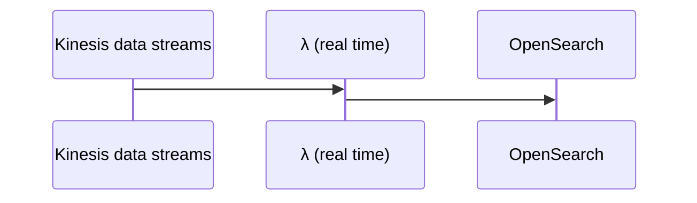
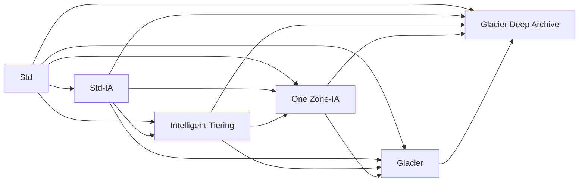
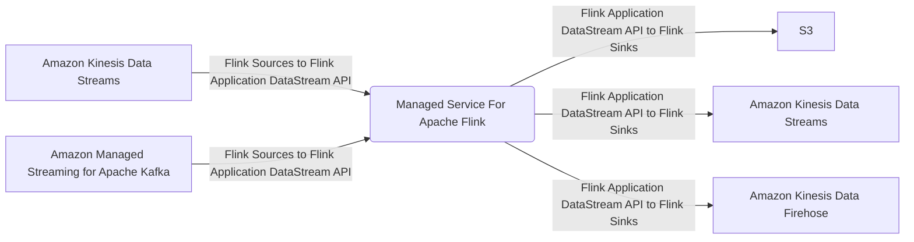
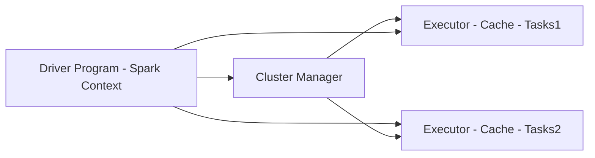
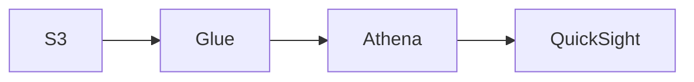
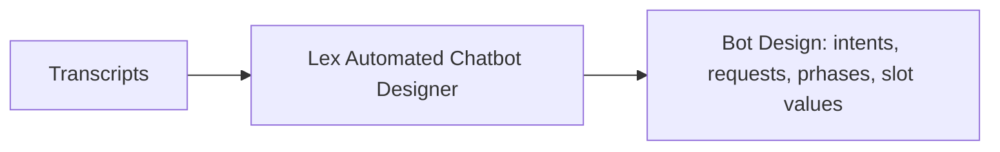
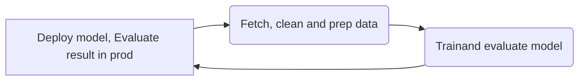
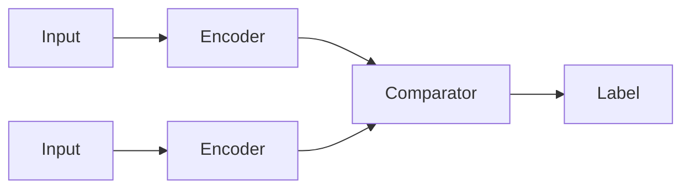

## AWS-MLS-C01-Study-Guide

Note these are my own personal notes and are a work in progress as I study torwards passing this exam.  If this helps someone great, but I make no guarantees/promises.  

## Table of Contents
1. <a href="#introduction">Introduction</a>
2. <a href="#data-engineering">Data Engineering</a>
3. <a href="#exploratory-data-analysis">Exploratory Data Analysis</a>
4. <a href="#modeling">Modeling</a>
5. <a href="#machine-learning-implementation-and-operations">Machine Learning Implementation and Operations</a>
6. <a href="#acronyms">Acronyms</a>

## Introduction
<a href="https://d1.awsstatic.com/training-and-certification/docs-sa-pro/AWS-Certified-Solutions-Architect-Professional_Exam-Guide.pdf">AWS Certified Machine Learning – Specialty (MLS-C01) Exam Guide</a>

<a href="https://certmetrics.com/amazon/candidate/benefit_summary.aspx">Don't forget to utilize a benefit code if you've passed another AWS exam previously to save</a>

### Exam Content Breakdown:

| Domain  | % of Exam |
| ------------- | ------------- |
| Domain 1: Data Engineering | 20%  |
| Domain 2: Exploratory Data Analysis | 24%  |
| Domain 3: Modeling | 36% |
| Machine Learning Implementation and Operations | 20% |
| **Total** | **100%** |

  * 170 minutes 
  * 65 questions
  * \>= 75% to pass
  * Good to use the bathroom before the exam
  * Average question time should be between 2 and 2 1/2 minutes
  * Try to understand each question thoroughly

## Data Engineering 

### Create data repositories for machine learning

#### Identify data sources (e.g., content and location, primary sources such as user data) and determine storage mediums (e.g., DB, Data Lake, S3, EFS, EBS)

##### Amazon Redshift:
  * fully managed, scalable cloud data warehouse, columnar instead of row based (no Multi-AZ, based on Postgres, No OLTP [row based], but OLAP [column based])
  * Offers parallel sql queries
  * Can be server less or use cluster(s)
  * Uses SQL to analyze structured and semi-structured data across data warehouses, operational DBs, and data lakes
  * Integrates with Quicksight or Tableau
  * Leader node for query planning, results aggregation
  * Compute node(s) for performing queries to be sent back to the leader
  * Provision node sizes in advance
  * Enhanced VPC Routing forces all COPY and UNLOAD traffic moving between your cluster and data repositories through your VPCs, otherwise over the internet routing, including to other AWS services
  * Can configure to automatically copy snapshots to other Regions
  * Large inserts are better (S3 copy, firehose)

##### Amazon Redshift Spectrum:
  * Resides on dedicated Amazon Redshift servers independent of your cluster
  * Can efficiently query and retrieve structured and semistructured data from files in S3 into Redshift Cluster tables (points at S3) without loading data in Redshift tables
  * Pushes many compute intensive tasks such as predicate filtering (ability to skip reading unnecessary data at storage level from a data set into RAM) and aggregation, down to the Redshift Spectrum layer
  * Redshift Spectrum queries use much less of the formal cluster's processing capacity than other queries

##### AWS RDS:
  * Autoscaling when running out of storage
  * OLTP based
  * Must be provisioned
  * Max read replicas: 5
  * Read replicas are not equal to a DB
  * Read replicas cross region/AZ incur $
  * IAM Auth
  * Integrates with Secrets Manager
  * Supports MySQL, MariaDB, Postgres, oracle, aurora
  * Fully customized => MS SQL Server or RDS Custom for Oracle => can use ssh or SSM session manager; full admin access to OS/DB
  * At rest encryption via KMS
  * Use SSL for data in transit to ensure secure access
  * Use permission boundary to control the maximum permissions employees can grant to the IAM principals (eg: to avoid dropped/deleted tables)
  * Multi-AZ: 
    * Can be set at creation or live
    * Synchronous replication, at least 2 AZs in region, while Read replicas => asynchronous replication can be in an AZ, cross-AZ or cross Region

##### Aurora:
  * MySQL or Postgres
  * OLTP based
  * Better performance than RDS version
  * Lower price
  * At rest encryption via KMS
  * 2 copies in each AZ, with a minimum of 3 AZ => 6 copies
  * max read replica: 15 (autoscales)
  * Shareable snapshots with other accounts
  * Replicas: MySQL, Postgres, or Aurora
  * Replicas can autoscale
  * Cross region replication (< 1 second) support available 
    * Aurora Global: multi region (up to 5)
    * Aurora Cloning: copy of production (faster than a snapshot)
  * Aurora multimaster (for write failover/high write availability)
  * Aurora serverless for cost effective option (pay per second) for infrequent, intermittent or unpredictable workloads
  * Non-serverless option must be provisioned
  * Automated backups
  * Automated failover with Aurora replicas 
    * Fail over tiers: lowest ranking number first, then greatest size
  * Aurora ML: ML using SageMaker and Comprehend on Aurora

##### Amazon Keyspaces (for Apache Cassandra):
  * Scalable, highly available, serverless, and managed Apache Cassandra compatible (NoSQL) DB service offering consistent single-digit millisecond server-side read/write performance, while also providing HA and data durability
  * Uses the Cassandra Query Language (CQL)
  * All writes are replicated 3x across multiple AWS AZ for durability and availability
  * Tables can scale up and down with virtually unlimited throughput and storage.  There is no limit on the size of a table or the number of rows you can store in a table. 

##### DynamoDB:
  * (Serverless) NoSQL Key-value / document DB that delivers single-digit millisecond performance at any scale.  It's a fully managed, multi-region, multi-master, durable DB with built-in security, backup and restore, and in-memory caching for internet scale applications
  * Stored on SSD
  * Good candidate to store ML model served by application(s)
  * Stored across 3 geographically distinct data centers
  * Eventual consitent reads (default) or strongly consistent reads (1 sec or less)
  * Session storage alternative (TTL)
  * IAM for security, authorization, and administration
  * Primary key possibilities could involve creation time
  * On-Demand (pay per request pricing) => $$$
  * Provisioned Mode (default) is less expensive where you pay for provisioned RCU/WCU
  * Backup: optionally lasts 35 days and can be used to recreate the table
  * Standard and IA Table Classes are available
  * Max size of an item in DynamoDB Table: 400KB
  * Can be exported to S3 as DynamoDB JSON or ion format
  * Can be imported from S3 as CSV, DynamoDB JSON or ion format

##### Amazon OpenSearch Service (Amazon ElasticSearch Service)
  * Service to search any field, even partial matches at petabyte scale
  * Common to use as a complement to another DB (conduct search in the service, but retrieve data based on indices from an actual DB)
  * Requires a cluster of instances (can also be Multi-AZ)
  * Doesn't support SQL (own query language)
  * Comes with Opensearch dashboards (visualization)
  * Built in integrations: Kinesis Firehose, AWS IOT, λ, Cloudwatch logs for data ingest
  * Security through Cognito and IAM, KMS encryption, SSL and VPC
  * Can help efficiently store and analyze logs (amongst cluster) for uses such as Clickstream Analytics
  * Patterns:
 ```mermaid
sequenceDiagram
    participant Kinesis data streams
    participant Kinesis data firehose (near real time)
    participant OpenSearch
    Kinesis data streams->>Kinesis data firehose (near real time): 
    Kinesis data firehose (near real time)->>OpenSearch: 
    Kinesis data firehose (near real time)->>Kinesis data firehose (near real time): data tranformation via λ
```


##### AWS Elasticache
  * Good to improve latency and throughput for read heavy applications or compute intensive workloads
  * Good for storing sessions of instances
  * Good for performance improvement of DB(s), though use of involves heavy application code changes
  * Must provision EC2 instance type(s)
  * IAM auth not supported
  * Redis versus Mem Cached:
    * Redis:
      * backup and restore features
      * read replicas to scale reads/HA
      * data durability using AOF persistence
      * multi AZ with failover 
      * Redis sorted sets are good for leaderboards
      * Redis Auth tokens enable Redis to require a token (password) before allowing clients to execute commands, thus improving security (SSL/Inflight encryption)
      * Fast in-memory data store providing sub-millisecond latency, Hippa compliant, replication, HA, and cluster sharding
    * Mem Cached:
      * Multinode partitioning of data (sharing)
      * No replication (HA)
      * Non persistence
      * No backup/restore
      * Multithreaded
      * Supports SASL auth
     
##### AWS DB Migration Service (AWS DMS):
  * Service to transition (no transformations) supported sources to relation DB, data warehouses, streaming platforms, and other data stores in AWS without new code (or any?)
  * Sources: 
    * On-premises and EC2 DBs: Oracle, MS SQL Server, MySQL, MariaDB, postgres, mongoDB, SAP, DB2
    * Azure: Azure SQL DB
    * Amazon RDS: all including Aurora
    * S3
  * Targets
    * On-premises and EC2 DBs: Oracle, MS SQL Server, MySQL, MariaDB, postgres, SAP
    * Amazon RDS: all including Aurora
    * Amazon Redshift
    * DynamoDB
    * S3
    * Elastic Search service
    * Kinesis Data Streams
    * DocumentDB
  * Homogenous migration: Oracle => Oracle
  * Heteregenous: Oracle => Aurora
  * EC2 server runs replication software, as well as continuous data replication using Change Data Capture (CDC) [for new deltas] and DMS 
  * Can pre-create target tables manually or use AWS Schema Conversion Tool (SCT) [runs on the same server] to create some/all of the target tables, indices, views, etc. (only necessary for heterogeneous case)

##### Data Lake
  * Offers centralized architecture within S3
  * Decouples storage (S3) from compute resources
  * Analagous to S3, any format is permitted, but typically they are: CSV, JSON, Parquet, Orc, Avro, and Protobuf

##### S3

###### Buckets:
  * Service to allow objects/files within a virtual "directory"
  * Bucket names must be *globally unique*
  * Buckets exist within AWS regions
  * Not a file system, and if a file system is needed, EBS/EFS/FSx should be considered
  * Not mountable as is a NFS
  * Supports any file format
  * Name formalities:
    * Must not start with the prefix 'xn--'
    * Must not end with the the suffix '-s3alias'
    * Not an IP address
    * Must start with a lowercase letter or number
    * Between 3-63 characters long
    * No uppercase
    * No underscores

###### Objects/Files
   * Each has a key, it's full path within the s3 bucket including the object/file separated by backslashes ("/")
   * Each has a value, it's content
   * Note there is no such thing as a true directory within S3, but the convention effectively serves as a namespace
   * Compression is good for cost savings concerning persistence
   * Max size is 5 TB
   * If uploading > 100MB and absolutely for > 5 GB, use Multi-Part upload
   * S3 Transfer Acceleration also can be utilized to increase transfer rates (upload and download) by going through an AWS edge location that passes the object to the target S3 bucket (can work with Multi-Part upload)
   * Strong consistency model to reflect latest version/value upon write/delete to read actions
   * Version ID if versioning enabled at the bucket level
   * Metadata (list of key/val pairs)
   * Tags (Unicode key/val pair <= 10) handy for lifecycle/security
   * Endpoint offers HTTP (non encrypted) and HTTPS (encryption in flight via SSL/TLS)

###### Security (IAM principle can access if either of the policy types below allows it and there is no Deny present):
  * Types
    * User Based: governed by IAM policies (eg: which user,  within a given AWS account, via IAM should be allowed to access resources) 
    * Resource Based:
      * Bucket Policies (JSON based statements)
        * Governing such things as:
          * (Blocking) public access \[setting was created to prevent company data leaks, and can be set at the account level to ensure of inheritance]
          * Forced encryption at upload (necessitates encryption headers).  Can be alternatively be done by "default encryption" via S3, though Bucket Policies are evaluated first
          * Cross account access
        * Bucket policy statement attributes 
          * SID: statement id
          * Resources: per S3, either buckets or objects
          * Effect: Allow or Deny
          * Actions: The set of api action to apply the effect to
          * Principal: User/Account the policy applies to
      * Object Access Control List (ACL) - finer control of individual objects (eg: block public access)
      * Bucket Access Control List (ACL) - control at the bucket level (eg: block public access)
  * S3 Object(s) are owned by the AWS account that uploaded it, not the bucket owner
  * Settings to block public access to bucket(s)/object(s) can be set at the account level
  * S3 is accessible to other AWS resources via:
    * VPC endpoint (private connection)
      * bucket policy tied to AWS:SourceVpce (for one endpoint)
      * bucket policy tied to AWS:SourceVpc (for all possible endpoint(s))
    * Public internet via an IGW=>public ip tied to a bucket policy tied to AWS:SourceIP:
  * S3 Access Logs can be stored to another S3 bucket (not the same to prevent infinite looping)
  * Api calls can be sent to AWS CloudTrail
  * MFA Delete of object(s) within *only* versioned buckets to prevent accidental permanent deletions *[only enabled/disabled by bucket owner via CLI]*

###### S3 Storage Classes

| |Std|Intelligent Tiering|Std-IA|One Zone-IA|Glacier Instant Retrieval|Glacier Flexible Retrieval|Glacier Deep Archive|
| ------------- | ------------- | ------------- | ------------- | ------------- | ------------- | ------------- | ------------- |
| *Durability | 99.99999999999% | 99.99999999999% | 99.99999999999% | 99.99999999999% | 99.99999999999% | 99.99999999999% | 99.99999999999% |
| *Availability | 99.99% | 99.9% | 99.9% | 99.5% | 99.9% | 99.99% | 99.99% |
| *Availability SLA | 99.99% | 99% | 99% | 99% | 99% | 99.99% | 99.99% |
| *AZs | >= 3 | >= 3| >= 3 | 1 | >= 3 | >= 3 | >= 3 |
| *Min Storage Duration Charge | None | None| 30 days | 30 days | 90 days | 90 days | 180 days |
| *Min Billable Obj Size | None | None| 128 KB | 128 KB | 128 KB | 40 KB | 40 KB |
| *Retieval Fee | None | None| Per GB | Per GB | Per GB | Per GB | Per GB |
| *Storage Cost (GB per month) | .023 | .0025 - .023 | .0125 | .01 | .004 | .0036 | .00099 |
| *Retieval Cost (per 1000 requests) | GET: .0004<br />POST: .005 | GET: .0004<br />POST: .005 | GET: .001<br />POST: .01 | GET: .001<br />POST: .01 | GET: .01<br />POST: .02 | GET: .0004<br />POST: .03<br />Expediated: $10<br />Std: .05<br />Bulk: free| GET: .0004<br />POST: .05<br />Std: .10<br />Bulk: .025 |
| *Retieval Time | immediate | immediate | immediate | immediate | immediate (milliseconds) | Expediated (1-5 mins)<br />Std (3-5 hrs)<br />Bulk (5-12 hrs) | Std (12 hrs)<br />Bulk (48 hrs) |
| *Monitoring Cost (per 1000 requests) | 0 | .0025 | 0 | 0 | 0 | 0 | 0 |
\*Note: US-East-1 for the sake of example, entire table subject to change by AWS

  * Durability: How often a file is not to be lost
  * Availability: How readily S3 bucket/files are available

###### S3 Standard:
  * Used data frequently accessed
  * Provides high throughput and low latency
  * Good for mobile and gaming applications, pseudo cdn, big data/analytics

###### S3 Standard Infrequent Access
  * Good for data less frequently acessed that need immediate access
  * Cheaper than Standard
  * Good for Disaster Recovery and/or backups

###### S3 Intelligent-Tiering
  * Modest fee for monthly monitoring and auto-tiering
  * Moves objects between tiers based on usage
  * Access tiers include:
    * Frequent (automatic) default
    * Infrequent (automatic) not acessed for 30 days
    * Archive Instant (automatic) not accessed for 90 days
    * Archive (optional) configurable between 90 days to >= 700 days
    * Deep Archive (optional) configurable between 180 days to >= 700 days 

###### S3 One Zone-IA
  * Data lost when AZ is lost/destroyed
  * Good for recreateable data or on-prem data secondary backup copies

###### S3 Glacier
  * Never setup a transition to glacier classes if usage might need to be rapid
  * Good for archiving/backup
  * Glacier Instant Retrieval is a good option for accessing data once a quarter
  * Harness Glacier Vault Lock (WORM) to no longer allow future edits, which is great for compliance and data retention
  * Glacier or Deep Archive are good for infrequentyly accessed objects that don't need immediate access

###### S3 Lifecycle Transitions (can also be conducted manually via AWS Console)

###### S3 Lifecycle Rules
  * Transition Actions: rules for when to transtion objects between s3 classes (see S3 storage classed above)
  * Expiration Actions: rules for when to delete an object after some period of time
    * Good for deleting log files, deleting old versions of files (if versioning enabled), or incomplete multi-part uploads
  * Rules can be created for object prefixes (addresses) or associated object tags

###### S3 Data Partioning
  * Harnesses disparate key \[path] to speed up queries (eg: Athena)
  * Typical scenarios are:
    * time/date (eg: s3://bucket/datasetname/year/month/day/....)
    * product (eg: s3://bucket/datasetname/productid/...)
  * Partitioning handled by tools such as Kinesis, Glue, etc.

###### SSE-S3 S3 Encryption
  * Encryption (keys) managed by AWS (S3)
  * Encryption type of AES-256
  * Encrypted server side via HTTP/S and Header containing "x-amz-server-side-encryption":"AES256"
  * Enabled by default for new buckets and objects

###### SSE-KMS S3 Encryption
  * Encryption (KMS Customer Master Key [CMK]) managed by AWS KMS
  * Encrypted server side via HTTP/S and Header containing "x-amz-server-side-encryption":"aws:kms"
  * Offers further user control and audit trail via cloudtrail
  * May be impacted by KMS limits, though you can increase them via Service Quotas Console
    * Upload calls the GenerateDataKey KMS API (counts towards KMS quota 5500, 10000, or 30000 req/s based upon region)
    * Download calls the Decrypt KMS API (also counts towards KMS quota)

###### SSE-C S3 Encryption:
  * Server side encryption via *HTTPS only*, using a fully managed external customer key external to AWS that must be provided in the HTTP headers for every HTTP request (key isn't saved by AWS)
  * Objects encrypted with SSE-C are never replicated between S3 Buckets

###### Client Side Encryption S3 Encryption
  * Utilizes a client library such as Amazon S3 Encryption Client
  * Encrypted prior to sending to S3 and must be decrypted by clients when retrieving from S3 conducted over HTTP/S
  * Utilizes a fully managed external customer key external to AWS
  * S3 objects useing SSE-C not able to be replicated between buckets

###### Encryption in transit (SSL/TLS) vs none
  * HTTP Endpoint - non-encrypted
  * HTTPS Endpoint - encrypted
  * To force encryption, a bucket policy is in order, and the following is an HTTP Get version
    * { "Version": "2012-10-17",
       "Statement": [
         {
           "Effect":"Deny",
           "Principal":"\*",
           "Action":"s3:GetObject",
           "Resource":"arn:aws:s3:::random-bucket-o-stuff/*",
           "Condition":{
             "Bool":"aws:SecureTransport":"false"
           }

         }
       ]
      }
  * To force SSE-KMS encryption
    * { "Version": "2012-10-17",
       "Statement": [
         {
           "Effect":"Deny",
           "Principal":"\*",
           "Action":"s3:PutObject",
           "Resource":"arn:aws:s3:::random-bucket-o-stuff/*",
           "Condition":{
             "StringNotEquals":{"s3:x-amz-server-side-encryption":"aws-kms"}
           }

         }
       ]
      }
  * To force SSE-C encryption
    * { "Version": "2012-10-17",
       "Statement": [
         {
           "Effect":"Deny",
           "Principal":"\*",
           "Action":"s3:PutObject",
           "Resource":"arn:aws:s3:::random-bucket-o-stuff/*",
           "Condition":{
             "Null":{"s3:x-amz-server-side-encryption-customer-algorithm":"true"}
           }

         }
       ]
      }


##### EFS: 
  * Linux based only
  * Can mount on many EC2(s)
  * Use SG control access
  * Connected via ENI
  * 10GB+ throughput
  * *Performance mode* (set at creation time): 
    * General purpose (default); latency-sensitive; use cases (web server, CMS); 
    * Max I/O-higher latency, throughput, highly parallel (big data, media processing)
  * *Throughput mode*: 
    * Bursting (1 TB = 50 MiB/s and burst of up to 100 MiB/s)
    * Provisioned-set your throughput regardless of storage size (eg 1 GiB/s for 1 TB storage)
  * *Storage Classes*, Storage Tiers (lifecycle management=>move file after N days):
    * Standard: for frequently accessed files
    * Infrequent access (EFS-IA): cost to retrieve files, lower price to store
  * *Availability and durability*: 
    * Standard: multi-AZ, great for production
    * One Zone: great for development, backup enabled by default, compatible with IA (EFS One Zone-IA)

##### EBS:
  * Volumes exist on EBS => virtual hard disk
  * Snapshots exist on S3 (point in time copy of disk)
  * Snapshots are incremental-only the blocks that have changed since the last snapshot are move to S3
  * First snapshot might take more time
  * Best to stop root EBS device to take snapshots, though you don't have to
  * Provisioned IOPS (PIOPS [io1/io2])=> DB workloads/multi-attach
  * Multi-attach (EC2 =>rd/wr)=>attach the same EBS to multiple EC2 in the same AZ; up to 16 (all in the same AZ)
  * Can change volume size and storage type on the fly
  * Always in the same region as EC2
  * To move EC2 volume=>snapshot=>AMI=>copy to destination Region/AZ=>launch AMI
  * EBS snapshot archive (up to 75% cheaper to store, though 24-72 hours to restore)

##### AWS FSx:
  * Launch 3rd party high performance file system(s) on AWS
  * Can be accessed via FSx File Gateway for on-premises needs via VPN and/or Direct Connect
  * Fully managed
  * Accessible via ENI within Multi-AZ
  * Types include:
    * FSx for Windows FileServer
    * FSx for Lustre
    * FSx for Net App ONTAP (NFS, SMB, iSCSI protocols); offering:
     * Works with most OSs
     * ONTAP or NAS
     * Storage shrinks or grows
     * Compression, dedupe, snapshot replication
     * Point in time cloning
    * FSx for Open ZFS; offering:
     * Works with most OSs
     * Snapshots, compression
     * Point in time cloning

##### Amazon FSx for Windows:
  * Fully managed Windows file system share drive
  * Supports SMB and Windows NTFS
  * Microsoft Active Directory integration, ACLs, user quotas
  * Can be mounted on Linux EC2 instances
  * Scale up to 10s of GBps, millions IOPs, 100s of PB of data
  * Storage Options:
   * SSD - latency sensitive workloads (DB, data analytics)
   * HDD - broad spectrum of workloads (home directories, CMS)
  * On-premises accessible (VPN and/or Direct Connect)
  * Can be configured to be Multi-AZ
  * Data is backed up daily to S3
  * Amazon FSx File Gateway allows native access to FSx for Windows from on-premises, local cache for frequently accessed data via Gateway

##### Amazon FSx for Lustre ("Linux" "Cluster"):
  * High performance, parallel, distributed file system designed for Applications that require fast storage to keep up with your compute such as ML, high peformance computing, video processing, Electronic Design Automation, or financial modeling
  * Integrates with linked S3 bucket(s), making it easy to process S3 objects as files and allows you to write changed data back to S3
  * Provides ability to both process 'hot data' in parallel/distributed fashion as well as easily store 'cold data' to S3
  * Storage options include SSD or HDD
  * Can be used from on-premises servers (VPN and/or Direct Connect)
  * Scratch File System can be used for temporary or burst storage use
  * Persistent File System can be used for storage / replicated with AZ

##### AWS Datasync:
  * A schedulable online data movement and discovery service that simplifies and accelerates *data migration* to AWS or *moving data* between on-premises storage, edge locations, other clouds and AWS storage (AWS to AWS, too)
  * Deployed VM AWS Datasync Agent used to convey data from internal storage (via NFS, SMB, or HDFS protocols) to the DataSync service over the internet or AWS Direct Connect to within AWS.  Agent is unnecessary for AWS to AWS
  * Directly within AWS =>S3/EFS/FSx for Windows File Server/FSx for Lustre/FSx open zfs/FSx for NetAp ONTAP
  * File permissions and metadata are preserved
  * transfers encrypted and data validation conducted

### Identify and implement a data ingestion solution.

#### Data job styles/types (batch load, streaming)

##### Streaming:
  * Good scenarios include where timing is important such as Fraud Detection or IoT Streaming Sensors gathering readings (eg: weather)
  * A lot more technical to develop/maintain

##### Batch Load:
  * If there is an acceptable latency, run the batch load job(s) every n seconds/minutes/hours/days/weeks/etc.

#### Data ingestion pipelines (Batch-based ML workloads and streaming-based ML workloads)

##### Example Full Data Engineering Analytics pipeline

 ```mermaid
graph LR
    A[S3]-->B[AWS Glue Data Catalog]
    B---|Schema|C[Athena]
    A-->E["Redshift /(Redshift Spectrum)"]
    A-->D["EMR (Hadoop/Spark/Hive)"]
    E-->C
    E-->F[QuickSight]
    C-->F
```

##### AWS Data Pipeline (DP)
  * Data sources can be on-prem or AWS
  * Destinations: S3, RDS, DynamoDB, Redshift, EMR
  * Conducted with EC2 or EMR instances managed by DP
  * Manages task dependencies
  * Retries and notifies upon failure(s)
  * HA

##### AWS DP vs. Glue:
  * Glue: 
    * focused on ETL
    * resources all managed by AWS
    * Data Catalog is there to make the data available to Athena or Redshift Spectrum
    * Lambda based
  * DP:
    * Move data from one location to another
    * More control over environment, compute resources that run code and the code itself
    * EC2 or EMR instance based

##### Amazon Kinesis:
  * Platform to send stream data (eg: IoT, metrics and logs) making it easy to load and analyze as well as provide the ability to build your own custom applications for your business needs
  * Any mention of "streaming (system[s])" and/or "real time" (big) data is of importance, kinesis is likely the best fit as it makes it easy to collect, process, and analyze real-time, streaming data to allow quick reactions from information taken in.  
  * Output can be classic or enhanced fan-out consumers
  * Accessed via VPC
  * IAM access => Identity-based (used by users and/or groups)
  * Types:
    * Kinesis Data Streams
    * Kinesis Data Firehose
    * Kinesis Analytics
    * Kinesis Video Streams


##### Amazon Kinesis Data Streams:
  * Service to provide low latency, real-time streaming ingestion 
  * On-demand capacity mode
    * 4 MB/s input, 8 MB/s output?
    * Scales automatically to accommodate up to double its previous peak write throughput observed in the last 30 days
    * Pay per stream per hour and data/in/out per GB
  * Provisioned mode (if throughput exceeded exception => add shard[s] manually or programmatically)
    * Streams are divided into ordered shards
    * 1 MB/s or 1k messages input per shard else 'ProvisionedThroughputException'
    * 2 MB/s output per shard
    * Pay per shard per hour
  * Can have up to 5 parallel consumers (5 consuming api calls per second \[per shard])
  * Synchronously replicate streaming data across 3 AZ in a single Region and store between 24 hours and 365 days in shard(s) to be consumed/processed/replayed by another service and stored elsewhere
  * Use fan-out if lag is encountered by stream consumers (~200ms vs ~70ms latency)
  * Requires code (producer/consumer)
  * Shards can be split or merged
  * 1 MB message size limit
  * TLS in flight or KMS at-rest encryption
  * *Can't subscribe to SNS*
  * *Can't write directly to S3*
  * Can output to:
    * Kinesis Data Firehose
    * Kinesis Data Analytics
    * Containers
    * λ
    * AWS Glue

##### Amazon Kinesis Data Analytics:
  * Fully Managed (serverless; scales automatically)
  * AWS Lambda can be a destination as well
  * Allows lots of flexibility for post-processing
    * Aggregating rows
    * Translating to different formats
    * Transforming and enriching data
    * Encryption
  * Opens up access to other services & destinations
    * S3, DynamoDB, Aurora, Redshift, SNS, SQS, CloudWatch
  * Perform real-time analytics on stream via SQL
  * Can utilize λ for preprocessing (near real-time)
  * Input stream can be joined with a ref table in S3
  * Output results include streams/errors
  * Can use either Kinesis Data Streams or Kinesis Data Firehose to analyze data in kinesis
  * Pay only for resources used, though that can end up not being cheap
  * Schema discovery
  * IAM permissions to access input(s)/output(s)
  * For SQL Applications: Input/Output: Kinesis Data Streams or Kinesis Data Firehose to analyze data
  * Managed Service for Apache Flink [Formerly Kinesis Data Analytics for Apache Flink or for Java (on a cluster)] : 
    * Input: Kinesis Data Stream or Amazon MSK
    * Output: Sink (S3/Kinesis Data Firehose/Kinesis Data Stream)
    * Kinesis Data Analytics always used; Flink under the hood
    * Now supports Python and Scala
    * Flink is a framework for processing data streams
    * MSAF integrates Flink with AWS
      * Instead of using SQL, you can develop your own Flink application from scratch and load it into MSAF via S3
    * In addition to the DataStream API, there is a Table API for SQL access
    * Serverless
  * Use cases:
    * Streaming ETL (simple selections/translations)
    * Continuous metric generation (eg: leaderboard)
    * Responsive analytics to generate alerts when certain metrics encountered
  * ML use cases:
    * Random Cut Forest:
      * SQL function for anomaly detection on numeric columns in a stream
      * uses only recent history to generate model
    * HOTSPOTS:
      * locate and return info about relatively dense regions of data
      * uses more than only recent history

Example MSAF Flow


##### Amazon Kinesis Data Firehose:
  * Fully Managed (serverless) service, no administration, automatic scaling
  * Allows for custom code to be written for producer/consumer
  * Can use λ to filter/transform data prior to output (Better to use if filter/tranform with a λ to S3 over Kinesis Data Streams)
  * Near real time: 60 seconds latency minimum for non-full batches
  * Minimum 1 MB of data at a time
  * Pay only for the data going through
  * Can subscribe to SNS
  * No data persistence and must be immediately consumed/processed
  * Sent to (S3 as a backup \[of source records] or failed \[transformations or delivery] case[s]):
    * S3
    * Amazon Redshift (copy through S3)
    * Amazon Elastic Search
    * 3rd party partners (datadog/splunk/etc.)
    * Custom destination (http[s] endpoint)
  * S3 Destination(s) (Error and/or output) allow for bucket prefixes:
    * output/year=!{timestamp:yyyy}/month=!{timestamp:MM}/
    * error/!{firehose:random-string}/!{firehose:error-output-type}/!{timestamp:yyyy/MM/dd}/
  * Data Conversion from csv/json to Parquet/ORC using AWS Glue (only for S3)
  * Data Transformation through λ (eg: csv=>json)
  * Supports compression if target is S3 (GZIP/ZIP/SNAPPY)

##### Amazon Kinesis Video Streams 
  * Producers
    * used to capture, process and store video streams in real-time such as smartphone/security/body camera(s), AWS DeepLens, audio feeds, images, RADAR data; RTSP camera.
    * One producer per video streams
    * Video playback capability
  * Consumers
    * custom build server (MXNet, Tensorflow, etc.)
      * This may pass on the data to db (checkpoint stream per processing status), decode the input frames and pass onto SageMaker, or even inference results to Kinesis Streams=>λ for downstream notifications
    * EC2 instances
    * AWS SageMaker
    * Amazon Rekognition Video
  * retention between 1 hr to 10 years

##### MQTT
  * An IOT Standard messaging protocol
  * Sensor data transferred to your model
  * The AWS loT Device SDK can connect via MQTT

### Identify and implement a data transformation solution. 
  * Handle ML-specific data using map reduce (Hadoop, Spark, Hive) 
  * Transforming data transit (ETL: Glue, EMR, AWS Batch)

#### AWS Step Functions:
  * A visual workflow service that helps developers use AWS services with λ to build distributed applications, automate processes, orchestrate micro services, or create data (ML) pipelines
  * JSON used to declare state machines under the hood
  * Advanced Error Handling and retry mechanism outside the code
  * Audit history of workflows is available
  * Able to "wait" for any length of time, though the max execustion time of a state machine is 1 year
  * Great for orchestrating and tracking and ordered flow of resources

#### EMR:
  * Service to create a managed Hadoop framework clusters (Big Data) to analyze/process lots of data using (many) instances
  * Supports Apache Spark, HBase, Presto, Flink, Hive, etc.
  * Takes care of provisioning and configuration
  * Autoscaling and integrated with Spot Instances for cost savings
  * Use cases: Data processing, ML, Web Indexing, BigData
  * Node types: 
    * Master Node:
      * single EC2 instance to manage the cluster
      * coordinates distribution of data and tasks
      * manages health-long running process
    * Core Node:
      * Hosts HDFS data and runs tasks and store data-long running process
      * can spin up/down as needed
    * Task Node (optional):
      * only to run tasks-usually Spot Instances are a best option
      * no hosted data, so no risk of data loss upon removal
      * can spin up/down as needed
  * Can have long-running cluster or transient (temporary) cluster
  * Purchasing options: 
    * On-demand: reliable, predictable, won't be terminated, good for long running cluster(s) \[though you need to manually delete]
    * Reserved: cost savings (EMR will use if available), good for long running cluster(s) \[though you need to manually delete]
    * Spot instances: 
      * cheaper, can be terminated, less reliable
      * Good choice for task nodes (temporary capacity)
      * Only use on core & master if you're testing or very cost-sensitive; you're risking partial data loss
  * At installation of the cluster you need to select frameworks and applications to install
  * Connect to the master node through an EC2 instance and run jobs from the terminal or via ordered steps submitted via the console
  * Instance Type(s) selection
    * Master node:
      * m4.large if < 50 nodes, m4 .xlarge if > 50 nodes
    * Core & task nodes:
      * m4.large is usually good
      * If cluster waits a lot on external dependencies (i.e. a web crawler), t2.medium
      * Improved performance: m4.xlarge
      * Computation-intensive applications: high CPU instances
      * Database, memory-caching applications: high memory instances
      * Network / CPU-intensive (NLP, ML) - cluster computer instances
      * Accelerated Computing / AI - GPU instances (g3, g4, p2, p3)
  * EMR promises
    * EMR charges by the hour
      * Plus EC2 charges
    * Provisions new nodes if a core node fails
    * Can add and remove tasks nodes on the fly
    * Can resize a running cluster's core nodes

##### EMR AWS Integration
  * Amazon EC2 for the instances that comprise the nodes in the
 cluster
  * Amazon VPC to configure the virtual network in which you launch your instances
  * Amazon S3 to store input and output data or HDFS (default)
  * Amazon CloudWatch to monitor cluster performance and configure alarms
  * AWS IAM to configure permissions
  * AWS CloudTrail to audit requests made to the service
  * AWS Data Pipeline to schedule and start your clusters

##### EMR Storage
  * HDFS (distributed scalable file system for Hadoop)
    * distributes data that it stores across every instance in a cluster, as well as multiple copies of data on different instances to ensure no data is lost if instance(s) fail
    * each file stored as blocks
    * default block size is 128 MB
    * storage is ephemeral and is lost upon termination
    * performance benefit of processing data where stored to avoid latency
    * EBS serves as a backup for HDFS
  * EMRFS: access S3 as if it were HDFS
    * EMRFS Consistent View - Optional for S3 consistency
    * Uses DynamoDB to track consistency
  * Local file system

##### EMR Notebook
  * Similar concept to Zeppelin, with more AWS integration
  * Notebooks backed up to S3 only (not in within the cluster)
  * Provision clusters from the notebook!
  * Able to use multiple Notebooks to share the multi-tenant EMR clusters
  * Hosted inside a VPC
  * Accessed only via AWS console
  * build Apache Spark Apps and run queries against the cluter (python, pyspark, spark sql, spark r, scala, andor anaconda based open source graphical libs)

##### Deep Learning on EC2 / EMR
  * EMR supports Apache MXNet and GPU instance types
  * Appropriate instance types for deep learning:
    * P3: 8 Tesla V100 GPU's
    * P2: 16 K80 GPU's
    * G3: 4 M60 GPU's (all Nvidia chips)
    * G5g : AWS Graviton 2 processors / Nvidia T4G Tensor Core GPU's
      * Not (yet) available in EMR
      * Also used for Android game streaming
    * P4d - A100 "UltraClusters" for supercomputing
  * Deep Learning AMI's
  * Sagemaker can deploy a cluster using whatever architecture you want
  * Trn1 instances
    * "Powered by Trainium"
    * Optimized for training NN/LLM (50% savings)
    * 800 Gbps of Elastic Fabric Adapter (EFA) networking for fast clusters
  * Trn1n instances
    * Even more bandwidth (1600 Gbps)
  * Inf2 instances
    * "Powered by AWS Inferentia2"
    * Optimized for inference
    
##### EMR Security
  * IAM policies: can be combined with tagging to control access on a cluster-by-cluster basis 
  * Kerberos
  * SSH can use kerboros or EC2 key pairs for client authentication
  * IAM roles:
    * Every cluster in EMR must have a service role and a role for EC2 instance profile(s).  These roles, attached via policies, will provide permission(s) to interact with other AWS Services
    * If a cluster uses automatic scaling, an autoscaling role is necessary
    * Service linked roles can be used if service for EMR has lost ability to clean up EC2 resources
    * IAM roles can also be sued for EMRFS requests to S3 to control user access to files with in EMR based on users, groups, or location(s) within S3
  * Security configurations may be specified for Lake Formation (JSON)
  * Native integration with Apache Ranger to provide security for Hive data metastore and Hive instance(s) on EMR
    * For data security on Hadoop/Hive

##### How to use EMR
  * Within EMR, select Create studio instance, which is your environment for running workspaces/notebooks
  * Requires:
    * VPC access
    * 1-5 subnets
    * Security group(s)
    * Service role (IAM/IAM Identity Center)
    * S3 bucket
  * Within the studio instance, create workspaces.  The workspace will need to create/attach an EMR cluster
  * A notebook must select a kernel at initialization (relative to the technology stack one is using)
  * Good practice delete your cluster if not using so it's not to be billed, though good to have a safeguard of the cluster shutting down, automatically to avoid paying for them
  
#### AWS Glue:
  * Managed ETL service (fully serverless) used to prepare/transform data for analysis
    * upper limit of 5 minutes as it is serverless
    * Utilizes Python (PySpark) or Scala (Spark) scripts, but run on serverless Spark platform
    * Targets: S3, JDBC (RDS, Redshift), or in Glue Data Catalog
    * Jobs scheduled via Glue Scheduler
    * Jobs triggered by events=>Glue Triggers
    * Transformations:
      * Bundled Transformations
        * DropFields/DropNullFields
        * Filter records
        * Join data to make more interesting data
        * Map/Reduce
      * ML Transformations
        * FindMatches ML: identify duplicate or matching data, even when the records lack a common unique identifier, and no fields exactly match
        * K-Means
      * Format conversions: CSV, JSON, Avro, Parquet, ORC, XML
      * Need an IAM role / credentials to access the TO/FROM data stores
  * Can be event driven (eg: λ triggered by S3 put object) to call Glue ETL
  * Glue Data Catalog:
    * Uses an AWS Glue Data Crawler scanning DBs/S3/data to write associated metadata utilized by Glue ETL, or data discovery on Athena, Redshift Spectrum or EMR
    * Can issue crawlers throughout a DP to be able to know what data is where in the flow
    * Metadata repo for all tables with versioned schemas and automated schema inference
  * Glue Crawlers go through your data to infer schemas and partitions (s3 based on organization \[see S3 Data Partitioning])
    * formats supported: ]SON, Parquet, CSV, relational store
    * Crawlers work for: S3, Amazon Redshift, Amazon RDS
    * Can be schedule or On-Demand
    * Need an IAM role / credentials to access the data stores
  * Glue Job bookmarks prevent reprocessing old data
  * Glue Databrew-clean/normalize data using pre-built transformation
  * Glue Studio-new GUI to create, run, and monitor ETL jobs in Glue
  * Glue Streaming ETL (built on Apache Spark Structured Streaming)-compatible with Kinesis Data Streaming, Kafka, MSK
  * Glue Elastic Views:
    * Combine and replicate data across multiple data stores using SQL (View)
    * No custom code, Glue monitors for changes in the source data, serverless
    * Leverages a "virtual table" (materialized view)

#### AWS Batch:
  * Fully managed (serverless) batch processing at any scale using dynamically launched *EC2 instances (spot or on-demand)* managed by AWS for which you pay
  * Job with a start and an end (not continuous)
  * Can run 100,000s of computing batch jobs
  * You submit/schedule batch jobs and AWS Batch handles it
    * Can be scheduled using CloudWatch Events 
    * Jobs can also be orchestrated using step functions 
  * Provisions optimal amount/type of compute/memory based on volume and requirements
  * Batch jobs are defined as *docker images and run on ECS*
  * Helpful for cost optimization and focusing less on infrastructure
  * No time limit
  * Any run time packaged in docker image
  * Rely on EBS/instance store for disk space
  * Advantage over λ=>time limit, limited runtimes, limited disk space
  * Good for any compute based job (must harness docker) and for any non-ETL based work, batch is likely best (eg: periodically cleaning up s3 buckets)
  * Using spot instances to train deep learning models

## Exploratory Data Analysis

### Data Distributions
  * Normal distribution: bell curve centered around 0
    * Probability density function: gives the probability of a data point falling within a given range of values (on a curve) with infinite possibilities (non-discrete)
  * Poisson distribution: series of discrete events that end in a success or failure, where the average number of successes over time is known.  As λ value approaches 0, distribution looks exponential
    * Probability mass function: discrete data example being a bell curve surrounding a histogram chart
  * Binomial Distribution: number of successes dealing with a binary result; discrete trials (n)
  * Bernouli Distribution: 
    * special binomial distribution
    * single trial (n=1)
    * Sum of bernouli=>binomial
   
### Types of Data
  * Numerical - quantitative measurement(s)
  * Categorical
    * yes/no, categories
    * can assign numbers to categories in order to represent them, though the numbers don't possess any real meaning
  * Ordinal
    * mix of numerical and categorical types (eg scale of 1 to 5), where 1 is worse than 2 and so forth and 5 being best

### Libraries to know at a high level:
  * Pandas:
    * used for slicing and mapping data (DataFrames, Series) and interoperates with numpy
    * Dataframe/Series are interchangeable with numpy arrays, though the former is often converted to the former to feed ML algorithms
  * Matplotlib (graphics might be good?)
    * boxplot (with whiskers)
    * histograms (binning: bins of results of similar measure)
  * Seaborn  (graphics might be good?)
    * essentially Matplotlib extended
    * heatmap: demonstrates another dimension within the given plot axes
    * pairplot: good for attribute correlations
    * jointplot: scatterplot with histograms adjoining each axis
  * scikit_learn
    * toolkit for/to make ML models
    * X=>attributes
    * y=>labels
    * X and y are utilized in conjunction with the fit function to train the model(s)
    * predict function harnesses the model to output inferences based on input
    * good for preprocessing data (input data=>normal distribution)
      * to avoid unequal weightings, scale to the around the mean for each column
  * Spark MLLib (see Apache Spark on EMR)


### Apache Spark on EMR
  * Hadoop consists largely of HDFS, YARN and Map Reduce
  * Hadoop Core or Hadoop - Common java archive (JAR) files/scripts used to boot Hadoop
  * YARN used to centrally manage cluster resources for different frameworks
  * Spark (faster alternative to Map Reduce)
    * Can be included within SageMaker
    * In memory cache
    * Optimized query execution on data of any size using directed acyclic graph adding efficiencies concerning dependencies/processing/scheduling
    * Java, Scala, Python, R apis available
    * Not used for OLTP or batch processing
    * Upon connecting acquires executors on nodes in the cluster that run computations and store data for your applications.  Code is sent to the executors and Spark context sends tasks to the executors to run

#### Spark Core: 
  * Foundation of the platform (memory management, fault recovery, scheduling, distributing, monitoring jobs and interactions with persistence stores)
    * Uses Resilient Distributed Dataset (RDD) at lowest level, representing a logical collection of data partitioned across nodes

##### Spark SQL
  * Up to 100x faster than Map Reduce including cost based optimizer, columnar storage and code generation for fast queries, JDBC/ODBC, JSON, HDFS, Hive, Orc, Parquet, or Hive Tables via HIVEQL
  * Exposes dataframe (python)/dataset (Scala) taking the place of RDD where input (SQL) to the spark cluster and transforms the initial query to a distributed query across the cluster

##### Spark Streaming: 
  * Data ingested via mini batches and analytics on the data is the same as application code for batch analytics for one application code for batch or streaming
  * Inputs include twitter, Kafka, Flume, HDFS, ZeroMQ, AWS Kinesis
  * Able to query unbounded table within windows of time, much like a database
  * Spark is able to query from Kinesis Data Streams via the Kinesis Client Library (KCL) 

##### Graph X: 
  * Distributed graph processing framework providing ETL, exploratory analysis, iterative graph computation to enable the building/transformation of graph data structures at scale

##### Spark MLLIB
  * Distributed and scalable via cluster nodes offering the following:
    * Classification: logistic regression, naive Bayes
    * Regression
    * Decision trees
    * Recommendation engine (ALS)
    * Clustering (K-Means)
    * LDA (topic modeling), extract topics from text input(s)
    * ML workflow utilities (pipelines, feature transformation, persistence)
    * SVD, PCA, statistics
    * ALS (Alternating Least Squares)

### Spark Workflow 

### Zeppelin + Spark 
  * Can run Spark code interactively (like you can in the Spark shell)
    * This speeds up your development cycle
    * And allows easy experimentation and exploration of your big data
  * Can execute SQL queries directly against SparkSQL
  * Query results may be visualized in charts and graphs
  * Makes Spark feel more like a data science tool!
  * Conducted via browser (Notebook)

### Jupyter Notebooks
  * runs in browser(s) to communicate with the python environment (eg: anaconda) server
 
*from sklearn import preprocessing*

*scaler = preprocessing.standardScaler()*

*new_data = scaler.fit_transform(input)*

### General flow for analyzing data import at first glance (note consider merging this with the next topic):
  * import data
  * head()
  * Does the data have column names?
  * Are certain rows attributes of the data type or na values?
    * Can drop rows potentially (*.dropna(inplace=True), though this might introduce bias if the missing values aren't evenly distributed
  * describe()=> are counts of all the columns equal?
  * If remapping the data, it is a good idea to check the mean/std of attributes from/to via describe()
  * To convert to the numpy array=>*.values()

### Sanitize and prepare data for modeling
  * Identify and handle missing data, corrupt data, stop words, etc.
  * Formatting, normalizing, augmenting, and scaling data
  * Labeled data (recognizing when you have enough labeled data and identifying mitigation
  * strategies [Data labeling tools (Mechanical Turk, manual labor)])

#### Imputing missing data
##### Mean Replacement 
  * Replace missing values with the mean value from the rest of the column (single feature)
  * Fast & easy, won't affect mean or sample size of overall data set
  * Median may be a better choice than mean when outliers are present
  * But it's generally pretty terrible.
    * Only works on column level, misses correlations between features
    * Can't use on categorical features (imputing, with most frequent value can work in this case, though)
    * Not very accurate
##### Dropping 
  * If not many rows contain missing Data
    * dropping those rows doesn't bias your data
    * you don't have a lot of time
    * maybe it's a reasonable thing to do?
  * But, it's never going to be the right answer for the "best" approach.
  * Almost anything is better. Can you substitute another similar field perhaps? (i.e., review summary vs. full text)
##### KNN: Find K "nearest" (most similar) rows and average their values
  * Assumes numerical data, not categorical
  * There are ways to handle categorical data (Hamming distance)
  * KNN is a good method to produce decent imputation results for missing data
##### Deep Learning
  * Build a machine learning model to impute data for your machine learning model!
  * Works well for categorical data, though complicated.
  * One of the better methods for missing data to produce decent results
##### Regression
  * Find linear or non-linear relationships between the missing feature and other features
  * Most advanced technique: MICE (Multiple Imputation by Chained Equations) - finds relationships between features and one of the better imputation methods for missing data
##### Get more data
  * What's better than imputing data? Getting more real data!

#### Unbalanced data
  * Large discrepancy between "positive" and "negative" cases
    * i.e., fraud detection. Fraud is rare, and most rows will be not-fraud
    * "positive" doesn't mean "good" it means the thing you're testing for happened.
      * If your machine learning model is made to detect fraud, then fraud is the positive case.
  * Mainly a problem with neural networks

#### Oversampling
  * Duplicate samples from the minority class
  * Can be done at random

#### Undersampling
  * Instead of creating more positive samples, remove negative ones
  * Throwing data away is usually not the right answer
    * Unless you are specifically trying to avoid "big data" scaling issues
   
#### SMOTE 
  * Artificially generate new samples of the minority class using nearest neighbors
    * Run K-nearest-neighbors of each sample of the minority class
    * Create a new sample from the KNN result (mean of the neighbors)
  * Both generates new samples and undersamples majority class
  * Generally better than just oversampling

#### Adjusting thresholds
  * When making predictions about a classification (fraud / not fraud), you have some sort of threshold of probability at which point you'll flag something as the positive case (fraud)
  * If you have too many false positives, one way to fix that is to simply increase that threshold.
    * Reduces false positives but, could result in more false negatives

### Perform feature engineering

  * Applying your knowledge of the data - and the model you're using - to identify and extract useful features to train your model with.  * 
  * Analyze/evaluate feature engineering concepts (binning, tokenization, outliers, synthetic features, 1 hot encoding, reducing dimensionality of data) to understand what features one should use
    * Do I need to transform these features in some way?
    * How do I handle missing data?
    * Should I create new features from the existing ones?
    * You can't just throw in raw data and expect good results
    * This is the art of machine learning; where expertise is applied
    * Trim down feature data or create and combine new ones
    * Normalize or encode data
    * Handle missing data
   
### The Curse of Dimensionality
  * Too many features can be a problem - leads to sparse data
  * Every feature is a new dimension
  * Much of feature engineering is selecting the features most relevant to the problem at hand
    * This often is where domain knowledge comes into play
  * Unsupervised dimensionality reduction techniques can also be employed to distill many teatures into fewer features
    * РСА
    * K-Means

### Time Series Analysis:
  * Discrete samples taken over a period of time
  * trends
    * slope slant
    * can be seasonal, can superimpose curves vs the trends to decipher if this pattern is exhibited in month to month variations
    * can both be seasonal and have an overall trend, too.  To get the overall trend, subtract out noise and seasonality 
  * Noise: random variations
    * Additive model
      * Seasonal variation is constant => seasonality + trends + noise = TS model
    * Multiplicative model
      * seasonal variation increases as the trend increases => seasonality * trends * noise = TS model
     
### NLP

#### 
TF-IDF
  * Stands for Term Frequency and Inverse Document Frequency
  * Important data for search - figures out what terms are most relevant for a document
    * Compute TF-IDF for every word/n-gram in a corpus
    * For a given search word/n-gram, sort the documents by their TF-IDF score accordingly 
    * Display the results
  * Term Frequency just measures how often a word occurs in a document
    * A word that occurs frequently is probably important to that document's meaning
* Document Frequency is how often a word occurs in an entire set of documents, i.e., all of Wikipedia or every web page
  * This tells us about common words that just appear everywhere no matter what the topic, like "a", "the", "and", etc.
* So a measure of the relevancy of a word to a document might be:
  * Term Frequency/Document Frequency
  * Or: Term Frequency * Inverse Document Frequency
* That is, take how often the word appears in a document, over how often it just appears everywhere. That gives you a measure of how important and unique this word is for this document
  * We actually use the log of the IDF, since word frequencies are distributed exponentially. That gives us a better weighting of a words overall popularity
  * TF-IDF assumes a document is just a "bag of words"
    * Parsing documents into a bag of words can be most of the work
    * Words can be represented as a hash value (number) for efficiency
    * What about synonyms? Various tenses? Abbreviations? Capitalizations? Misspellings?
  * Doing this at scale is the hard part
    * That's where Spark comes in!


#### Unigrams, bigrams, etc.
  * An extension of TF-IDF is to not only compute relevancy for individual words (terms) but also for bi-grams or, more generally, n-grams.
  * "I love certification exams"
    * Unigrams: "l", "love", "certification", "exams"
    * Bi-grams: "I love", "love certification", "certification exams"
    * Tri-grams: "I love certification", "love certification exams"
  * The TF-IDF matrix will consist of the documents as rows and the selection of n-grams as columns

#### Modern Natural Language Processing
  * Transformer deep learning architectures are currently state of the art utilizing a mechanism of "self-attention"
    * Weighs significance of each part of the input data
    * Processes sequential data (like words, like an RNN), but processes entire input all at once.
    * The attention mechanism provides context, so no need to process one word at a time.
  * BERT, RoBERTa, T5, GPT-2, DistilBERT
  * DistilBERT: uses knowledge distillation to reduce model size by 40%

#### Transfer Learning
  * fine-tuning and transfer learning are the same thing
  * NLP models (and others) are too big and complex to build from scratch and re-train every time
    * The latest may have hundreds of billions of parameters!
  * use a pre-trained model to further train for specific task(s)
  * Model zoos such as Hugging Face offer pre-trained models to start from
    * Integrated with Sagemaker via Hugging Face Deep Learning Containers
    * Hugging face is essentially a giant repo of pre-trained models (eg: GPT2, GPTJ, llama, stable-diffusion)
  * You can fine-tune these models for your own use cases
  * If fine-tuning a model, need to install the source version of the model
  * BERT transfer learning example:
    * Hugging Face offers a Deep Learning Container (DLC) for BERT
    * It's pre-trained on BookCorpus and Wikipedia
    * You can fine-tune BERT (or DistilBERT etc) with your own additional training data through transfer learning
      * Tokenize your own training data to be of the same format
      * Just start training it further with your data, with a low learning rate.

##### Transfer Learning approaches 
  * Continue training a pre-trained model (fine-tuning)
    * Use for fine-tuning a model that has way more training data than you ever have
    * Use a low learning rate to ensure you are just incrementally improving the model
  * Add new trainable layers to the top of a frozen model
    * Learns to turn old features into predictions on new data
    * Can freeze certain layers, re-train others (NN based)
      * Train a new tokenizer to learn a new Fine-tuning NN language per additional training data
    * Can do both: add new layers, then fine tune as well
  * Retrain from scratch
    * If you have a large amount of training data and it's fundamentally different from what the model was pre-trained with
    * And you have the computing capacity for it!
  * Use it as-is
    * When the model's training data is what you want already
  * Adapt it to other tasks (eg: classification, etc.)

### Analyze and visualize data for machine learning
  * Graphing (scatter plot, time series, histogram, box plot)
  * Interpreting descriptive statistics (correlation, summary statistics, p value)
  * Clustering (hierarchical, diagnosing, elbow plot, cluster size)

#### Amazon Athena:
  * Serverless ad-hoc query service enabling analysis and querying of data in S3 using standard SQL, while allowing more advanced queries (joins permitted)
  * Compress data for smaller retrieval
  * Use target files (> 128 MB) to minimize overhead and as a cost savings measure
  * $5.00 per TB scanned
  * Commonly used/integrated with Amazon Quicksight
  * Federated query allows SQL queries across relational, object, non-relational, custom (AWS or on-premisis) using Data Source Connectors that run on λ with results being returned and stored in S3
  * presto under the hood
  * supports: csv, json, orc, parquet, Auro
  * able to query unstructured, semi-structured or structured data with in the data lake
  * use cases
    * query web logs (CloudTrail, CloudFront, VPC, ELB)
    * query data prior to loading in DB
  * can integrate with Jupiter, Zepplin, or R-Studio notebooks
  * able to integrate with other visualization tools via ODBC/JDBC protocols
  * can harness Glue Data Catalog metadata for queries
  * anti-patterns:
    * Highly formatted reports / visualization=>That's what QuickSight is for
    * ETL=>Use Glue instead
   
##### Typical pipeline use case of Athena

##### Athena Security:
  * Access control
    * IAM, ACLs, S3 bucket policies
    * AmazonAthenaFullAccess/AWSQuicksightAthenaAccess
  * Encrypt results at rest in S3 staging directory
    * Server-side encryption with S3-managed key (SSE-S3)
    * Server-side encryption with KMS key (SSE-KMS)
    * Client-side encryption with KMS key (CSE-KMS)
  * Cross-account access in S3 bucket policy possible
  * TLS encrypts in-transit (between Athena and S3)

#### Amazon Quicksight:
  * BI/analytics serverless ML service used to build interactive visualizations (dashboards, graphs, charts and reports), perform ad-hoc analysis without paying for integrations of data and leaving the data uncanned for exploration
  * Integrates with sources both in and out of AWS (RDS)
  * In memory computation using Spice Engine
    * Data sets are imported into SPICE
      * Super-fast, Parallel, In-memory Calculation Engine
      * Uses columnar storage, in-memory, machine code generation
      * Accelerates interactive queries on large datasets
    * Each user gets 10GB/month of SPICE
    * Highly available / durable
    * Scales to hundreds of thousands of users
  * Column-Level security (CLS)
  * Can share analysis (if published) or the dashboard (read only) with users or groups
  * Available as an application anytime on any device (browsers [mobile])
  * Data Sources
    * Redshift
    * Aurora / RDS
    * Athena
    * EC2-hosted databases
    * Files (S3 or on-premises)
      * Excel
      * CSV, TSV
      * Common or extended log format
    * AWS loT Analytics
    * Data preparation allows limited ETL
  * Quicksight Paginated Reports
    * Reports designed to be printed
    * May span many pages
    * Can be based on existing Quicksight dashboards
  * Q
    * Machine learning-powered
    * Answers business questions with NLP eg: "What are the top-selling items in Florida?"
    * Offered as an add-on for given regions
    * Personal training on how to use it is required
    * Must set up topics associated with datasets
      * Datasets and their fields must be NLP-friendly
      * How to handle dates must be defined
  * Security:
    * Multi-factor authentication on your account
    * VPC connectivity
      * Add QuickSight's IP address range to your database security groups
    * Row-level security
      * Column-level security too (CLS) - Enterprise edition only
    * Private VPC access (for on-prem access)
      * Elastic Network Interface, AWS DirectConnect
  * User Management
    * Users defined via IAM, or email signup
    * SAML-based single sign-on
    * Active Directory integration (Enterprise Edition)
    * MFA
  * Pricing
    * Annual subscription
      * Standard: $9 / user /month
      * Enterprise: $18 / user / month
      * Enterprise with Q: $28 / user / month
    * Extra SPICE capacity (beyond 10GB), otherwise more $
      * $0.25 (standard) $0.38 (enterprise) / GB / month
    * Month to month
      * Standard: $12 / user / month
      * Enterprise: $24 / user / month
      * Enterprise with Q: $34 / user / month
    * Additional charges for paginated reports, alerts & anomaly detection, Q capacity, readers, and reader session capacity.
    * Enterprise edition
      * Encryption at rest
      * Microsoft Active Directory integration
      * CLS
  * Use Cases:
    * Interactive ad-hoc exploration / visualization of data
    * Dashboards and KPI's
    * Analyze / visualize data from:
      * Logs in S3
      * On-premise databases
      * AWS (RDS, Redshift, Athena, S3)
      * SaaS applications, such as Salesforce
      * Any JDBC/ODBC data source
  * ML insights feature (only ML capabilties of Quicksight)
    * Anomaly detection (uses Random Cut Forest)
    * Forcasting to get rid of anomalies to make forcast (uses Random Cut Forest)
    * Autonarratives to build rich dashboards with embedded narratives
  * Anti-Patterns
    * Highly formatted canned reports
      * QuickSight is for ad ho queries, analysis, and visualization
      * No longer true with paginated reports!
    * ETL
      * Use Glue instead, although QuickSight can do some transformations
  * Visual Types
    * AutoGraph - automatically selects chart based on input features to best display the data and relationships.  Not 100% effective and might require intervention
    * Bar Charts
      * For comparison and distribution (histograms)
    * Line graphs
      * For changes/trends over time
      * \[stacked] area line charts - allows visualization of different components added up to a change/trend
    * Scatter plots, heat maps
      * For correlation
    * Pie graphs, tree maps - Heirarchical Aggregation chart (eg: npm package map)
      * For aggregation
    * Pivot tables
      * For tabular data to aggregate in certain ways into other tables
      * applying statistical functions applied to (multi-dimensional) data  
    * KPIs - chart detailing measurement(s) between current value(s) vs target(s)
    * Geospatial Charts (maps) - map with sized circles annotating certain amounts in certain areas
    * Donut Charts - when precision isn't important and few items in the dimension; show percentile/proportion of the total amount
    * Gauge Charts - compare values in a measure (eg: fuel left in a tank)
    * Word Clouds - word or phrase frequency within a corpus

## Modeling
### Frame business problems as machine learning problems. 
  * When to use/when not to use ML
    * Effective goal is to take the predictions (aka inference) to generalize well against new inputs
    * Good use for problems if: 
      * either too complex for traditional programming approach have no known algorithm
      * a fluctuating env, where ml can adapt to the new data
      * getting insights/patterns about complex problems and large amounts of data (data mining)
    * Don't use otherwise possibly in favor of a traditional programming approach

  * Know the difference between supervised and unsupervised learning
  * Selecting from among classification, regression, forecasting, clustering, recommendation, etc.

### Select and express intuition behind the appropriate model(s) for a given machine learning problem
  * [Xgboost](https://github.com/LongBu/AWS-MLS-C01-Study-Guide#xgboost-extreme-gradient-boosting)
    * Observations are weighted
    * Some will take part in new training sets more often
    * Training is sequential; each classifier takes into account the previous one's success.
    * Boosting generally yields better accuracy than Bagging

  * logistic regression - supervised model dealing with classification and probability outcomes, though the former is more prevalent
  * K-means - unsupervised cluster analysis on unlabeled data where the aim is to partition a set of objects into K clusters in such a way to understand what types of groups exist or to identify unknown groups in complex data sets
  * linear regression - useful in predicting a variable based on the value of another variable, a supervised model curvature, if you will, in a n-space dimensional plane 
  * decision trees - a supervised model based on a set of decision rules for prediction analysis, data classification, and regression. May possibly overfit training data.
  * [RNN](https://github.com/LongBu/AWS-MLS-C01-Study-Guide#rnn)
  * [CNN](https://github.com/LongBu/AWS-MLS-C01-Study-Guide#cnn)
  * Ensemble-supervised, multiple models that are combined to improve the overall performance and accuracy.  An excellent example being Random Cut Forests, as decision trees are prone to overfitting, where lots of decision trees are modeled and let them all vote on the result.  
  * [Transfer learning](https://github.com/LongBu/AWS-MLS-C01-Study-Guide#transfer-learning)
  * Bagging - generate N new training sets by random sampling with replacement.  Each resampled model can be trained in parallel
    * Bagging avoids overfitting over boost
    * Bagging is easier to parallelize over boost

### Train machine learning models

##### Loss Functions (aka Cost Function): seek to calculate/minimize the error (difference between actual and predicted value)

### Perform hyperparameter optimization. 
  * Regularization
    * Preventing overfitting
      * Models that are good at making predictions on the data they were trained on, but not on new data it hasn’t seen before
      * Overfitted models have learned patterns in the training data that don't generalize to the real world
      * Often seen as high accuracy on training data set, but lower accuracy on test or evaluation data set.
        * When training and evaluating a model, we use training, evaluation, and testing data sets.
      * Batch sizes that are larger can increase chances of becoming stuck in a local minima
      * Higher learning rates run the risk of overshooting an optimal solution
      * Generally good to pair a small batch size and a small learning rate
    * Regularization techniques are intended to prevent overfitting.
    * Too wide/deep of a neural layer(s) ending in overfitting=> simpler model might be better
    * Specific to NN:
      * Dropout: Remove some neurons at each Epoch During training, which forces the model to learn/spread out learning among other neurons Preventing individual neurons from overfitting specific data point(s)
      * Early stopping is breaking early training from Epochs as accuracy levels out, preventing overfitting
    * L1 (LASSO) / L2 (Ridge) Regularization
      * Preventing overfitting in ML in general
      * A regularization term is added as weights are learned
      * L1 term is the sum of the weights absolute weights
        * Performs feature selection - entire features go to O
        * Computationally inefficient
        * Sparse output
        * Good to avoid curse of dimensionality
        * When to use L1
          * Feature selection can reduce dimensionality
          * Out of 100 features, maybe only 10 end up with non-zero coefficients!
          * The resulting sparsity can make up for its computational inefficiency
          * But, if you think all of your features are important, L2 is probably a better choice.
      * L2 term is the sum of the square of the weights
        * All features remain considered, just weighted
        * Computationally efficient
        * Dense output
      * Same idea can be applied to loss functions and/or weights as learned
  * Training data vs Validation data split (eg 80/20 rule if data is largely available)
    * Test set used to get the error rate (aka generalization or out of sample error)
    * If you training error is low and the generalization error is high=>overfitting
    * If you'd like to validate which algorithm is best, harness the training data on them and then validate against test set
    * If also validating multiple hyperparameters, a holdout, validation set, might be decent to validate following the training set=>validation set (select best model and hyperparameters that perform best), and then testing against the test set to avoid selecting a model that performs best on the test set data
    * Alternatively there is cross validation too, to avoid wasting too much training data on validation sets.  This involves splitting the training set into complementary subsets and the model is trained against a different combination of the subsets and tested against the remaining data subset(s).  Once the model/hyperparameters are finalized they are then trained on the complete training data to then measure the generalized error against the test set.
  * Cross validation - usually done if data is in short supply
  * Model initialization
  * Neural network architecture (layers/nodes)
    * NN Learning Rate
      * Neural networks are trained by gradient descent (or some similar flavor)
      * We start at some random point, and sample different solutions (weights) seeking to minimize some cost function, over many epochs
        * Epochs – iterations at which we train, and attempt a different set of weights, looking to minimize the cost/loss function
      * How far apart these samples are is the learning rate
      * *Too high a learning rate means you might overshoot the optimal solution!*
      * *Too small a learning rate will take too long to train/find the optimal solution*
      * Learning rate is an example of a hyperparameter
    * NN Batch Size
      * How many training samples are used within each batch of each epoch
      * Somewhat counter-intuitively:
        * *Smaller batch sizes tend to work their way out of "local minima" more easily*
        * *Batch sizes that are too large can end up getting stuck in the wrong solution*
        * Random shuffling at each epoch can make this look like very inconsistent results from run to run
    * NN activation functions
  * Tree-based models (# of trees, # of levels)
  * Linear models (learning rate)
  * Note there is a time/cost consideration with iterations of training, so understand costs vs requirements up front 

#### Neural Network (NN)
  * Deep Learning Network is the case where there are multiple layers of neurons in a NN
  * Training involves learning the appropriate weights and biases throughout the network to generate classifications
  * Great for parallelization (GPU)
  * Deep Learning Frameworks (AWS supports both, but tend to build using MXNet):
    * TensorFlow/Keras
    * MXNet
  * Types:
    * Feedforward Neural Network
    * Convolutional Neural Network (CNN)
      * Image classification
    * Recurrent Neural Network (RNN)
      * Deal with Time series data or words in a sentence
      * RNN types:
        * Long Short Term Memory (LSTM), Gated Recurrent Unit (GRU)
       
##### NN on EC2
  * within EC2 instance-AMI can search for applicable image (Quickstart AMI is usually a good choice), thereafter, selecting the appropriate instance type for the AMI
  * can ssh into the instance from your local system
    * paste given host name
    * Auth=>ppl or pen file
    * Tunnel=>localhost:8888
    * after running/tunneling into the instance=> 'jupyter notebook' to then run in the browser
  * NN => data should be re-shaped/scaled appropriately between values of zero to one => Label should ideally be one-hot encoded

##### CNN

Usage:
  * When you have data that doesn't neatly align into columns
    * Images Analysis that you want to find features or patterns within (eg: feature-location invariant)
    * Machine translation (eg: English to French)
    * Sentence classification
    * Sentiment analysis (can pick out sentences that flag the certain sentiment, this is more appropriate for CNN variants with attention)
  * They can find features that aren't in a specific spot
    * Like a stop sign in a picture
    * Or words within a sentence

How do they work?
  * Inspired by the biology of the visual cortex
    * Local receptive fields are groups of neurons that only respond to a part of what your eyes see (subsampling)
    * They overlap each other to cover the entire visual field (convolutions)
    * They feed into higher layers that identify increasingly complex Images
      * Some receptive fields identify horizontal lines, lines at different angles, etc. (filters)
      * These would feed into a layer that identifies shapes
      * Which might feed into a layer that indentifies objects
  * For color images, extra layers for red, green, and blue

How do we "know" what we're seeing is what we're seeing?
  * Individual local receptive fields scan the image looking for edges, and pick up the edges of an object in a layer
  * The edges of the object get picked up by a higher level convolution that identifies the object's shape (and letters, too)
  * This shape then gets matched against your pattern of what your desired object looks like, also using the color layers to help narrow it down
  * The information continues to be processed upward until you are aware of what the object is
  * A CNN works the same way

CNNs using Keras / Tensorflow
  * Source data must be of appropriate dimensions
    * ie width x length x color channels
  * Conv2D layer type does the actual convolution on a 2D image
    * Conv1D and Conv3D also available - doesn't have to be image data
  * MaxPooling2D layers can be used to reduce a 2D layer (data) down by taking the maximum value in a given block reducing processing load on the CNN
  * Flatten layers will convert the 2D layer to a 1D layer for passing into a flat hidden layer of neurons
  * Typical usage:
    * Conv2D=>MaxPooling2D=>Dropout=>Flatten=>Dense=>Dropout=>Softmax

CNN's training isn't easy
  * Very resource-intensive (CPU, GPU, and RAM)
  * Lots of hyperparameters
    * Kernel sizes, many layers with different numbers of units, amount of pooling, number of layers, choice of optimizer, etc.
  * Getting the training data is often the hardest part! (As well as storing and accessing it)

CNN example architectures
  * Defines specific arrangement of layers, padding, and hyperparameters
  * LeNet-5
    * Good for handwriting recognition
  * AlexNet
    * Image classification, deeper than LeNet
  * GoogLeNet
    * Even deeper, but with better performance
    * Introduces inception modules (groups of convolution layers)
  * ResNet (Residual Network)
    * Even deeper - maintains performance via skip connections.

##### RNN
Usage:
  * Time-series data
    * When you want to predict future behavior based on past behavior
    * Web logs, sensor logs, stock trades
    * Where to drive your self-driving car based on past trajectories
  * Data that consists of sequentes of arbitrary length
    * Machine translation
    * Image captions
    * Machine-generated music
   
Types:
  * Sequence to sequence (e.g. time series)
    * such as predict stock prices based on series of historical data
  * Sequence to vector
    * such as words in a sentence to sentiment
    * matching sequences to a vector state via multi layer perceptrons
  * Vector to sequence
    * such as create captions from an image
  * Encoder -> Decoder
    * Sequence -> vector -> sequence
    * such as machine translation

Training:
  * Backpropagation through time
    * Just like backpropagation on MLP's, but applied to each time step.
    * Back propagation must take into account nn topology as well as the time steps taken
  * All those time steps add up fast
    * Ends up looking like a really, really deep neural network.
    * Can limit backpropagation to a limited number of time steps (truncated backpropagation through time)
  * State from earlier time steps get diluted over time
    * This can be a problem (State Dilution), for example when learning sentence structures
    * Older behavior doesn't matter more than new behavior (eg: first words in a sentence, might be more important); understanding, relationships between words to derive sentiment, meaning, etc.=>LSTM or GRU
  * Layer of rnn with feedback scales horizontally, and can learn more complicated patterns as results
  * RNN neurons have a training feedback loop:
    * training data is fed to its input during training, step and/or, perhaps from the loop input from a previous layer (can be a layer or a single neuron) or step to be summed up-> activation function (eg: tanh)
    * over time during training is "memory cell" as it maintains memories of previous steps
  * LSTM Cell
    * Long Short-Term Memory Cell
    * Maintains separate short-term and long-term
States
  * GRU Cell
    * Gated Recurrent Unit
    * Simplified LSTM Cell that performs about as well, but shorter to train
  * RNN isn't easy to train
    * Very sensitive to topologies, choice of hyperparameters
    * Very resource intensive
    * A wrong choice can lead to a RNN that doesn't converge at all.

##### Transformers

The Evolution of Transformers
  * Prior to Transformers, there were RNN'S, LSTMs
  * Introduced a feedback loop for propagating information forward
  * Useful for modeling sequential things
    * Time series
    * Language! A sequence of words (or tokens)
  * Machine translation
  * Encoder / Decoder architecture
  * Encoders and Decoders are RNN's
  * But, the one vector tying them together creates an information bottleneck
    * Information from the start of the sequence may be lost


Attention
  * A hidden state for each step (token)
  * Deals better with differences in word order
  * Starts to have a concept of relationships between words
  * But RNNs are still sequential in nature, can't parallelize it


 What are Transformers
  * Ditch RNN's for feed-forward neural networks (FFNN's)
  * Use "self-attention"
  * This makes it parallelizable (so can train on much more data)
  * Attention-as a token is translated in a sentence, what other token(s) in said sentence, should attention be paid, potentially extracting meaning
  * Attention weights-certain weighting applied as sequential tokens are processed

Self-Attention (in more depth)
  * Each encoder or decoder has a list of embeddings (vectors) for each token
  * Self-attention produces a weighted average of all token embeddings.
magic is in computing the attention weights.
  * This results in tokens being tied to other tokens that are important for its context, and a new embedding that captures its "meaning" in context.
  * Three matrices of weights are learned through back-propagation
  * Query (Wq)
  * Key (Wk)
  * Value (Wv)
  * Every token gets a query (q), key (k), and value (v) vector by multiplying its embedding for a token against these matrices
  * Compute a score for each token by multiplying dot
product its query with each key
  * "Scaled dot-product attention"
  * Dot product is just one similarity function we can use.
  * In practice, softmax is then applied to the scores to normalize them.


Masked Self-Attention
  * A mask can be applied to prevent tokens from peeking" into future tokens (words)
  * GPT does this, but BERT does something else (masked language modeling)
  * In this example, "good" wouldn't be altected by "novel", but "novel" could by affected by "good"
  * This is just the concept... actual implementation detalls will vary.
  * Now we sum.
  * Multiply values by scores, and sum them up.
  * Repeat entire process for each token (in parallel)
  * Now we have our updated embeddings for each token!
  * These weight each token embedding as it's passed into the feed-forward NN.


Multi-Headed Self-Attention
  * The q, k, and v vectors are reshaped into matrices
  * Then each row of the matrix can be processed in parallel
  * The number of rows are the number of "heads"
  * Transformer Encoder-designed to learn embeddings that can be used for predictive modeling
    * BERt=> Composed of stacks of encoders
  * Transformer Decoder-designed to generate new text per query
    * GPT=> composed entirely of decoders
  * embeddings fed into an embedding layer

Applications of Transformers 
  * Chat!
  * Question answering
  * Text classification
    * eg: sentiment analysis
  * Named entity recognition
  * Summarization
• Translation
  * Code generation
  * Text generation
    * eg: automated customer service 

##### GPT
  * Generative Pre-Trained Transformer (GPT-2 in this example)
  * Decoder-only - stacks of decoder blocks
  * Each consisting of a masked self-attention layer, and a feed-forward neural network
  * As an aside, BERT consists only of encoders. TS is an example of a model that uses both encoders and decoders.
  * No concept of input, all it does is generate the next token over and over
Using attention to maintain relationships to previous words / tokens
  * You "prompt" it with the tokens of your question or whatever
  * It then keeps on generating given the previous tokens
  * Getting rid of the idea of inputs and outputs is what allows us to train it on unlabeled piles of text
  * It's "learning a language" rather than optimizing for some specific task
  * Hundreds of billions of parameters
  * GPT output is not based on finding true or correct results, but results generated based upon the input it was trained on


GPT Input processing
  * Tokenization, token encoding
  * Token embedding
    * Captures semantic relationships between tokens, token similarities
  * Positional encoding
    * Captures the position of the token in the input relative to other nearby tokens
    * Creates a (scalable \[works on any length]) matrix of vectors with overlayed sine and cosine functions interwoven, where words are within a period relative to other words to derive meaning



GPT Output processing
  * The stack of decoders outputs a vector at the end
  * Multiply this with the token embeddings
  * This gives you probabilities (logits) of each token being the right next token (word) in the sequence
  * You can randomize things a bit here ("temperature") instead of always picking the highest probability.  Setting the temperature to 0 picks the highest probability.  
  * can import GPT-2 into AWS via hugging face
  * Stacking up decoder blocks with own self attention increases the complexity of the model
  * The stack of decoder blocks is conducting masked self-attention and outputting into a feed forward NN to finally produce an output, vector of what the next token is, this output vector is then multiplied back into the embedding matrix to give us probabilities of what the next token is
  * NN work on numbers only, not words, pictures, etc.
  * Token embedding => Convert tokens to vectors in a multi dimensional space; space–distance correlating similarity of meeting
  * positional encoding-process all tokens in parallel

##### Foundation Models (Generative AI via AWS)
  * The giant, pre-trained transformer models we are fine tuning for specific tasks, or applying to new applications
  * GPT-n (OpenAl, Microsoft)
  * BERT (Google)
  * DALL-E (OpenAl, Microsoft)
  * LLaMa (Meta)
  * Segment Anything (Meta)
  * Where's Amazon?
  * Jurassic-2 (Al21labs)
    * Multilingual LLMs for text generation
    * Spanish, French, German, Portuguese, Italian,
Dutch
  * Claude (Anthropic)
    * LLM's for conversations
    * Question answering
    * Workflow automation
  * Stable Diffusion (stability.ai)
    * Image, art, logo, design generation
  * Amazon Titan
    * Text summarization
    * Text generation
    * Q&A
    * Embeddings
      * Personalization
      * Search
      * Converting input to a vector, which can then be used as a similar to comparison for another import, or even a listing of similar results

###### Amazon SM Jumpstart with Generative AI
  * SageMaker Studio has a
"JumpStart" feature
  * Lets you quickly open up a notebook with a given model loaded up and ready to go
  * Current foundation models
    * Hugging race models (text generation
      * Falcon, Flan, BloomZ, GPT-J
    * Stabile Diffusion (image generation)
    * Amazon Alexa (encoder/decoder multilingual LLM)
    * Google, and Microsoft models aren't supported on AWS as their direct competitors
  * jumpstart=> launch NB within SM, with pre-populated foundation, models, (internal, hugging face, etc.)
    * create a domain
      * A unique domain name
      * The user profile
        * execution role
      * IAM/identity center
      * SM studio integrations
      * SM canvas
      * fine tuned network security settings
      * fine-tuned encryption settings
      * VPC associated with an account
    * deploys actual hardware, though you were also given the opportunity to change the instance type(s) or potentially changing the use/# of GPUs
    * Can fine-tune the model through direct input within the notebook or S3
      * if input is large, it will train it many times trying to optimally tune, hyperparameters


#### Activation functions

A gated function that verifies how an incoming value to a node/neuron is higher than a threshold value to prevent linearity to define the output, used within internal/output layer cells in neural networks

Linear activation function (eg: y=x)
  * It doesn't really *do* anything
  * Can't do backpropagation




Binary step function
  * It's on or off
  * Can't handle multiple classification - it's binary after all
  * Vertical slopes don't work well with calculus!


Non-linear activation functions
  * These can create complex mappings between inputs and outputs
  * Allow backpropagation (because they have a useful derivative)
  * Allow for multiple layers (linear functions degenerate to a single layer)


Sigmoid / Logistic / TanH
  * Nice & smooth
  * Scales everything from 0-1
 (Sigmoid AKA Logistic) or -1 to 1 (tanh / hyperbolic tangent)
  * But: changes slowly for high or low values
    * The "Vanishing Gradient" problem exists for both when getting toward extremes in +/-, output changes very slowly, where numerical precision can become an issue
      * When the slope of the learning curve approaches zero, things can get stuck
      * We end up working with very small numbers that slow down training, or even introduce numerical errors
      * Becomes a problem with deeper networks and RNN's as these "vanishing gradients" propagate to deeper layers
      * Opposite problem: "exploding gradients"
    * Fixing the Vanishing Gradient Problem
      * Multi-level heirarchy
        * Break up levels into their own sub-networks trained individually
      * Long short-term memory (LSTM)
      * Residual Networks
        * eg: ResNet [a CNN based object recognition]
        * Ensemble of shorter networks
      * Better choice of activation function
        * ReLU is a good choice
    * Gradient checking:
      * A debugging technique
      * Numerically check the derivatives of the learning curve computed during training
      * Useful for validating code of NN training, though it's likely you're probably not gonna write this code
  * Computationally expensive
  * Tanh generally preferred over sigmoid
  * Tanh well suited for RNN
  * sigmoid appropriate for more than one classification





Rectified Linear Unit (ReLU)
  * If using slower neural network convergence
    * ReLU - solution to sigmoid and tanh 
  * Very popular choice
  * Easy & fast to compute
  * But, when inputs are zero or negative, we have a linear function and all of its problems
    * The "Dying ReLU problem", where input is <= 0


Leaky ReLU
* Solves "dying ReLU" by introducing a negative slope below 0 (usually not as steep as this)


Parametric ReLU (PReLU)
  * ReLU, but the slope in the negative part is learned via backpropagation
  * Complicated and YMMV (your mileage may vary)


Other ReLU variants
  * Exponential Linear Unit (ELU)
  * Swish
    * From Google, performs really well
    * But it's from Google, not Amazon...
    * Mostly a benefit with very deep networks (40+ layers)
  * Maxout
    * Outputs the max of the inputs
    * Technically ReLU is a special case ot maxout
    * But doubles parameters that need to be trained, not often practical.

Softmax
  * Used on the final output layer of a multiple classification problem
  * Basically converts outputs to probabilities of each classification
  * Can't produce more than one label for something (sigmoid can)
  * Don't worry about the actual function for the exam, just know what it's used for 

How to choose an activation function
  * For multiple classification, use softmax on the output layer
  * RNN's do well with Tanh
  * For everything else
    * Start with ReLU
    * If you need to do better, try Leaky ReLU
    * Last resort: PReLU, Maxout
    * Swish for really deep networks
  * Leaky ReLU or PReLU are the answer to dying ReLU, while the latter is computationally expensive slope calculations along with the weights in said NN

### Evaluate machine learning models.
  * Avoid overfitting/underfitting (detect and handle bias and variance)
  * Metrics (AUC-ROC, RMSE)
  * Outliers
    * Variance measures how "spread-out" the data is.
      * Variance (σ^2) is simply the average of the squared differences from the mean
      * Example: What is the variance of the data set (1, 4, 5, 4, 8)?
        * First find the mean: (1+4+5+4+8)/5 = 4.4
        * Now find the differences from the mean: (-3.4, -0.4, 0.6, -0.4, 3.6)
        * Find the squared differences: (11.56, 0.16, 0.36, 0.16, 12.96)
        * Find the average of the squared differences:
          * σ^2= (11.56 + 0.16 + 0.36 + 0.16 + 12.96) / 5 = 5.04

    * Standard Deviation σ is just the square root of the variance.
      * σ^2 = 5.04
      * σ = (5.04)^.5 = 2.24
      * So the standard deviation of (1, 4, 5, 4, 8) is 2.24.
      * This is usually used as a way to identify outliers. Data points that lie more than one standard deviation from the mean can be considered unusual.
      * You can tell how extreme a data point is by asking about "how many sigmas" away from the mean it is?
    * Dealing with Outliers
      * Sometimes it's appropriate to remove outliers from your training data
      * Do this responsibly! Understand why you are doing this.
      * For example: in collaborative filtering a single user who rates thousands of movies could have a big effect on everyone else's ratings. That may not be desirable.
      * Another example: in web log data, outliers may represent bots or other agents that should be discarded.
      * But if someone really wants the mean income of US citizens for example, don't toss out billionaires just because you want to.
      * Our old friend standard deviation provides a principled way to classify outliers.
      * Find data points more than some multiple of a standard deviation in your training data.
      * What multiple? Use common sense.
      * Remember AWS's Random Cut Forest algorithm creeps into many of its services - it is made for outlier detection
        * Found within QuickSight, Kinesis Analytics, SageMaker, and more

    * Binning
      * Bucket observations together based on ranges of values.
      * Example: estimated ages of people
        * Put all 20-somethings in one classification, 30-somethings in another, etc.
      * Quantile binning categorizes data by their place in the data distribution
      * Ensures even sizes of bins
      * Transforms numeric data to ordinal data
      * Especially useful when there is uncertainty in the measurements
      * Helps to cover up imprecision in data collection(s)

    * Transforming
      * Applying some function to a feature to make it better suited for training
      * Feature data with an exponential trend may benefit from a logarithmic transform
      * Example: YouTube recommendations
        * A numeric feature x is also represented by x?and VX
        * This allows learning of super and sub-linear functions

    * Encoding
      * Transforming data into some new representation required by the model
      * One-hot encoding
        * Create "buckets" for every category
        * The bucket for your category has a 1, all others have a 0
        * Very common in deep learning, where categories are represented by individual output "neurons"

    * Scaling / Normalization
      * Some models prefer feature data to be normally distributed around 0 (most neural nets)
      * Most models require feature data to at least be scaled to comparable values
      * Otherwise features with larger magnitudes will have more weight than they should
        * Example: modeling age and income as features - incomes will be much higher values than ages
        * Scikit_learn has a preprocessor module that helps (MinMaxScaler, etc)
      * Remember to scale your results back up
    * Shuffling
      * Many algorithms benefit from shuffling their training data
      * Otherwise they may learn from residual signals in the training data resulting from the order in which they were collected
  * Binary confusion matrix:
    | | Actual Yes | Actual No |
    | --- | --- | ---|
    | Predicted Yes | true positives | false positives |
    | Predicted No | false negatives| true negatives |

  * Multi-class confusion matrix + heat map, where heat map shows how the classifications or misclassifications happened (note true positives would be on the diagonal)
  * Confusion Matrix Measurements:
    | Measure | Abbreviation | Formula |
    | ------------- | ------------- | ------------- |
    | Error Rate | ERR | (FP + FN)/(TP + TN + FN + FP) = (FP + FN)/(P + N)|
    | Root Mean Square | RMSE | square root of the sum of all squared errors of each prediction from the actual true value |
    | Accuracy | ACC | (TP + TN)/(TP + FP + TN + FN) |
    | Sensitivity, True positive rate, Recall, Completeness| SN, TPR, REC | TP/(TP + FN) = TP/P|
    | Precision, Positive predictive value, Correct Positives| PREC, PPV | TP/(TP + FP) |
    | Specificity, True negative rate | SP, TNR | TN/(TN + FP) = TN/N|
    | False positive rate | FPR | FP/(FP + TN) = 1 - SP = 1 - TNR|
    | F1 Score (harmonic mean of precision and recall) | F1 | 2TP/(2TP + FP + FN) = 2 * (Precision * Recall)/(Precision+Recall)|
   
  * Recall is a good choice of metric when you care a lot about false negatives (eg: fraud detection)
  * Precision is a good choice of metric when you care a lot about false positives (eg: medical screening, drug testing)
  * F1 is a good choice when you care about precision AND recall
  * RMSE, an accuracy measurement, is a good choice when you only care about right & wrong answers
  * Offline and online model evaluation, A/B testing
  * Compare models using metrics (time to train a model, quality of model, engineering costs)
  * Cross validation (eg: from sklearn.model_selection import cross_val_score)
    * choose many (k-folds)=>train
    * choose remaining holdouts to validate against
    * average out the validation step results
    * good if lacking data
  * Sometimes accuracy isn't everything:
    * A test for a rare disease can be 99.9% accurate by just guessing "no" all the time
    * We need to understand true positives and true negative, as well as false positives and false negatives.
    * A confusion matrix shows this.


  * Number of correct and incorrect predictions per class (infer from colors of each cell)
  * F1 scores per class
  * True class frequencies: the "total" column to the left of F1
  * Predicted class frequencies: the "total" on the bottom row

#### ROC Curve

  * Receiver Operating Characteristic Curve
  * Plot of true positive rate (recall) vs. false positive rate at various threshold settings.
  * Points above the diagonal represent good classification (better than random)
  * Ideal curve would just be a point in the upper-left corner
  * The more it's "bent" toward the upper-left, the better

#### AUC Curve
  * Area Under the Curve (AUC) is the area under an ROC curve
  * Equal to probability that a classifier will rank a randomly chosen positive instance higher than a randomly chosen negative one
  * ROC AUC of 0.5 is a useless classifier, 1.0 is perfect
  * Commonly used metric for comparing classifiers

## Machine Learning Implementation and Operations

### Build ML solutions for performance, availability, scalability, resiliency, and fault tolerance. 
#### AWS environment logging and (error) monitoring

##### AWS CloudTrail:
  * Service that monitors and records account activity across AWS infrastructure (history of events/API calls)
  * Provides governance, compliance and audit for your AWS account:
   * Enabled by default
   * Trail can be applied to all regions (default) or a single region

##### CloudTrail Events:
  * Able to be separated into read/write events
  * Management events (default on)
  * Data events (default off due to volume, though can be turned on to trigger/invoke)
  
##### CloudTrail Insights:
  * Used to detect unusual activity in account (if enabled):
   * Inaccurate resource provisioning
   * Hitting service limits
   * Bursts of AWS IAM actions
   * Gaps in periodic maintenance
   * Analyzes normal manangement events to create a baseline to then continuosly analyze write events to detect unusual patterns (S3/CloudTrail console/EventBridge events)
   * Cloudtrail Events are stored for 90 days, though can be sent to S3 and analyzed by Athena

##### Amazon EventBridge (aka Cloudwatch Events):
  * Service to provide connectivity between certain events and resultant services such as
    * CRON job triggering (via EventBridge) a λ 
    * λ triggering (via EventBridge) SNS/SQS messages
    * S3 Event Notifications (via EventBridge) to trigger whatever service is required
    * Event Pattern: rules specified in AWS JSON rule configs react (eg: filter) to certain service action(s) (eg: check for external generated certs that are n days away from expiration, metadata, object sizes, names, etc.)
    * When an EventBridge rule runs, it needs permission on the target (eg: \[λ, SNS, SQS, Cloudwatch Logs, API GW, etc.] resource based policy or \[Kinesis Streams, Sys Mgr Run Command, ECS tasks etc.] IAM Role must allow EventBridge)
    * Externally available to 3rd party SAAS partners
    * Can analyze events and infer an associated schema (capable of versioning).  This registered schema allows code generation for applications to know the structure of the data in coming into the event bus
    * EventBridge Event Buses Types:
      * Default (receive events from AWS services)
      * Partner (receive events from SAAS)
      * Custom (recieve from Custom Applications)
    * EventBridge Event Buses:
      * Are accessible to other AWS accounts/Regions via Resource based policies
      * Events can be archived/filtered sent to it (time based or forever) and even replayed
      * Multiple destinations at one time is possible

##### Cloudwatch vs Cloudtrail:
  * Cloudwatch:
    * Cloudwatch Contributor Insight=>helps analyze (VPC) logs
    * Performance monitoring and dashboards (metrics, CPU, network, etc.)
    * Events and Alerting
    * Log aggregation and analysis
    * Cloudwatch metric=>kinesis data firehose to S3 or 3rd parties in near real time
  * CloudTrail: 
    * Record API calls made within Account by everyone
    * Can define trails for specific resources
    * Global service

#### Multiple regions, Multiple AZs
#### AMI/golden image
#### Docker containers
#### Auto Scaling groups
#### Rightsizing
  * Instances
  * Provisioned IOPS
  * Volumes
  * Load balancing
  * AWS best practices
### Recommend and implement the appropriate machine learning services and features for a given problem.
#### ML on AWS (application services)

##### Amazon Polly:
  * Turn text into lifelike speech using deep learning (for talking applications)
  * Neural Text-To-Speech, many voices & languages
  * Customize pronunciation of words and phrases with pronunciation lexicons (words or phrases mapped to a certain pronunciation) that are harnessed by the Sythesize Speech Operation
  * Can map stylized words and/or acronyms to resultant output
  * Can output directely to Audio or as an audio download (mp3 or other formats)
  * Generate more customized output from text marked up with SSML including:
    * breating, whispering
    * emphasis on words
    * phonetic pronunciation
    * speech rate, pitch, pauses
  * Speech Marks
    * Can encode when sentence / word starts and ends in the audio stream
    * Useful for lip-synching animation

##### Amazon Kendra:
  * Intelligent enterprise document search service powered by ML that allows users to search across different content repositories with built-in connectors.  Learns from user interaction/feedback for incremental learning.
  * Can return precise answers or pointers to document(s) from natural language (eg: "Where is the IT support desk?" "How do I connect to my VPN?")
  * Allows discovery of information spanning all connected data allocated in AWS (given permission) and any 3rd party connected data (salesforce, ServiceNow, SharePoint, Intranet, sharing services (JDBC, S3), DBs, Microsoft One Drive, etc.) into one searchable repository
  * Can use other services in AWS to preprocess content to text that is searchable/indexable
  * Relevance tuning - boost strength of document freshness, view counts, etc.

##### Amazon Lex: 
  * ASR to convert speech to text
  * Natural language chatbot engine understanding to recognize parts of speech/text
  * Helps to build chatbots, call center bots around intents
    * Utterances invoke intents ("I want to order a pizza")
    * Lambda functions are invoked to fulfill the intent
    * Slots specify extra information needed by the intent such as pizza size, toppings, crust type, when to deliver, etc.  Note: slot is the variable, while the slot value is the value 
  * Can deploy to AWS Mobile SDK, Facebook Messenger, Slack, and Twilio


Amazon Lex Automated Chatbot Designer
  * You provide existing conversation transcripts
  * Lex applies NLP & deep learning, removing overlaps & ambiguity
  * Intents, user requests, phrases, values for slots are extracted
  * Ensures intents are well defined and separated
  * Integrates with Amazon Connect transcripts



##### Contact Lens for Amazon Connect
  * For customer support call centers
  * Ingests audio data from recorded calls
  * Allows search on calls / chats
  * Sentiment analysis
  * Find "utterances" that correlate with successful calls
  * Categorize calls automatically
  * Measure talk speed and interruptions
  * Theme detection: discovers emerging issues

##### Amazon Personalize:
  * Fully managed ML service to build real-time personalized recommendations applications (same one as Amazon)
  * Service ingests via S3 (read data [purchases, ratings, impressions, cart adds, catalog, user demographics etc.]) and/or Amazon Personalize API (real-time data integration)
  * API access
    * You provide an explicit schema in Avro format
    * Javascript or SDK
    * GetRecommendations
      * Recommended products, content, etc.
      * Similar items
    * GetPersonalizedRanking
      * Rank a list of items provided
      * Allows editorial control / curation
  * Console and CLI too
  * Real-time or batch recommendations
  * Recommendations for new users and new items (the cold start problem)
  * Contextual recommendations
    * Device type, time, etc.
  * Similar items
  * Unstructured text input
  * Intelligent user segmentation
    * For marketing campaigns
  * Business rules and filters
    * Filter out recently purchased items or things that can't be shipped easily or are unavailable
    * Highlight premium content
    * Ensure a certain percentage of results are of some category
  * Promotions
    * Inject promoted content into recommendations
    * Can find most relevant promoted content
  * Trending Now
  * Personalized Rankings
    * Search results
    * Promotions
    * Curated lists

Personalize Terminology to remember
  * Datasets
    * Users, Items, Interactions
  * Recipes
    * USER_PERSONALIZATION - recommendations for a specific user
    * PERSONALIZED_ RANKING - give a list of items that are rent by end, user and a personal way
    * RELATED_ITEMS - similar items per a given item based on aggregate customer behavior
  * Solutions
    * Trains the model
    * Optimizes for relevance as well as your additional objectives
      * Video length, price, etc. - must be numeric
    * Hyperparameter Optimization (HPO)
  * Campaigns
    * Deploys your "solution version" (model that has been trained with a given set of data)
    * Deploys capacity for generating real-time recommendations

Personalize Hyperparameters
  * User-Personalization, Personalized-Ranking
    * hidden dimension (HPO) - automatically optimized for USER_PERSONALIZATION and PERSONALIZED_ RANKING; how many hidden variables are there in the underlying model
    * bptt (back-propagation through time - creates an RNN) - if time is important to recommendations; the older and event is the less significant it is; weighting more towards recent events
    * recency_mask (weights recent events) - gives more weight to recent events
    * min/max user history length_percentile (filter out robots/crawlers that have been on the site a lot or an individual who looked at one or two things)
    * exploration_weight 0-1 (.3 by default), controls relevance; higher weight=> less relevance in results and the reverse in kind (how wide a net is cast)
    * exploration_item_age_cut_off - how far back in time you go
  * Similar-items
    * item_id_hidden_dimension (HPO)
  * item_metadata_hidden_dimension (HPO with min & max range specified)

Maintaining Relevance
  * Keep your datasets current
    * Incremental data import
  * Use PutEvents operation to feed in real-time user behavior
  * Retrain the model
    * They call this a new solution version
    * Updates every 2 hours by default
    * Should do a full retrain (trainingMode=FULL) weekly

Personalize Security
  * Data not shared across accounts
  * Data may be encrypted with KMS
  * Data may be encrypted at rest in your region (SSE-S3)
  * Data in transit between your account and Amazons internal systems encrypted with TLS 1.2
  * Access control via IAM
  * Data in S3 must have appropriate bucket policy for Amazon Personalize to process
  * monitoring & logging via CloudWatch and

Personalize Pricing
  * Data ingestion: per-GB
  * Training: per training-hour
  * Inference: per TPS-hour (the more you hit the service the more you pay)
  * Batch recommendations: per user or per item

##### Amazon Augmented Al (A2I)
  * Human review of ML predictions
  * Builds workflows for reviewing low-confidence predictions
  * Access the Mechanical Turk workforce or vendors
  * Integrated into Amazon Textract and Rekognition
  * Integrates with SageMaker
  * Very similar to Ground Truth

##### Amazon Comprehend (Medical):
  * Serverless NLP service harnessing NLP to uncover valuable insights and connections in text analytics
  * Medical version detects PHI via DetectPHI API
  * Input social media, emails, web pages, documents, transcripts, medical records (Comprehend Medical)
  * PII Identification & Redaction
  * Targeted sentiment (for specific entities)
  * Can train on your own data
  * Results of the model are the following:
    * Events detection
    * Entities-nouns
    * Key phrases-noun phrases
    * Language
    * Sentiment
    * Syntax-boils down each word into a part of speech

##### Amazon Transcribe:
  * Automatically convert speech to text
    * Input in FLAC, MP3, MP4, or WAV, in a specified language
    * Streaming audio supported (HTTP/2 or WebSocket)
      * French, English, Spanish only
  * Uses Deep Learning - Automatic Speech Recognition (ASR)
  * Use cases:
    * Transcribe customer calls
    * Automate close captioning/subtitles
    * Generate metadata for media assets to create full scaleable architecture
  * Can remove PII using redaction
  * Supports automatic language identification for multi-lingual audio
  * Speaker Identification
    * Specify number of speakers
  * Channel Identification
    * eg: two callers could be transcribed separately
    * Merging based on timing of "utterances"
  * Automatic Language Identification
    * You don't have to specify a language; it can detect the dominant one spoken.
  * Custom Vocabularies
    * Vocabulary Lists just a list of special words - names, acronyms)
    * Vocabulary Tables (can include "SoundsLike", "IPA", and "DisplayAs")

##### DeepLens: 
  * Deep learning-enabled video camera service
  * Integrated with Rekognition, SageMaker, Polly, Tensorflow, MXNet, Caffe

##### AWS Panorama
  * Like DeepLens
  * Computer Vision at the edge
  * Brings computer vision to your existing IP cameras, those some cameras have this built-in now
  * Results go to S3, cloudwatch, etc.


##### Amazon Rekognition:
  * Find objects, people, text, scenes in images and videos using computer vision ML
  * Facial analysis and search to perform user verification, people counting
    * Create a DB of "familiar faces" or compare against celebrities
  * Images come from S3, or provide image bytes as part of request using the API
    * S3 will be faster if the image is already there
  * Facial recognition depends on good lighting, angle, visibility of eyes, resolution
  * Video must come from Kinesis Video Streams
    * H.264 encoded
    * 5-30 FPS
    * Favor resolution over framerate
  * Can use with Lambda to trigger image analysis upon upload to S3
  * Rekognition Custom Labels
    * Train with a small set of labeled images
    * Use your own labels for unique items
    * Example: the NFL uses custom labels to identify team logos, pylons, and foam fingers in images.
  * Use cases: 
    * Labeling
    * Text (in image) detection
    * Face detection and analysis (gender, emotions, age range, etc.)
    * Face search, comparison and verification
    * Celebrity recognition
    * Video analysis
      * Objects / people / celebrities marked on timeline
      * Pathing (eg: for sports game analysis)
    * Content Moderation (inappropriate, unwanted, or offensive images/videos)
      * Social media/broadcast media/advertising/e-commerce
      * Confidence level of content flags/gates (threshold configuration based)
      * Flag sensitive content for manual review in A2I
      * Help comply with regulations

 ##### Amazon Textract:
   * OCR that extracts text, handwriting and data from any scanned documents (eg: forms, tables tables, etc.) using ML
   * Read from any type of document (PDFs, images, etc.)
   * Good for invoices, financial reports, medical records, insurance claims, taxforms, ids, passports
		
##### Amazon Translate:
  * Natural and accurate language translation using deep learning
  * Allows localization of content (eg applications/websites) for international users, and to easily translate large volumes of text efficiently 
  * Supports custom terminology
    * CSV or TMX format
    * Appropriate for proper names, brands, etc.

##### Amazon Forecast:
  * Fully managed service using ML to deliver highly accurate forecasts (time series data)
  * 50% more accurate than looking at the data itself
  * Reduces forecasting time from months to hours
  * Use cases: Product Demand Planning, Financial Planning, Resource Planning
  * Data => S3 => Amazon Forecast => Model => Predictions
  * "AutoML" techniques chooses the best model automatically for your time series data
    * ARIMA, DeepAR, ETS, NPTS, Prophet
  * Works with any time series
    * Price, promotions, economic performance, etc.
    * Can combine with associated data to find relationships
  * Based on "dataset groups," "predictors," and "forecasts.'
  * Forecast algorithms
    * CNN-QR ($$$)
      * Convolutional Neural Network - Quantile Regression
      * Best for large datasets with hundreds of time series
      * Accepts related historical time series data & metadata
    * DeepAR+ ($$$)
      * Recurrent Neural Network
      * Best for large datasets
      * Accepts related forward-looking time series & metadata
    * Prophet ($$)
      * Additive model with non-linear trends and seasonality
    * NPTS ($)
      * Non-Parametric Time Series
      * Good for sparse data. Has variants for seasonal / climatological forecasts
    * ARIMA ($)
      * Autoregressive integrated moving average
      * Commonly used ter simple datasets (<100 time series)
    * ETS ($)
      * Exponential Smoothing
      * Commonly used for simple datasets (<100 time series)

##### Amazon Fraud Detector
  * Upload your own historical fraud data
  * Builds custom models from a template you choose
  * Exposes an API for your online application
  * Assess risk from:
    * New accounts
    * Guest checkout
    * "Try before you buy" abuse
    * Online payments
   
##### Amazon CodeGuru
  * Automated code reviews!
  * Finds lines of code that hurt performance
  * Resource leaks, race conditions
  * Fix security vulnerabilities
  * Offers specific recommendations
  * Powered by ML
  * Supports Java and Python

##### Amazon CodeWhisperer
  * An "Al coding companion"
    * Java, JavaScript, Python, TypeScript, C#
  * Real-time code suggestions
    * Write a comment of what you want
    * It suggests blocks of code into your IDE
    * Based on LLM's trained on billions of lines of code
      * Amazon's code and open source code
  * Security scans
    * Analyzes code for vulnerabilities
    * Java, JavaScript, Python
  * Reference tracker
    * Flags suggestions that are similar to open source code
    * Provides annotations for proper attribution
    * Proper attribution will import the license, so you need to be aware that is allowed within your organization

  * Bias avoidance
    * Filters out code suggestions that might be biased or unfair
  * AWS service integration
    * Can suggest code for interacting wIth AWS API's
      * EC2
      * Lambda
      * S3
  * Security
    * All content transmitted with TLS
    * Encrypted in transit
    * Encrypted at rest
    * However - Amazon is allowed to mine your data for individual plans
   
###### Amazon CodeWhisperer Pricing
  * Individual Tier
    * Free to use
    * Up to 50 security scans / month
  * Professional Tier
    * Manage which developers in an organization has access
    * Organizational policy management
      * i.e., can you use open source code?
    * Authenticated with IAM Identity Center
    * Up to 500/user/month security scans
    * $19 / user / month


###### Amazon CodeWhisperer: Supported IDE'S
  * Visual Studio Code
  * JetBrains
    * IntelliJ
    * PyCharm
    * Clion
    * GoLand
    * WebStorm
    * PhpStorm
    * RubyMine
    * DataGrip
  * JupyterLab
  * SageMaker Studio
  * AWS Lambda console
  * AWS Cloud9

##### Amazon Bedrock
  * An API for Foundation Models
  * Serverless
  * Fine-tuning API
  * Provide labeled examples in S3
  * As few as 20
  * Your data is only used in your copy of the FM
  * Your data is encrypted and does not leave your VPC
  * Integrates with SageMaker
  * don't have to access model through a SM NB, but an API
  * integrates with sage maker (notebooks)
  * able to find two models and/or simply output results from pre-train models

##### Amazon DeepComposer
  * Al-powered keyboard
  * Composes a melody into an entire song
  * For educational purposes

##### AWS DeepRacer
  * Reinforcement learning powered 1/18-scale race car

##### Amazon Lookout
  * Equipment, metrics, vision
  * Detects abnormalities from sensor data automatically to detect equipment issues or need for maintenance 
  * Monitors metrics from S3, RDS, Redshift, 3ra party SaaS apps (eg: Salesforce)
  * Vision uses computer vision to detect defects in silicon wafers, circuit boards, etc.

##### Amazon Monitron
  * End to end system for monitoring industrial equipment & predictive maintenance


##### TorchServe 
  * Serve pytorch models
  * Model serving framework for PyTorch
  * Part of the PyTorch open source project from Facebook (Meta?)

##### AWS Neuron
  * SDK for optimizing ML inference models specifically on AWS Inferentia chips
  * By using SDK access, you can integrate with anything you care for
  * EC2 Inf1 instance type
  * Integrated with SageMaker or whatever else you want (deep learning AMI's, containers, Tensorflow, PyTorch, MXNet)

#### SageMaker

##### SageMaker Notebooks can direct the process (data preparation)
  * Notebook Instances on EC2 are spun up from the console
    * S3 data access (data usually comes from here)
      * Ideal format varies with algorithm - often it is RecordIO / Protobuf being the most efficient
    * Can also ingest from Athena, EMR, Redshift, and Amazon Keyspaces
    * Scikit_learn, Apache Spark, Tensorflow frameworks 
    * Wide variety of built-in models
    * Ability to spin up training instances
    * Ability to deploy trained models for making predictions at scale
  * Sage maker Console can serve as an alternative to notebooks 

###### SageMaker Processing
  * Processing jobs
    * Copy data from S3
    * Spin up a processing container
      * SageMaker built-in or user provided
    * Output processed data to S3

###### Training on SageMaker
  * Create a training job
    * URL of S3 bucket with training data
    * ML compute resources
    * URL of S3 bucket for output
    * ECR path to training code
  * Training options
    * Built-in training algorithms
    * Spark MLLib
    * Custom Python Tensorflow / MXNet code
    * PyTorch, Scikit-Learn, RLEstimator
    * XGBoost, Hugging Face, Chainer
    * Your own Docker image (note all training code, regardless of origin, is deployed to Sagemaker harnessing instances registered and emanating from ECR)
    * Algorithm purchased from AWS marketplace

####### SM Elastic Inference 
  * Accelerates deep learning inference 
    * At fraction of cost of using a GPU instance for inference 
  * EI accelerators may be added alongside a CPU instance 
    * ml.eia1.medium / large / xlarge 
  * EI accelerators may also be applied to notebooks 
  * Works with Tensorflow, PyTorch, and MXNet pre-built containers 
    * ONNX may be used to export models to MXNet 
    * ONNX-> Used to make model compatible with an elastic interface
  * Works with custom containers built with EI- enabled Tensorflow, PyTorch, or MXNet 
  * Works with Image Classification and Object Detection built-in algorithms 
  * add elastic inference accelerator machine type alongside a CPU instance
  * Note elastic interface is now deprecated, but may still appear on the exam?



###### Deploying Trained Models via SageMaker
  * Save your trained model to S3
  * Can deploy two ways.
    * Persistent endpoints for making individual predictions on demand 
    * SageMaker Batch Transform to get predictions for an entire dataset
  * SageMaker deployment options
    * Inference Pipelines for more complex processing
    * SageMaker Neo for deploying to edge devices
    * Elastic Inference for accelerating deep learning models
    * Automatic scaling (increase # of endpoints as needed)
    * Shadow Testing evaluates new models against currently deployed model to catch errors



  * Note: ECR (aka the EC2 Container Registry) spins up instances for deployment of endpoint to make inferences in production as is needed

####### SM Automatic Scaling 
  * You set up a scaling policy to define target metrics, min/max capacity, cooldown periods 
  * Works with CloudWatch 
  * Dynamically adjusts number of instances for a production variant 
  * Load test your configuration before using it! 

####### SM  and Availability Zones 
  * SageMaker automatically attempts to distribute instances across availability zones 
  * But you need more than one instance for this to work! 
  * Deploy multiple instances for each production endpoint 
  * Configure VPC’s with at least two subnets, each in a different AZ 

##### SM integration with Docker

  * All models in SageMaker are hosted in Docker containers
    * Pre-built deep learning
    * Pre-built scikit-learn and Spark ML
    * Pre-built Tensorflow, MXNet, Chainer, PyTorch
      * Distributed training via Horovod (tensorflow can't be distributed across multiple machines) or Parameter Servers
    * Your own training and inference code! Or extend a pre-built image.
  * This allows you to use any script or algorithm within SageMaker, regardless of runtime or language 
    * Containers are isolated, and contain all dependencies and resources needed to run 

Using Docker
  
  * Docker containers are created from images
  * Images are built from a Dockerfile
  * Can separate or combine images for training and deployment
  * Run pip install sagemaker-training=> install common functionality necessary to create containers that work with SM
  * Images are saved in a repository (All SM docker containers need to be registered in ECR) Amazon SageMaker Containers
    * Library for making containers compatible with SageMaker 
    * RUN pip install sagemaker-containers in your Dockerfile 

Structure of a training container 


/opt/ml 

|── input 

|   ├── config

|   │   ├── hyperparameters.json

|   │   └── resourceConfig.json

|   └── data

|       └── < channel_name >

|           └── \<input data>

|── model

├── code

│   └── \<script files>

│

└── output

    └── failure

Structure of a Deployment Container 

 /opt/ml
 
 └── model
 
     └── \<model files>

Structure of your Docker image 
  * WORKDIR 
    * nginx.conf=>front-end server configuration
    * predictor.py=>flask web server for predictions
    * serve/ =>deployment materials that launches G-unicorn server running multiple instance os the flask application detailed in predictor.py
    * train/ =>training image, code, etc.
    * wsgi.py => wrapper used to invoke flask app for serving results

Assembling it all in a Dockerfile 

FROM tensorflow/tensorflow:2.0.0a0 
RUN pip install sagemaker-containers 

\# Copies the training code inside the container

COPY train.py /opt/ml/code/train.py 

\# Defines train.py as script entrypoint 

ENV SAGEMAKER_PROGRAM train.py 


Environment variables 
  * SAGEMAKER_PROGRAM=>env variable must be defined if defining your container from scratch
    * Run a script inside /opt/ml/code 
  * SAGEMAKER_TRAINING_MODULE =>load libraries and modules
  * SAGEMAKER_SERVICE_MODULE  =>load libraries and modules
  * SM_MODEL_DIR => model checkpoints are saved and pushed into S3
  * SM_CHANNELS / SM_CHANNEL_* =>where your train, test, validations channels are and what to expect in said directories
  * SM_HPS / SM_HP_* =>hyperparameters
  * SM_USER_ARGS 


Using your own image 
  * cd dockerfile
  * !docker build -t foo .
  * from sagemaker.estimator import Estimator 
    estimator = Estimator(image_name=‘foo', role='SageMakerRole', train_instance_count=1, train_instance_type='local') 
    estimator.fit() 

Production Variants 
  * You can test out multiple models on live traffic using Production Variants 
    * Variant Weights tell SageMaker how to distribute traffic among them 
    * So, you could roll out a new iteration of your model at say 10% variant weight 
    * Once you’re confident in its performance, ramp it up to 100% 
  * This lets you do A/B tests, and to validate performance in real- world settings 
    * Offline validation isn’t always useful
  * Shadow Variants
  * Deployment Guardrails 


  * using your own image SG
    * changes into docker dir
    * Build a docker image within SM
    * does then reference within an ESTIMATOR
    * which is then trained (fit)

##### SM integration with MLOps and Kubernetes 
  * Integrates SageMaker with Kubernetes-based ML infrastructure 
  * Amazon SageMaker Operators for Kubernetes 
  * Components for Kubeflow Pipelines 
  * Enables hybrid ML workflows (on-prem + cloud) 
  * Enables integration of existing ML platforms built on Kubernetes / Kubeflow (K8s MLOps solution) 

  * SageMaker Operators for Kubernetes -wraps SM operations so K8s can you utilize them via K8s API (kubectl)
    
  * SageMaker Components for Kubeflow Pipelines 
 
  * SageMaker Projects  (effectively MLOps for SM, which manages the larger pipeline for development, testing and deployment of models
)
    * SageMaker Studio’s native MLOps solution with CI/CD 
    * Build images
    * Prep data, feature engineering
    * Train models
    * Evaluate models
    * Deploy models
    * Monitor & update models 
  * Uses code repositories for building & deploying ML solutions 
  * Uses SageMaker Pipelines defining steps (chain different MLOps steps together within SM)


##### SM Security

###### General SM Security 
  * Use Identity and Access Management (IAM)
    * Set up user accounts with only the permissions they need 
  * Use MFA-admin and root accounts
  * Use SSL/TLS when connecting to anything 
  * Use CloudTrail to log API and user activity 
  * Use encryption 
  * Be careful with PII=>Encryption(at rest and in-transit)=> Both types of encryption are good for PII or sensitive info

Protecting your Data at Rest in SageMaker 
  * AWS Key Management Service (KMS) 
    * At rest encryption
    * Accepted by notebooks and all SageMaker jobs 
      * Training, tuning, batch transform, endpoints 
      * Notebooks and everything under /opt/ml/ and /tmp can be encrypted with a KMS key 
  * S3 
    * At rest and in-transit encryption
    * Can use encrypted S3 buckets for training data and hosting models 
    * S3 can also use KMS 

###### Protecting Data in Transit in SageMaker 
  * All traffic supports TLS / SSL 
  * IAM roles are assigned to SageMaker to give it permissions to access resources 
  * Inter-node training communication may be optionally encrypted (might be necessary due to regulations)
    * Can increase training time and cost with deep learning 
    * AKA inter-container traffic encryption 
    * Enabled via console or API when setting up a training or tuning job 

###### SM integration with VPC 
  * Training jobs run in a Virtual Private Cloud (VPC) 
  * You can use a private VPC for even more security (note: the following are necessary for SM to work at all within a private VPC)
  * You’ll need to set up S3 VPC endpoints
  * Custom endpoint policies and S3 bucket policies can keep this secure 
  * Notebooks are Internet-enabled by default 
    * This can be a security hole
    * If disabled, your VPC needs an interface endpoint (PrivateLink) or NAT Gateway, and allow outbound connections, for training and hosting to work
  * Training and Inference Containers are also Internet-enabled by default
    * Network isolation is an option, but this also prevents S3 access 

###### SM integration with IAM 
  * User permissions for:   
    * CreateTrainingJob
    * CreateModel
    * CreateEndpointConfig   
    * CreateTransformJob 
    * CreateHyperParameterTuningJob
    * CreateNotebookInstance
    * UpdateNotebookInstance 
  * Predefined policies:
    * AmazonSageMakerReadOnly
    * AmazonSageMakerFullAccess
    * AdministratorAccess
    * DataScientist 

###### SM Logging and Monitoring 
  * CloudWatch can log, monitor and alarm on:
    * Invocations and latency of endpoints
    * Health of instance nodes (CPU, memory, etc)
    * Ground Truth (active workers, how much they are doing) 
  * CloudTrail records actions from users, roles, and services within SageMaker 
    * Log files delivered to S3 for auditing 

##### SM Neo 
  * Train once, run anywhere 
  * compiles inference, code to work on edge devices
    * Edge devices
    * ARM, Intel, Nvidia processors
    * Embedded in any supported mobile device 
  * Optimizes code for specific devices 
    * Tensorflow, MXNet, PyTorch, ONNX, XGBoost, DarkNet, Keras 
  * Consists of a compiler and a runtime library

###### SM Neo + AWS IoT Greengrass 
  * Neo-compiled models can be deployed to an HTTPS endpoint 
    * Hosted on C5, M5, M4, P3, or P2 instances 
    * Must be same instance type used for compilation
  * or can deploy to IoT Greengrass
    * This is how you get the model to an actual edge device 
    * Inference at the edge with local data, using model trained in the cloud
    * Uses Lambda inference applications 

##### SageMaker I/O Modes:
  * File Mode:
    * Useful for small files that fit in memory and where the algorithm has a large number of epochs
    * Can leverage the file system cache for secondary epochs, the overall I/O throughput with Pipe mode is still faster than file mode
  * Pipe Mode:
    * Recommended for large datasets
    * Overall I/O throughput with Pipe mode is still faster than file mode
    * Can stream dataset directly to your training instances where data is fed on-the-fly without using any disk I/O or downloading the complete file prior to execution. 
    * Shorter startup times because the data is being streamed instead of being downloaded to your training instances.
    * Higher I/O throughputs due to our high-performance streaming agent (no disk I/O usage).
   
#### SageMaker Ground Truth:
  * Sometimes you don't have training data at all, and it needs to be generated by humans first. (eg: training an image classification model. Somebody needs to tag a bunch of images with what they are images of before training a neural network)
  * Ground Truth manages humans who will label your data for training purposes
  * Ground Truth creates its own model as images are labeled by people
  * As this model learns, only images the model isn't sure about are sent to human labelers.
  * This can reduce the cost of labeling jobs by 70%
  * human labelers include
    * Mechanical Turk
    * internal team (your company?)
    * Professional labeling companies
  * Alternatives to generate training labels:
    * Rekognition=>Automatically classify images
    * Comprehend=>Automatically classify text by topics, sentiment
    * Any pre-trained model or unsupervised technique that may be helpful

#### SageMaker Ground Truth Plus:
  * Turnkey solution managing the workflow and team of labelers
  * You fill out an intake form
  * They contact you and discuss pricing
  * You track progress via the Ground Truth Plus Project Portal
  * Get labeled data from S3 when done

#### SageMaker integration with Spark
  * Pre-process data as normal with Spark (eg: distribute computation across an entire cluster)
    * Generate DataFrames
  * Use sagemaker-spark library
  * SageMakerEstimator (takes DF following spark preprocessing to pass onto SM Algorithms and thus SM models)
    * KMeans, PCA, XGBoost
  * SageMakerModel
  * Connect notebook to a remote EMR
  * cluster running Spark (or use Zeppelin)
  * Training dataframe should have:
    * A features column that is a vector of
Doubles
    * An optional labels column of Doubles
  * Call fit on your SageMakerEstimator to get a SageMakerModel
  * Call transform on the SageMakerModel to make inferences
  * Works with Spark Pipelines as well.
  * Allows you to combine pre-processing big data in Spark with training and inference in SageMaker.

#### SageMaker Data Wrangler
  * ETL Visual interface (in SageMaker
Studio) to prepare data for machine learning
  * Import data
  * Visualize data
  * Transform data (300+
transformations to choose from)
    * Or integrate your own custom forms with pandas, PySpark, PySpark SQL
  * "Quick Model" to train your model with your data and measure its results
  * Effectively a cogeneration tool to handle transformations
  * Is not a pipeline itself, but the code it provides can go into a pipeline
  * Steps:Import=>Preview (can change data types or column names)=> Visualized data=> Transform=>"Quick Model" to analyze (data prep choices check)=> export data flow (python code)
  * Inputs
    * S3
    * Athena
    * Redshift
    * Lake formation
    * SageMaker Feature Store
    * JDBD (Databricks, Saas)
  * Outputs (via a notebook)
    * SageMaker Processing
    * SageMaker Pipelines
    * SageMaker Feature Store
  * Troubleshooting
    * Make sure your Studio user has appropriate IAM roles
    * Make sure permissions on your data sources allow Data
Wrangler access
      * Add AmazonSageMakerFullAccess policy to input data
    * EC2 instance limit
      * If you get "The following instance type is not available..." errors
      * May need to request a quota increase
      * Service Quotas / Amazon SageMaker / Studio KernelGateway Apps running on ml.m5.4xlarge instance


#### SageMaker ML Lineage Tracking
  * Creates & stores your ML workflow (MLOps)
  * Keep a running history of your models
  * Tracking for auditing and compliance
  * Automatically or manually-created tracking entities
  * Integrates with AWS RAM for cross-account lineage
  * Entities
    * Trial component (processing jobs, training jobs, transform jobs)
    * Trial (a model composed of trial components)
    * Experiment (a group of Trials for a given use case)
    * Context (logical grouping of entities)
    * Action (workflow step, model deployment
    * Artifact (Object or data, such as an S3 bucket or an image in ECR)
    * Association (connects entities together) - has optional Association Type:
      * Contributed To
      * AssociatedWith
      * DerivedFrom
      * Produced
      * SameAs
  * Querying Lineage Entities
    * Use the LineageQuery API from Python
      * Part of the Amazon SageMaker SDK for Python
    * Do things like find all models / endpoints / etc. that use a given artifact
    * Produce a visualization
      * Requires external Visualizer helper class
  * Sample SageMaker-created lineage graph:


#### SageMaker Clarify 
  * Tool to diagnose how features impacted most weight on predictions and resultant bias(es)
  * Pre-training Bias Metrics
    * Class Imbalance (CI)
      * One facet (demographic group) has fewer training values than another
    * Difference in Proportions of Labels (DPL)
      * Imbalance of positive outcomes between facet values
    * Kiverack-Leiber Divergence (KL), Jensen-Shannon
      * How much outcome distributions of facets diverge (E.g.: how different are loan outcomes for different demographic groups, were the actual outcomes of different groups are measured for bias)
    * Lp-norm (LP)
      * P-norm difference between distributions of outcomes from facets (E.g.: how different are loan outcomes for different demographic groups, were the actual outcomes of different groups are measured for bias)
    * Total Variation Distance (TVD)
      * L1-norm difference between distributions of outcomes from facets (E.g.: how different are loan outcomes for different demographic groups, were the actual outcomes of different groups are measured for bias)
    * Kolmogorov-Smirnov (KS) -measures outcomes and distributions, such as a Gaussian distribution of each group's outcome
      * Maximum divergence between outcomes in distributions from facets
    * Conditional Demographic Disparity (CDD)-do some groups have a larger proportion of rejections than acceptance? Effectively looking at the groups distributions to check acceptance/rejection disparities
      * Disparity of outcomes between facets as a whole, and by subgroups

#### SageMaker Notebooks
  * Notebooks within Sage maker can be opened directly via the browser
  * Can pass in parameters, they can be set to default values via environment, variables, or directly hardcoded
  * to import and display a script in a notebook => !pygmentize xyz.py
  * if wanting to see if a model works initially perhaps only try one epoch to save time and money
  * Monitoring the progress of a NB can be done in the individual NB or through SM=>Training Jobs in the console
  * Stop notebooks when not use to not incur charges
  * Terminate session deployments when not in use to not incur charges

#### SageMaker Serverless Inference 
  * Introduced for 2022 
  * Specify your container, memory requirement, concurrency requirements 
  * Underlying capacity is automatically provisioned and scaled 
  * Good for infrequent or unpredictable traffic; will scale down to zero when there are no requests. 
  * Charged based on usage 
  * Monitor via CloudWatch
    * ModelSetupTime, Invocations, MemoryUtilization 


#### Amazon SageMaker Inference Recommender 
  * Recommends best instance type & configuration for your models 
  * Automates load testing model tuning 
  * Deploys to optimal inference endpoint
  * How it works: 
    * Register your model to the model registry 
    * Benchmark different endpoint configurations 
    * Collect & visualize metrics to decide on instance types 
    * Existing models from zoos may have benchmarks already 
  * Instance Recommendations 
    * Runs load tests on recommended instance types 
    * Takes about 45 minutes 
  * Endpoint Recommendations 
    * Custom load test
    * You specify instances, traffic patterns, latency requirements, throughput requirements 
    * Takes about 2 hours 


#### SageMaker Inference Pipelines 
  * Linear sequence of 2-15 containers 
  * Any combination of pre-trained built-in algorithms or your own algorithms in Docker containers 
  * Combine pre-processing, predictions, post-processing 
  * Spark ML and scikit-learn containers OK
    * Spark ML can be run with Glue or EMR
    * Serialized into MLeap format 
  * Can handle both real-time inference and batch transforms 
  * chain different docker containers for different stages of the model
  * spark ML containers are serialized into MLeap format

#### SageMaker Studio
  * Visual IDE for machine learning!
  * SageMaker Notebooks
    * Create and share Jupyter notebooks with SageMaker Studio
    * Switch between hardware configurations (no infrastructure to manage)
  * SageMaker Experiments-component of sage maker studio
    * Organize, capture, compare, and search your ML jobs

#### SageMaker Debugger
  * Saves internal model state at periodical intervals
    * Gradients / tensors over time as a model is trained
    * Define rules for detecting unwanted conditions while training
    * A debug job is run for each rule you configure
    * Logs & fires a CloudWatch event when the rule is hit
  * Integrates with SM studio via SM Studio Debugger Dashboard
  * SageMaker Studio Debugger dashboards
  * Auto-generated training reports
  * Built-in rules:
    * Monitor system bottlenecks
    * Profile model framework operations
    * Debug model parameters
  * Supported Frameworks & Algorithms:
    * Tensorflow
    * PyTorch
    * MXNet
    * XGBoost
    * SageMaker generic estimator (for use with custom training containers)
  * Debugger API's available in GitHub
    * Construct hooks & rules for Create Training Job and
    * Describe TrainingJob API's
    * SMDebug client library lets you register hooks for accessing training data
  * SageMaker Debugger Insights Dashboard
  * Debugger ProfilerRule
    * ProfilerReport
    * Hardware system metrics (CPUBottlenck, GPUMemoryIncrease, etc)
    * Framework Metrics (MaxInitialization Time, OverallFrameworkMetrics, StepOutlier); these metrics are hyperparameters
  * Built-in actions to receive notifications or stop training
    * Stop Training(), Email), or SMS()
    * In response to Debugger Rules
    * Sends notifications via SNS
  * Profiling system resource usage and training

#### SageMaker Model Monitor
  * Get alerts on quality deviations, drift, etc. on your deployed models (via CloudWatch); set up via SM studio
  * Visualize data drift
    * Example: loan model starts giving people more credit due to drifting or missing input features
  * Detect anomalies & outliers
  * Detect new features
  * No code needed
  * Data is stored in S3 and secured
  * Monitoring jobs are scheduled via a Monitoring Schedule
  * Metrics are emitted to CloudWatch
    * CloudWatch notifications can ke used to trigger alarms
    * You'd then take corrective action (retrain the model, audit the data)
  * Integrates with Tensorboard, QuickSight, Tableau
    * Or just visualize within SageMaker Studio
  * Monitoring Types:
    * Drift in data quality
      * Relative to a baseline you create
      * "Quality" is just statistical properties of the features
    * Drift in model quality (accuracy, etc)
      * Works the same way with a model quality baseline
      * Can integrate with Ground Truth labels (what humans say) comparing classification drift and model quality versus these attributes to alert if it diverges too much
    * Bias drift (new biases in your feature data)
    * Feature attribution drift
      * Based on Normalized Discounted Cumulative Gain (NDCG) score
      * This compares feature ranking of training vs. live data
  * Integrates with SageMaker Clarify
    * SageMaker Clarify detects potential bias
    * eg: imbalances across different groups / ages / income brackets
    * With ModelMonitor, you can monitor for bias and be alerted to new potential bias via CloudWatch
    * SageMaker Clarify also helps explain model behavior
      * Understand which features contribute the most to your predictions


#### SageMaker Deployment Safeguards
  * Deployment Guardrails-when a new model is rolled out, bad performance doesn't occur
    * For asynchronous or real-time inference endpoints
    * Controls shifting traffic to new models
      * "Blue/Green Deployments" 
        * All at once: shift everything, monitor, terminate blue fleet
        * Canary: shift a small portion of traffic and monitor
        * Linear: Shift traffic in linearly spaced steps
    * If a new model doesn't scale, Auto-rollbacks are there to go back to the blue fleet
  * Shadow Tests
    * Compare performance of shadow variant to production
    * You monitor in SageMaker console and decide when to promote it


#### SageMaker Training Compiler
  * Integrated into AWS Deep Learning Containers (DLCs)
    * Can't bring your own container
  * Compile & optimize training jobs on GPU instances
  * Can accelerate training up to 50% (dependent on how it is used)
  * Converts models into hardware-optimized instructions
  * Tested with Hugging Face transformers library, or bring your own model
  * Incompatible with SageMaker distributed training libraries
  * Best practices:
    * Ensure GPU instances are used (ml.p3, ml.p4)
    * PyTorch models must use PyTorch/XLA's model save function
    * Enable debug flag in compiler_config parameter to enable debugging



#### SageMaker Feature Store
  * A "feature" is just a property used to train a machine learning model.
    * Like, you might predict someone's political party based on "features" such as their address, income, age, etc.
  * Machine learning models require fast, secure access to feature data for training.
  * It's also a challenge to keep it organized and share features across different models.
  * Feature Store inputs could be any input you want
  * Feature Store organizes your data into feature groups with such attributes as record identifiers, feature names and event times
  * STREAMING access via PutRecord / GetRecord API's
  * BATCH access via the offline S3 store (use with anything that hits S3, like Athena, Data Wrangler, etc. Automatically creates a Glue Data Catalog for you.)
  * Security
    * Encrypted at rest and in transit
    * Works with KMS customer master keys
    * Fine-grained access control with IAM
    * May also be secured with AWS PrivateLink

#### SageMaker Automatic Model Tuning 
  * How do you know the best values of learning rate, batch size, depth, etc?
  * Often you have to experiment
  * Problem blows up quickly when you have many different hyperparameters; need to try every combination of every possible value somehow, train a model, and evaluate it every time
  * Define the hyperparameters you care about and the ranges you want to try, and the metrics you are optimizing for
  * SageMaker spins up a "HyperParameter Tuning Job" that trains as many combinations as you'll allow
    * Training instances are spun up as needed (parallel), potentially a lot of them
  * The set of hyperparameters producing the best results can then be deployed as a model
  * It learns as it goes, so it doesn't have to try every possible combination
  * Best Practices:
    * Don't optimize too many hyperparameters at once
    * Limit your ranges to as small a range as possible
    * Use logarithmic scales when appropriate
    * Don't run too many training jobs concurrently
      * This limits how well the process can learn as it goes
    * Make sure training jobs running on multiple instances report the correct objective metric in the end

#### SageMaker Autopilot
  * Automates:
    * Algorithm selection
    * Data preprocessing
    * Model tuning
    * All infrastructure
  * It does all the trial & error for you
  * More broadly this is called AutoML
  * Can add in human guidance
  * With or without code in SageMaker Studio or AWS SDK's
  * Problem types:
    * Binary classification
    * Multiclass classification
    * Regression
  * Algorithm Types:
    * Linear Learner
    * XGBoost
    * Deep Learning (MLP's)
    * Ensemble mode
  * Data must be tabular CSV or Parquet

##### SageMaker Autopilot workflow
  * Load data from S3 for training
  * Select your target column for prediction
  * Automatic model creation
  * Model notebook is available for visibility & control
  * Model leaderboard
    * Ranked list of recommended models
    * You can pick one
  * Deploy & monitor the model, refine via notebook if needed

##### SageMaker Autopilot Explainability
  * Integrates with SageMaker Clarify
  * Transparency on how models arrive at predictions
  * Feature attribution
  * Uses SHAP Baselines / Shapley Values
  * Research from cooperative game theory
  * Assigns each feature an importance value for a given prediction

#### SageMaker Canvas
  * No-code machine learning for business analysts
  * Need to set up SageMaker domain=>Launch Application=>Canvas
  * Import csv data (csv only for now) into the application from S3, select a column to predict, create the model, build it, and make predictions (import files to generate predictions)
    * Quickbuild-shows an overview of the attribute weight per predictions and scoring of predicted versus actual results
    * Standard build (standard able to be shared)
  * Can also join datasets
  * Classification or regression
  * Automatic data cleaning
    * Missing values
    * Outliers
    * Duplicates
  * Share models & datasets with SageMaker Studio
  * Local file uploading must be configured "by your IT administrator."
    * Set up an S3 bucket with appropriate CORS permissions
  * Can integrate with Okta SSO
  * Canvas lives within a SageMaker Domain that must be manually updated
  * Import from Redshift can be set up
  * Time series forecasting must be enabled via IAM role associated with SM canvas users
  * Can run within a VPC
  * Pricing is $1.90/hr plus a charge based on number of training cells in a model
  * effectively fills the business need for the deprecated AWS Machine Learning Service


#### SM Resource Management (eg: choosing your instance type[s])
  * In general, algorithms that rely on deep learning will benefit from GPU instances (P3, g4dn) for training 
  * Inference is usually less demanding and you can often get away with compute instances there (C5) 
  * general purpose (M5) could be a good fit for training if the algorithm is not deep learning based
  * GPU instances can be really pricey; however, might be more cost-effective to have a single machine with multiple GPU than many CPU instances
  * Managed Spot Training 
    * Can use EC2 Spot instances for training
      * Save up to 90% over on-demand instances
      * Spot instances can be interrupted!
      * Use checkpoints to S3 so training can resume 
    * Can increase training time as you need to wait for spot instances to become available 

#### SageMaker Algorithms
##### Linear Learner
Usage:
  * Linear regression
    * Fit a line to your training data
    * Predications based on that line
  * Can handle both regression (numeric)predictions and classification predictions
    * For classification, a linear threshold function is used.
    * Can do binary or multi-class

Training input:
  * recordIO-wrapped protobuf
    * Float32 data only!
  * CSV
    * First column assumed to be the label
  * File or Pipe mode both supported
  * Pipe mode streams from S3 -> More efficient and solves the problem of optimizing slow training

How to use:
  * Preprocessing
    * Training data must be normalized (so all features are weighted the same)
    * Linear Learner can do this for you automatically
    * Input data should be shuffled
  * Training
    * Uses stochastic gradient descent
    * Choose an optimization algorithm (Adam,
 AdaGrad, SGD, etc.)
    * Multiple models are optimized in parallel
    * Tune L1, L2 regularization
  * Validation
    * Most optimal model is selected during validation step

Hyperparameters:
  * Balance_multiclass_weights
    * Gives each class equal importance in loss functions
  * Learning_rate, mini_batch_size
  * L1
    * Regularization
  * Wd
    * Weight decay (L2 regularization)

Instance Types:
  * Training
    * Single or multi-machine CPU or GPU
    * Multi-GPU does not help (on one machine)

##### Seq2Seq

Usage:
  * Input is a sequence of tokens, output is a sequence of tokens
  * Machine Translation
  * Text summarization
  * Speech to text
  * Implemented with RNN's and CNN's with attention

Training input:
  * recordIO-Protobuf
    * Tokens must be integers (this is unusual, since most algorithms want floating point data.)
  * Start with tokenized text files (integers=>indices in vocabulary files for mapping purposes)
  * Convert to protobuf using sample code
    * Packs into integer tensors with vocabulary files
    * Similar to TF/IDF
  * Must provide training data, validation data, and vocabulary files.

How to use:
  * Training for machine translation can take days, even on SageMaker
  * Pre-trained models are available
  * Public training datasets are available for specific translation tasks

Hyperparameters:
  * Batch_size
  * Optimizer_type (adam, sgd, rmsprop)
  * Learning_rate
  * Num_layers_encoder
  * Num_layers_decoder
  * Can optimize on:
    * Accuracy
      * Vs. provided validation dataset
    * BLEU score
      * Compares against multiple reference translations
    * Perplexity
      * Cross-entropy
    * BLEU score and perplexity are well suited for measuring machine translation problems

Instance Types:
  * Can only use GPU instance types (P3
for example)
  * Can only use a single machine for training
    * But can use multi-GPU's on one machine

##### XGBoost (eXtreme Gradient Boosting)

Usage:
  * Boosted group of decision trees
  * New trees made to correct the errors of previous trees
  * Uses gradient descent to minimize loss as new trees are added
  * Fast and popular with Kaggle competitions
  * Can be used for:
    * classification
    * regression: using regression trees

 
Training input:
* XGBoost for SageMaker is just open source 
XGBoost
  * Takes CSV or libsvm input.
  * AWS recently extended it to accept recordIO-protobuf and Parquet


How to use:
* Models are serialized/deserialized with Pickle
  * Can use as a framework within notebooks
    * Sagemaker.xgboost
  * Or as a built-in SageMaker algorithm-> Refer to XG boost docker image in ECR-> Deploy a fleet of training hosts for large scale jobs


Hyperparameters:
  * Subsample
    * Prevents overfitting
  * Eta
    * Step size shrinkage, prevents overfitting
  * Gamma
    * Minimum loss reduction to create a partition; larger = more conservative
  * Alpha
    * L1 regularization term; larger = more conservative
  * Lambda
    * L2 regularization term; larger = more conservative
  * eval metric
    * Optimize on AUC, error, rmse...
    * For example, if you care about false positives more than accuracy, you might use AUL here
  * scale_pos_weight
    * Adjusts balance of positive and negative weights
    * Helpful for unbalanced classes
    * Might set to sum(negative cases) / sum (positive cases)
  * max_depth
    * Max depth of the tree
    * The more deep a tree is the more complicated the model is, risking overfitting

Instance Types:
  * Is memory-bound, not compute-bound
  * So, M5 is a good choice
  * As of XGBoost 1.2 single instance GPU training is available
    * For example P2, P3
    * Must set tree_method hyperparameter to gpu_hist
    * Trains more quickly and can be more cost effective.
  * XGBoost 1.2-2
    * P2, P3, G4dn, G5
  * XGBoost 1.5+: Distributed GPU training now available
    * Must set use_dask gpu_training to true 
    * Must also set tree_method hyperparameter to gpu_hist 
    * Set distribution to fully_replicated in Training nput
    * Only works with csv or parquet input

##### DeepAR

Usage:
  * Forecasting one-dimensional time series data
  * Uses RNN's
  * Allows you to train the same model over several related time series
  * Can train over several related times series at once, not limited to single time series. Good if these multiple times series are interdependent, it can learn those relationships to create a better model to generalize to a given singular time series. 
  * Finds frequencies and seasonality

Training input:
  * JSON lines format
    * Gzip or Parquet for better performance
  * Each record must contain:
    * Start: the starting time stamp
    * Target: the time series values
  * Each record can contain:
    * Dynamic_feat: dynamic features (such as, was a promotion applied to a product in a time series product purchases)
    * Cat: categorical features
  * Example data:
{"start": "2009-11-01 00:00:00", "target": [4.3, "NaN", 5.1, ...], "cat": [0,1], "dynamic_feat": [[1.3, 0.4, ...]]}
{"start": "2012-01-30 00:00:00","target": [4.3, "NaN", 6.1, ...], "cat": [3,5], "dynamic_feat": [[1.2, 0.6, ...]]}
{"start": "1999-01-30 00:00:00", "target": [4.3, "NaN", 7.1, ...], "cat": [2,4], "dynamic_feat": [[2.3, 0.4, ...]]}


How to use:
  * Always include entire time series for training, testing, and inference
  * Use entire dataset as test set, remove last time points for training. Evaluate on withheld values.
  * Don t use very large values for prediction length (> 400 data points)
  * Train on many time series and not just one when possible

Hyperparameters:
  * Context_length
    * Number of time points the model sees before making a prediction
    * Can be smaller than seasonalities; the model will lag one year anyhow.
  * Epochs
  * mini_batch_size
  * Learning_rate
  * Num_cells (eg: the neurons used)

Instance Types:
  * Can use CPU or GPU
  * Single or multi machine
  * Start with CPU (ml.c4.2xlarge, ml.c4.4xlarge)
  * Move up to GPU if necessary.
    * Only helps with larger models
    * Or with large mini-batch sizes (>512)
  * CPU-only for inference
  * May need larger instances for tuning

##### BlazingText

Usage:
  * Text classification
    * Predict labels for a sentence
    * Useful in web searches, information retrieval
    * Supervised
  * Word2vec
    * Creates a vector representation of words
    * Semantically, similar words a representative vectors is close to one another
    * This is called a word embedding (aka word embeddings)
    * It is usetul for NLP, but is not an NLP algorithm in itself!
      * Used in machine translation, sentiment analysis
    * Remember it only works on individual words, not sentences or documents

Training input:
  * For supervised mode (text classification):
    * need to supply labels
    * One sentence per line
    * First "word" in the sentence is the string _label
_ followed by the label
  * Also, "augmented manifest text format"
  * Word2vec just wants a text file with one training sentence per line.
  *  augmented manifest text format:

__label__4 linux ready for prime time, intel says, despite all the linux hype, the open-source movement has yet to make a huge splash in the desktop market. that may be about to change, thanks to chipmaking giant intel corp.

__label__2 bowled by the slower one again, kolkata, november 14 the past caught up with sourav ganguly as the indian skippers return to international cricket was short lived.

  * augmented text format (Tokenized and pre-processed):

    {"source" "linux ready for prime time, intel says, despite all the linux hype", "label":1} 

    {"source":"bowled by the slower one again, kolkata, november 14 the past caught up with sourav ganguly", "label" :2}

How to use:
  * Word2vec has multiple modes
    * Cbow (Continuous Bag of Words)
    * Skip-gram =>Order of words matters
    * Batch skip-gram => Order of words matters
      * Distributed computation over many CPU nodes

Hyperparameters:
  * Word2vec:
    * Mode (batch_skipgram, skipgram, cbow)
    * Learning_rate
    * Window_size
    * Vector_dim
    * Negative_samples
  * Text classification:
    * Epochs
    * Learning_rate
    * Word_ngrams
    * Vector_dim

Instance Types:
  * For cbow and skipgram, recommend a single ml.p3.2xlarge
    * Any single CPU or single GPU instance will work
  * For batch skipgram, can use single or multiple CPU instances
  * For text classification, C5
recommended if less than 2GB
training data. For larger data sets, use a single GPU instance (ml.p2.xlarge or ml.p3.2xlarge)

##### Object2Vec

Usage:
  * Remember word2vec from Blazing
Text? It's like that, but arbitrary objects
  * It creates low-dimensional dense embeddings of high-dimensional objects
  * It is basically word2vec, generalized to handle things other than words.
  * Compute nearest neighbors of objects
  * Visualize clusters
  * Genre prediction
  * Recommendations (similar items or users)

Training input:
  * Data must be tokenized into integers
  * Training data consists of pairs of tokens and/or sequences of tokens
    * Sentence - sentence
    * Labels-sequence (genre to description?)
    * Customer-customer
    * Product-product
    * User-item
  * Example input:

{"label": 0, "in0": [6, 17, 606, 19, 53, 67, 52, 12, 5, 10, 15, 10178, 7, 33, 652, 80, 15, 69, 821, 4], "in1": [16, 21, 13, 45, 14, 9, 80, 59,
164, 4]}

{"label": 1, "in0": [22, 1016, 32, 13, 25, 11, 5, 64, 573, 45, 5, 80, 15, 67, 21, 7, 9, 107, 4], "in1": [22, 32, 13, 25, 1016, 573, 3252, 4]} 

{"label": 1, "ino": [774, 14, 21, 206], "in1": [21, 366, 125]}


How to use:
  * Process data into JSON Lines and shuffle it
  * Train with two input channels, two encoders, and a comparator
  * Encoder choices:
    * Average pooled embeddings
    * Bidirectional LSTM
  * Comparator is followed by a feed-forward neural network, like so:


Hyperparameters:
  * The usual deep learning ones...
    * Dropout, early stopping, epochs, learning rate, batch size, layers, activation function, optimizer, weight decay
  * Enc1_network, enc2_network
    * Choose henn, bilstm, pooled embedding

Instance Types:
  * Can only train on a single machine
 (CPU or GPU, multi-GPU OK)
    * ml.m5.2xlarge
    * ml.p2.xlarge
    * If needed, go up to ml.m5.4xlarge or ml.m5.12xlarge
    * GPU options: P2, P3, G4dn, G5
  * Inference: use ml. p3.2xlarge
    * Use INFERENCE PREFERRED MODE environment variable to optimize for encoder embeddings rather than classification or regression.


##### Object Detectection

Usage:
  * Identify all objects in an image with bounding boxes
  * Detects and classifies objects with a single deep neural network
  * Classes are accompanied by confidence scores
  * Can train from scratch, or use pre-trained models based on ImageNet

Training input:
  * MXNet: recordIO or image format (jpg or png)
  * Tensor flow input varies based upon the model selected
  * With image format, supply a JSON file for annotation data for each image
  * Example input:

"file": "your_image_directory/sample_image1.jpg".
"image_size": [
{
"width": 500,
"height": 400,
"depth": 3
}
]
"annotations": [
{
"class_id": 0,
"left": 111,
"top": 134,
"width": 61,
"height": 128
}
],
"categories": [
{
"class id": 0,
"name": "dog"
}
]
}

How to use:
  * Two variants: MXNet and Tensorflow
  * Takes an image as input, outputs all instances of objects in the image with categories and confidence scores
  * MXNet
    * Uses a CNN with the Single Shot multibox Detector (SSD) Algorithm
      * The base CNN can be VGG-16 or ResNet-50
    * Transfer learning mode / incremental training
      * Use a pre-trained model for the base network weights instead of random imital weights
    * Uses flip, rescale, and jitter internally to avoid overfitting
  * Tensorflow
    * Uses ResNet, EfficientNet, MobileNet models from the TensorFlow Model Garden

Hyperparameters:
  * Mini_batch_size / batch_size
  * Learning_rate
  * Optimizer
    * Sgd, adam, rmsprop, adadelta

Instance Types:
  * Use GPU instances for training (multi-GPU and multi-machine
OK)
    * ml.p2.xlarge, ml.p2.16xlarge,
ml.p3.2xlarge, ml.p3.16xlarge,
G4dn, G5
  * Use CPU or GPU for inference
    * M5, P2, P3, G4dn all OK

##### Image Classification

Usage:
  * Assign one or more labels to an image
  * Doesn't tell you where objects are, just what objects are in the image

How to use:
  * Separate algorithms for MXNet and Tensorflow
  * MXNet:
    * Full training mode
      * Network initialized with random weights
    * Transfer learning mode
      * Initialized with pre-trained weights
      * The top fully-connected layer is initialized with random weights
      * Network is fine-tuned with new training data
    * Default image size is 3-channel 224×224 (ImageNet's dataset)
  * Tensorflow: Uses various Tensorflow Hub models MobileNet, Inception, ResNet, EfficientNet)
    * Top classification layer is available for fine tuning or further training

Hyperparameters:
  * The usual suspects for deep learning
    * Batch size, learning rate, optimizer
  * Optimizer-specific parameters
    * Weight decay, beta 1, beta 2, eps, gamma
    * Slightly different between MXNet and
Tensorflow versions

Instance Types:
  * GPU instances for training (ml.p2, p3, g4dn, g5) Multi-GPU
 and multi-machine OK.
  * CPU or GPU for inference (m5, p2, p3, g4dn, g5); instance types are really ml varieties of course (ml.m5, ml.p2, etc.

##### Semantic Segmentation

Usage:
  * Pixel-level object classification
  * Different from image classification - that assigns labels to whole images
  * Different from object detection - that assigns labels to bounding boxes
  * Useful for self-driving vehicles, medical imaging diagnostics, robot sensing
  * Produces a segmentation mask, which maps individual pixels to labels or classifications

Training input:
  * JPG Images and PNG annotations
  * For both training and validation
  * Label maps to describe annotations
  * Augmented manifest image format supported for Pipe mode (for performance).
  * JPG images accepted for inference

How to use:
  * Built on MXNet Gluon and Gluon CV
  * Choice of 3 algorithms:
    * Fully-Convolutional Network (FCN)
    * Pyramid Scene Parsing (PSP)
    * DeepLabV3
  * Choice of backbones:
    * ResNet50
    * ResNet101
    * Both trained on ImageNet database
  * Incremental training, or training from scratch, supported too

Hyperparameters:
  * Epochs, learning rate, batch size, optimizer, etc
  * Algorithm
  * Backbone

Instance Types:
  * Only GPU supported for training
(P2, P3, G4dn, G5) on a single machine only
  * Inference on CPU (C5 or M5) or
GPU (P3 or G4dn)


##### Random Cut Forest

Usage:
  * Anomaly detection
  * Unsupervised
  * Detect unexpected spikes in time series data
  * Breaks in periodicity
  * Unclassifiable data points
  * Assigns an anomaly score to each data point
  * Based on an algorithm developed by Amazon that they seem to be very proud of!
and trying

Training input:
  * recordIO-protobuf or CSV
  * Can use File or Pipe mode on either
  * Optional test channel for computing accuracy, precision, recall, and F1 on labeled data (anomaly or not)

How to use:
  * Creates a forest of trees where each tree is a partition of the training data; looks at expected change in complexity of the tree as a result of adding a point into it
  * Data is sampled randomly
  * Then trained
  * RCF shows up in Kinesis Analytics as well; it can work on streaming data too.
Hyperparameters:
  * Num_trees
    * Increasing reduces noise
  * Num_samples_per_tree
    * Should be chosen such that 
1/num_samples_per_tree approximates the ratio of anomalous to normal data

Instance Types:
  * Does not take advantage of GPUs
  * Use M4, C4, or C5 for training
  * ml.c5.xl for inference


##### Neural Topic Model

-A topic modeling algorithm
-Not really trained as it's unsupervised, so you can do a training pass, a validation, or test channel to measure performance versus known data, where you know the topics


Usage:
  * A topic modeling algorithm (like LDA)
  * Organize documents into topics
  * Classify or summarize documents based on topics
  * It's not just TF/IDF
    * "bike", "car", "train", "mileage", and
"speed" might classify a document as
"transportation" for example (although it wouldn't know to call it that)
  * Unsupervised
    * Algorithm is "Neural Variational
Inference"

Training input:
  * Not really trained as it's unsupervised, so you can do a training pass, a validation, or test channel to measure performance versus known data, where you know the topics
  * Four data channels
    * "train" is required
    * "validation", "test", and "auxiliary" optional
  * recordlO-protobuf or CSV
  * Words must be tokenized into integers
    * Every document must contain a count for every word in the vocabulary in CSV
    * The "auxiliary" channel is for the vocabulary
  * File or pipe mode

How to use:
  * You define how many topics you want
  * These topics are a latent representation based on top ranking words
  * One of two topic modeling algorithms in SageMaker - you can try them both!

Hyperparameters:
  * Lowering mini_batch_size and learning_rate can reduce validation loss
    * At expense of training time
  * Num_topics

Instance Types:
  * GPU or CPU
    * GPU recommended for training
    * CPU OK for inference
    * CPU is cheaper


##### Latent Dirichlet Allocation (LDA)

Usage:
  * A topic modeling algorithm (like Neural Topic Model)
  * Latent Dirichlet Allocation
  * Another topic modeling algorithm
    * Not deep learning
  * Unsupervised
    * The topics themselves are unlabeled; they are just groupings of documents with a shared subset of words
  * Can be used for things other than words
    * Cluster customers based on purchases
    * Harmonic analysis in music

Training input:
  * Train channel, optional test channel (to measure accuracy)
  * recordIO-protobuf or CSV
  * Each document has counts for every word in vocabulary (in CSV format)
  * Pipe mode only supported with recordIO

How to use:
  * Unsupervised; generates however many topics you specify
  * Optional test channel can be used for scoring results
    * Per-word log likelihood
  * Functionally similar to NTM, but CPU-based
    * Therefore maybe cheaper / more efficient

Hyperparameters:
  * Num_topics
  * Alpha
    * Initial guess for concentration parameter
    * Smaller values generate sparse topic mixtures
    * Larger values (>1.0) produce uniform mixtures

Instance Types:
  * Single-instance CPU 

##### KNN

Usage:
  * Supervised
  * K-Nearest-Neighbors
  * Simple classification or regression algorithm
  * Classification
    * Find the K closest points to a sample point and return the most frequent label
  * Regression
    * Find the K closest points to a sample point and return the average value

Training input:
  * Train channel contains your data
  * Test channel emits accuracy or MSE
  * recordIO-protobuf or CSV training
    * First column is label
  * File or pipe mode on either

How to use:
  * Data is first sampled
  * SageMaker includes a dimensionality reduction stage
    * Avoid sparse data ("curse of dimensionality")
    * At cost of noise / accuracy
    * "sign" or "fjlt" methods
  * Build an index for looking up neighbors
  * Serialize the model
  * Query the model for a given K
  * k parameter=> Experiment on this till you get diminishing returns on high values of K

Hyperparameters:
  * К!
  * Sample_size

Instance Types:
  * Training on CPU or GPU
    * MI.m5.2xlarge
    * MI.p2.xlarge
  * Inference
    * CPU for lower latency
    * GPU for higher throughput on large batches

##### K-Means Clustering
Usage:
  * Unsupervised clustering
  * Divide data into K groups, where members of a group are as similar as possible to each other
    * You define what "similar" means
    * Measured by Euclidean distance
  * Web-scale K-Means clustering

Training input:
  * Train channel, optional test
    * Train ShardedByS3Key (More efficient), test FullyReplicated
  * recordIO-protobuf or CSV
  * File or Pipe on either

How to use:
  * Every observation mapped to n-dimensional
space (n = number of features)
  * Works to optimize the center of K clusters
    * "extra cluster centers" may be specified to improve accuracy (which end up getting reduced to k)
    * K = k*x
      * Where k => # of clusters we want to end up with
      * Where x => extra cluster centers term
  * Algorithm:
    * Determine initial cluster centers
      * Random or k-means++ approach
      * K-means++ tries to make initial clusters far apart
    * Iterate over training data and calculate cluster centers
    * Reduce clusters from K to k
      * K is a larger number of clusters we want to reduce down to the desired k
    * Using Lloyd's method with means++

Hyperparameters:
  * K！
    * Choosing K is tricky
    * Plot within-cluster sum of squares (Measure how tight your clusters are) as function of K where larger values aren't producing any further benefit
    * Use "elbow method"
    * Basically optimize for tightness of clusters
  * Mini _batch_size
  * Extra_center_factor: this is the x variable
  * Init_method: random or K-means++

Instance Types:
  * CPU or GPU, but CPU recommended
    * Only one GPU per instance used on GPU
    * So use ml.g4dn.xlarge if you're going to use GPU
    * p2, p3, g4dn, and g4 supported

##### Principal Component Analysis (PCA)


Usage:
  * Dimensionality reduction
    * Project higher-dimensional data (lots of features) into lower-dimensional (like a 2D plot) while minimizing loss of information
    * The reduced dimensions are called components
      * First component has largest possible variability
      * Second component has the next largest...
  * Unsupervised

Training input:
  * recordIO-protobuf or CSV
  * File or Pipe on either

How to use:
  * Covariance matrix is created, then singular value decomposition (SVD)
  * Two modes
    * Regular
      * For sparse data and moderate number of observations and features
    * Randomized: better for large data, scales better
      * For large number of observations and features
      * Uses approximation algorithm

Hyperparameters:
  * Algorithm_mode
  * Subtract_mean
    * Unbias data

Instance Types:
  * GPU or CPU
    * It depends "on the specifics of the input data"

##### Factorization Machines

Usage:
  * Dealing with sparse data; find factors from a giant sparse matrix
  * Click prediction
  * Item recommendations
  * Since an individual user doesn't interact with most pages / products the data is sparse
  * Supervised
  * Classification or regression
  * Limited to pair-wise interactions
  * User -> item for example

Training input:
  * recordIO-protobuf with Float32
  * Sparse data means CSV isn't practical

How to use:
* Finds factors we can use to predict a classification (click or not? Purchase or not?) or value (predicted rating?) given a matrix representing some pair of things (users & items?)
  * Usually used in the context of recommender systems (Really good choice for this scenario)
  * Good choice of handling only sparse data

Hyperparameters:
  * Initialization methods for bias, factors, and linear terms
  * Uniform, normal, or constant
  * Can tune properties of each method

Instance Types:
  * CPU or GPU
  * CPU recommended
  * GPU only works with dense data

##### IP Insights

Usage:
  * Unsupervised learning of IP address usage patterns
  * Identifies suspicious/anomalous behavior from IP
 addresses using a NN
    * Identify logins from anomalous IP's
    * Identify accounts creating resources from anomalous IP's

Training input:
  * User names, account ID's can be fed in directly; no need to pre-process
  * Training channel, optional validation (computes AUC score)
  * CSV only
    * Entity, IP

How to use:
  * Uses a neural network to learn latent vector representations of entities and IP addresses.
  * Entities are hashed and embedded
    * Need sufficiently large hash size
  * Automatically generates negative samples during training by randomly pairing entities and IP's
Hyperparameters:
  * Num_entity_vectors
    * Hash size
    * Set to twice the number of unique entity identifiers
  * Vector_dim
    * Size of embedding vectors
    * Scales model size
    * Too large results in overfitting
  * Epochs, learning rate, batch size, etc.

Instance Types
  * CPU or GPU
    * GPU recommended
    * MI.p3.2xlarge or higher
    * Can use multiple GPU's
    * Size of CPU instance depends on vector_dim and num_entity_vectors

##### Reinforcement Learning
  * You have some sort of agent that "explores" some space
  * As it goes, it learns the value of different state changes in different conditions
  * Those values inform subsequent behavior of the agent as from learnings a model is created
  * Examples: Pac-Man, Cat & Mouse game (game Al)
    * Supply chain management
    * HVAC systems
    * Industrial robotics
    * Dialog systems
    * Autonomous vehicles
  * Yields fast on-line performance once the space has been explored

###### Q-Learning
  * A specific implementation of reinforcement learning
  * You have:
    * A set of environmental states s
    * A set of possible actions in those states a
    * A value of each state/action Q
  * Start off with Q values of 0
  * Explore the space
  * As bad things happen after a given state/action, reduce its Q
  * As rewards happen after a given state/action, increase its Q
  * What are some state/actions here?
    * Pac-man has a wall to the West
    * Pac-man dies if he moves one step South
    * Pac-man just continues to live if going North or East
  * You can "look ahead" more than one step by using a discount factor when computing Q (here s is previous state, s' is current state)
    * Q(s,a) += discount * (reward(s,a) + maxQ(s')) - Q(s,a))

###### Q-learning exploration
  * How do we efficiently explore all of the possible states?
    * Simple approach: always choose the action for a given state with the highest Q. If there's a tie, choose at random
      * But that's really inefficient, and you might miss a lot of paths that way
    * Better way: introduce an epsilon term
      * If a random number is less than epsilon, don't follow the highest Q, but choose at random
      * That way, exploration never totally stops
      * Choosing epsilon can be tricky
  * Markov Decision Process
    * From Wikipedia: Markov decision processes (MDPs) provide a mathematical framework for modeling decision making in situations where outcomes are partly random and partly under the control of a decision maker.
    * Sound familiar? MDP's are just a way to describe what we just did using mathematical notation.
    * States are still described as s and s'
    * State transition functions are described as Pa (s, s')
    * Our "O" values are described as a reward function Ra (s, s')
  * MDP is a discrete time stochastic control process.
  * You can make an intelligent Pac-Man in a few steps:
    * Have it semi-randomly explore different choices of movement (actions) given different conditions (states)
    * Keep track of the reward or penalty associated with each choice for a given state/action (Q) and can propagate rewards and penalties backwards multiple steps for better performance
    * Use those stored Q values to inform its future choices
  * Pretty simple concept. But hey, now you can say you understand reinforcement learning, Q-learning, Markov Decision Processes, and Dynamic Programming!

###### Reinforcement Learning in SM
Usage: 
  * Uses a deep learning framework with Tensorflow and MXNet
  * Supports Intel Coach and Ray Rilib toolkits.
  * Custom, open-source, or commercial environments supported.
    * MATLAB, Simulink
    * EnergyPlus, RoboSchool, PyBullet
    * Amazon Sumerian, AWS RoboMaker

Training input:
  * Can distribute training and/or environment rollout
  * Multi-core and multi-instance

How to use:
  * Key Terms
    * Environment
      * The layout of the board / maze / etc
    * State
      * Where the player / pieces are
    * Action
      * Move in a given direction, etc
    * Reward
      * Value associated with the action from that state
    * Observation
      * eg: surroundings in a maze, state of chess board

Hyperparameters:
  * Parameters of your choosing may be abstracted
  * Hyperparameter tuning in SageMaker can then optimize them

Instance Types:
  * No specific guidance given in developer guide
  * But, it's deep learning - so GPU's are helpful
  * And we know it supports multiple instances and cores
  * More than one machine, if using CPUs 

#### Identity and Access Management (IAM)

##### Allow vs Deny: If any denial in policy is present, the resource is denied regardless of allow statement(s).  The default behavior is to deny resource(s) and resource(s) need allow statements to be allowed.  

##### LDAP: software protocol for enabling the location of data about organizations, individuals and other resources in a network.  

##### Identity federation: a system of trust between two parties for the purpose of authenticating users and conveying information needed to authorize their access to resources.

##### User groups can only contain users

##### S3 Bucket Policies vs Access permissions:
  * Used to add or deny permissions across some or all S3 objects in a bucket, enabling central management of permissions
  * Can grant users within an AWS account or other AWS accounts to S3 resources
  * Can restrict based on request time (Date condition), request sent using SSL (Boolean condition), requester IP Address (Ip address condition) using policy keys
  * User access to S3 => IAM permissions
  * Instance (EC2) access => IAM role
  * Public access to S3 => bucket policy

| Type of Access Control | Account Level Control | User Level Control |
| ------------- | ------------- | ------------- |
| IAM Policies | No | Yes |
| ACLs | Yes | No |
| Bucket Policies | Yes | Yes |

##### IAM Credentials Report: IAM security tool that lists all your AWS accounts, IAM users and the status of their various credentials; good for auditing permissions at the **account level**

##### IAM Access Advisor: shows the service permissions granted to a user and when those services were last used; can use this information to revise policies at the **user level**

##### AWS Policy Simulator: used to test and troubleshoot IAM policies that are attached to users, user groups, or resources.  

#####  IAM Access Analyzer: service to identify unintended access  to resources in an organization and accounts, such as Amazon S3 buckets or IAM roles, shared with an external entity to avoid security risk(s)

##### IAM Policy Evaulation Logic:


##### Amazon Cognito:
  * Web Identity federation service/identity broker handling interations between application(s)/resource(s) and Web IdPs.
  * Capable of synchronizing data from multiple devices by means of SNS to send notifications to all devices associated to a given user upon data deltas (IAM policy can be tethered to user ids possibly).
  * User pool: user based; handling user registration, authentication and account recovery.
    * Compatible IdPs: Facebook, Amazon, Google, Apple, OpenID Connect providers, SAML
  * Identity pool: receives authentication token to authorize access to resources directly or through the API GW.
    * Maps to IAM role(s)
    * default IAM role(s) for authenticated/guest users
##### AWS Resource Access Manager (RAM):
  * Share AWS resources that you own with other AWS accounts (within OU or any account)
  * Aids in avoiding resource duplication by sharing thing such as:
    * VPC subnets (owner can share +1 subnets with other accounts in the same OU):
      * Allows all resources (EC2, etc.) launched in the same VPC
      * Must be from the same OU
      * Can't share SGs and default VPC
      * Users can manage own resources, but can't modify, view, or delete other's resources
      * VPC by itself can't be shared
    * AWS Transit Gateway
    * Route 53 Resolver Rules
    * Licence Manager Configurations accross accounts using Private IP(s)


#### Security Groups (SGs):
  * Stateful connection, allowing inbound traffic to the necessary ports, thus enabling the connection
  * If adding an Internet Gateway, ensure the SG allows traffic in
  * SG => EC2 instances level, LBs, EFS, DBs, Elasticache
  * Allow rules only

#### NACL Groups:
  * Stateless, thus a source port inbound will become the outbound port (or possibly taking the defined port and responding via an ephemeral port)
  * Great way of allowing/blocking ip addresses at the subnet level
  * Like a firewall controlling to/from subnet traffic
  * One NACL per subnet
  * New Subnet automatically set to default NACL which denies all inbound/outbound traffic
  * Do not modify default NACL, instead create custom NACL(s)
  * If accepting internet traffic routed via internet gateway
  * If accepting vpn or AWS Direct Connect traffic routed via Virtual Private Gateway
  * NACL rules:
    * Range from 1-32766, with a higher precedence placed on lower numbers
    * Allow and Deny rules
    * First rule match drives acceptance/denial
    * Last rule match is a catch all (\*) and denies a request in case no rules match
    * AWS recommends adding rules by an increment of 100

#### VPC
##### VPC Endpoint:
  * Every AWS service is publicly exposed (public url)
  * VPC Endpoints (using AWS PrivateLink) allows connections to AWS service(s) using a private network instead of public internet
  * Redundant and scales horizontally
  * Removes the need for IGW, NATGW, etc. to access AWS service(s)
  * In case of issues: 
    * Check DNS setting resolution in VPC 
    * Check Route tables
  * Types of Endpoints:
    * Interface Endpoints: provisions an ENI (private ip) as an entry point (must attach a SG); supports most AWS services; powered by Private Link
    * Gateway Endpoints: provisions a gateway and must be used as a target in Route table; supports both *S3 and DynamoDB*
  * Gateway Endpoints are preferred most of the time over Interface Endpoints as the former is free and the latter costs $
  * Interface endpoint is preferred if access is required from on-premises (site-to-site VPN or Direct Connect), a different VPC or a different region

### Deploy and operationalize machine learning solutions.
  * Exposing endpoints and interacting with them
  * ML model versioning
  * A/B testing
  * Retrain pipelines
  * ML debugging/troubleshooting
    * Detect and mitigate drop in performance
    * Monitor performance of the model 


## Acronyms

| Acronym  | Definition |
| ------------- | ------------- |
| AOF | Append-only file |
| ASR | Automatic Speech Recognition |
| AZ | Availability Zones |
| BERT | Bi-directional Encoder Representations from Transformers |
| CLS | Column Level Security |
| CNN | Convolutional Neural Network |
| DB | Database |
| DP | Data Pipeline |
| EBS | Elastic Block Store |
| ECS | Elastic Container Service |
| EFS | Elastic File System |
| EMR | Elastic Map Reduce |
| EMRFS | Elastic Map Reduce File System|
| ENI | Elastic Network Interface |
| ETL | Extract, Translate, Load |
| FN | False Negative |
| FP | False Positive |
| GPT | Generative Pre-trained Transformer |
| GRU | Gated Recurrent Unit |
| IA | Infrequent Access |
| IAM | Identity and Access Management |
| IGW | Internet Gateway |
| IOPS | Input/Output operations per second |
| IOT | Internet of Things |
| KMS | Key Management Service |
| KPI | Key Performance Indicator |
| LSTM | Long Short Term Memory |
| ML | Machine Learning |
| MQTT | Message Queuing Telemetry Transport |
| MSK | Managed Streaming Kafka |
| NFS | Network File System |
| NN | Neural Network |
| OCR | Optical Character Recognition |
| OLAP | Online Analytical Processing |
| OLTP | Online Transaction Processing |
| RCU | Read Capacity Units |
| RDS | Relational Database Service |
| RNN | Recurrent Neural Network |
| S3 | Simple Storage Service |
| SCT | AWS Schema Conversion Tool |
| SG | Security Group |
| SMOTE | Synthetic Minority Over-sampling TEchnique |
| SNS | Simple Notification Service |
| SQS | Simple Queue Service |
| SSD | Solid State Drive |
| SSE | Server Side Encryption |
| SSH | Secure Shell |
| SSL | Secure Sockets Layer |
| SSM | Systems Manager |
| SSML | Speech Synthesis Markup Language |
| TLS | Transport Layer Security |
| TN | True Negative |
| TP | True Positive |
| TPS | Trasactions Per Second |
| TTL | Time to live |
| VPC | Virtual Private Cloud |
| VPN | Virtual Private Network |
| WCU | Write Capacity Units |
