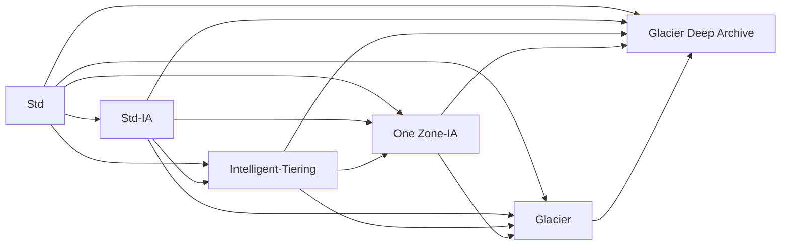

# AWS-MLS-C01-Study-Guide

Note these are my own personal notes and are a work in progress as I study torwards passing this exam.  If this helps someone great, but I make no guarantees/promises.  

## Table of Contents
1. <a href="#introduction">Introduction</a>
2. <a href="#data-engineering">Data Engineering</a>
3. <a href="#exploratory-data-analysis">Exploratory Data Analysis</a>
4. <a href="#modeling">Modeling</a>
5. <a href="#machine-learning-implementation-and-operations">Machine Learning Implementation and Operations</a>
6. <a href="#acronyms">Acronyms</a>

## Introduction
<a href="https://d1.awsstatic.com/training-and-certification/docs-sa-pro/AWS-Certified-Solutions-Architect-Professional_Exam-Guide.pdf">AWS Certified Machine Learning – Specialty (MLS-C01) Exam Guide</a>
### Exam Content Breakdown:

| Domain  | % of Exam |
| ------------- | ------------- |
| Domain 1: Data Engineering | 20%  |
| Domain 2: Exploratory Data Analysis | 24%  |
| Domain 3: Modeling | 36% |
| Machine Learning Implementation and Operations | 20% |
| **Total** | **100%** |

## Data Engineering 

### Create data repositories for machine learning

#### Identify data sources (e.g., content and location, primary sources such as user data)(TBD)
#### Determine storage mediums (e.g., DB, Data Lake, S3, EFS, EBS)(TBD)
##### DB(TBD)
##### Data Lake
  * Offers centralized architecture within S3
  * Decouples storage (S3) from compute resources
  * Analagous to S3 buckets any format is permitted, but typically they are: CSV, JSON, Parquet, Orc, Avro, and Protobuf

##### S3

###### Buckets:
  * Service to allow objects/files within a virtual "directory"
  * Bucker names must be *globally unique*
  * Buckets exist within AWS regions
  * Not a file system, and if a file system is needed, EBS/EFS/FSx should be considered
  * Not mountable as is a NFS
  * Supports any file format
  * Name formalities:
    * Must not start with the prefix 'xn--'
    * Must not end with the the suffix '-s3alias'
    * Not an IP address
    * Must start with a lowercase letter or number
    * Between 3-63 characters long
    * No uppercase
    * No underscores

###### Objects/Files
   * Each has a key, it's full path within the s3 bucket including the object/file separated by backslashes ("/")
   * Each has a value, it's content
   * Note there is no such thing as a true directory within S3, but the convention effectively serves as a namespace
   * Compression is good for cost savings concerning persistence
   * Max size is 5 TB
   * If uploading > 100MB and absolutely for > 5 GB, use Multi-Part upload
   * S3 Transfer Acceleration also can be utilized to increase transfer rates (upload and download) by going through an AWS edge location that passes the object to the target S3 bucket (can work with Multi-Part upload)
   * Strong consistency model to reflect latest version/value upon write/delete to read actions
   * Version ID if versioning enabled at the bucket level
   * Metadata (list of key/val pairs)
   * Tags (Unicode key/val pair >= 10) handy for lifecycle/security
   * Endpoint offers HTTP (non encrypted) and HTTPS (encryption in flight via SSL/TLS)

###### Security (IAM principle can access if either of the policy types below allows it and there is no Deny present):
  * Types
    * User Based: governed by IAM policies (eg: which user,  within a given AWS account, via IAM should be allowed to access resources) 
    * Resource Based:
      * Bucket Policies (JSON based statements)
        * Governing such things as:
          * (Blocking) public access \[setting was created to prevent company data leaks, and can be set at the account level to ensure of inheritance]
          * Forced encryption at upload (necessitates encryption headers).  Can be alternatively be done by "default encryption" via S3, though Bucket Policies are evaluated first
          * Cross account access
        * Bucket policy statement attributes 
          * SID: statement id
          * Resources: per S3, either buckets or objects
          * Effect: Allow or Deny
          * Actions: The set of api action to apply the effect to
          * Principal: User/Account the policy applies to
      * Object Access Control List (ACL) - finer control of individual objects (eg: block public access)
      * Bucket Access Control List (ACL) - control at the bucket level (eg: block public access)
  * S3 Object(s) are owned by the AWS account that uploaded it, not the bucket owner
  * Settings to block public access to bucket(s)/object(s) can be set at the account level
  * S3 is accessible to other AWS resources via:
    * VPC endpoint (private connection)
      * bucket policy tied to AWS:SourceVpce (for one endpoint)
      * bucket policy tied to AWS:SourceVpc (for all possible endpoint(s))
    * Public internet via an IGW=>public ip tied to a bucket policy tied to AWS:SourceIP:
  * S3 Access Logs can be stored to another S3 bucket (not the same to prevent infinite looping)
  * Api calls can be sent to AWS CloudTrail
  * MFA Delete of object(s) within *only* versioned buckets to prevent accidental permanent deletions *[only enabled/disabled by bucket owner via CLI]*

###### S3 Storage Classes

| |Std|Intelligent Tiering|Std-IA|One Zone-IA|Glacier Instant Retrieval|Glacier Flexible Retrieval|Glacier Deep Archive|
| ------------- | ------------- | ------------- | ------------- | ------------- | ------------- | ------------- | ------------- |
| *Durability | 99.99999999999% | 99.99999999999% | 99.99999999999% | 99.99999999999% | 99.99999999999% | 99.99999999999% | 99.99999999999% |
| *Availability | 99.99% | 99.9% | 99.9% | 99.5% | 99.9% | 99.99% | 99.99% |
| *Availability SLA | 99.99% | 99% | 99% | 99% | 99% | 99.99% | 99.99% |
| *AZs | >= 3 | >= 3| >= 3 | 1 | >= 3 | >= 3 | >= 3 |
| *Min Storage Duration Charge | None | None| 30 days | 30 days | 90 days | 90 days | 180 days |
| *Min Billable Obj Size | None | None| 128 KB | 128 KB | 128 KB | 40 KB | 40 KB |
| *Retieval Fee | None | None| Per GB | Per GB | Per GB | Per GB | Per GB |
| *Storage Cost (GB per month) | .023 | .0025 - .023 | .0125 | .01 | .004 | .0036 | .00099 |
| *Retieval Cost (per 1000 requests) | GET: .0004 POST: .005 | GET: .0004 POST: .005 | GET: .001 POST: .01 | GET: .001 POST: .01 | GET: .01 POST: .02 | GET: .0004 POST: .03 Expediated: $10 Std: .05 Bulk: free| GET: .0004 POST: .05 Std: .10 Bulk: .025 |
| *Retieval Time | immediate | immediate | immediate | immediate | immediate (milliseconds) | Expediated (1-5 mins) Std (3-5 hrs) Bulk (5-12 hrs) | Std (12 hrs) Bulk (48 hrs) |
| *Monitoring Cost (per 1000 requests) | 0 | .0025 | 0 | 0 | 0 | 0 | 0 |
\*Note: US-East-1 for the sake of example, entire table subject to change by AWS

  * Durability: How often a file is not to be lost
  * Availability: How readily S3 bucket/files are available

###### S3 Standard:
  * Used data frequently accessed
  * Provides high throughput and low latency
  * Good for mobile and gaming applications, pseudo cdn, big data/analytics

###### S3 Standard Infrequent Access
  * Good for data less frequently acessed that need immediate access
  * Cheaper than Standard
  * Good for Disaster Recovery and/or backups

###### S3 Intelligent-Tiering
  * Modest fee for monthly monitoring and auto-tiering
  * Moves objects between tiers based on usage
  * Access tiers include:
    * Frequent (automatic) default
    * Infrequent (automatic) not acessed for 30 days
    * Archive Instant (automatic) not accessed for 90 days
    * Archive (optional) configurable between 90 days to >= 700 days
    * Deep Archive (optional) configurable between 180 days to >= 700 days 

###### S3 One Zone-IA
  * Data lost when AZ is lost/destroyed
  * Good for recreateable data or on-prem data secondary backup copies

###### S3 Glacier
  * Never setup a transition to glacier classes if usage might need to be rapid
  * Good for archiving/backup
  * Glacier Instant Retrieval is a good option for accessing data once a quarter
  * Harness Glacier Vault Lock (WORM) to no longer allow future edits, which is great for compliance and data retention
  * Glacier or Deep Archive are good for infrequentyly accessed objects that don't need immediate access

###### S3 Lifecycle Transitions (can also be conducted manually via AWS Console)

###### S3 Lifecycle Rules
  * Transition Actions: rules for when to transtion objects between s3 classes (see S3 storage classed above)
  * Expiration Actions: rules for when to delete an object after some period of time
    * Good for deleting log files, deleting old versions of files (if versioning enabled), or incomplete multi-part uploads
  * Rules can be created for object prefixes (addresses) or associated object tags

###### S3 Data Partioning
  * Harnesses disparate key \[path] to speed up queries (eg: Athena)
  * Typical scenarios are:
    * time/date (eg: s3://bucket/datasetname/year/month/day/....)
    * product (eg: s3://bucket/datasetname/productid/...)
  * Partitioning handled by tools such as Kinesis, Glue, etc.

###### Encryption
  * SSE-S3:
    * Encryption (keys) managed by AWS (S3)
    * Encryption type of AES-256
    * Encrypted server side via HTTP/S and Header containing "x-amz-server-side-encryption":"AES256"
    * Enabled by default for new buckets and objects
  * SSE-KMS
    * Encryption (KMS Customer Master Key [CMK]) managed by AWS KMS
    * Encrypted server side via HTTP/S and Header containing "x-amz-server-side-encryption":"aws:kms"
    * Offers further user control and audit trail via cloudtrail
    * May be impacted by KMS limits, though you can increase them via Service Quotas Console
      * Upload calls the GenerateDataKey KMS API (counts towards KMS quota 5500, 10000, or 30000 req/s based upon region)
      * Download calls the Decrypt KMS API (also counts towards KMS quota)
  * SSE-C:
    * Server side encryption via *HTTPS only*, using a fully managed external customer key external to AWS that must be provided in the HTTP headers for every HTTP request (key isn't saved by AWS)
    * Objects encrypted with SSE-C are never replicated between S3 Buckets
  * Client Side Encryption:
    * Utilizes a client library such as Amazon S3 Encryption Client
    * Encrypted prior to sending to S3 and must be decrypted by clients when retrieving from S3 conducted over HTTP/S
    * Utilizes a fully managed external customer key external to AWS
    * S3 objects useing SSE-C not able to be replicated between buckets

###### Encryption in transit (SSL/TLS) vs none
  * HTTP Endpoint - non-encrypted
  * HTTPS Endpoint - encrypted
  * To force encryption, a bucket policy is in order, and the following is an HTTP Get version
    * { "Version": "2012-10-17",
       "Statement": [
         {
           "Effect":"Deny",
           "Principal":"\*",
           "Action":"s3:GetObject",
           "Resource":"arn:aws:s3:::random-bucket-o-stuff/*",
           "Condition":{
             "Bool":"aws:SecureTransport":"false"
           }

         }
       ]
      }
  * To force SSE-KMS encryption
    * { "Version": "2012-10-17",
       "Statement": [
         {
           "Effect":"Deny",
           "Principal":"\*",
           "Action":"s3:PutObject",
           "Resource":"arn:aws:s3:::random-bucket-o-stuff/*",
           "Condition":{
             "StringNotEquals":{"s3:x-amz-server-side-encryption":"aws-kms"}
           }

         }
       ]
      }
  * To force SSE-C encryption
    * { "Version": "2012-10-17",
       "Statement": [
         {
           "Effect":"Deny",
           "Principal":"\*",
           "Action":"s3:PutObject",
           "Resource":"arn:aws:s3:::random-bucket-o-stuff/*",
           "Condition":{
             "Null":{"s3:x-amz-server-side-encryption-customer-algorithm":"true"}
           }

         }
       ]
      }

##### EFS: 
  * Linux based only
  * Can mount on many EC2(s)
  * Use SG control access
  * Connected via ENI
  * 10GB+ throughput
  * *Performance mode* (set at creation time): 
    * General purpose (default); latency-sensitive; use cases (web server, CMS); 
    * Max I/O-higher latency, throughput, highly parallel (big data, media processing)
  * *Throughput mode*: 
    * Bursting (1 TB = 50 MiB/s and burst of up to 100 MiB/s)
    * Provisioned-set your throughput regardless of storage size (eg 1 GiB/s for 1 TB storage)
  * *Storage Classes*, Storage Tiers (lifecycle management=>move file after N days):
    * Standard: for frequently accessed files
    * Infrequent access (EFS-IA): cost to retrieve files, lower price to store
  * *Availability and durability*: 
    * Standard: multi-AZ, great for production
    * One Zone: great for development, backup enabled by default, compatible with IA (EFS One Zone-IA)

##### EBS:
  * Volumes exist on EBS => virtual hard disk
  * Snapshots exist on S3 (point in time copy of disk)
  * Snapshots are incremental-only the blocks that have changed since the last snapshot are move to S3
  * First snapshot might take more time
  * Best to stop root EBS device to take snapshots, though you don't have to
  * Provisioned IOPS (PIOPS [io1/io2])=> DB workloads/multi-attach
  * Multi-attach (EC2 =>rd/wr)=>attach the same EBS to multiple EC2 in the same AZ; up to 16 (all in the same AZ)
  * Can change volume size and storage type on the fly
  * Always in the same region as EC2
  * To move EC2 volume=>snapshot=>AMI=>copy to destination Region/AZ=>launch AMI
  * EBS snapshot archive (up to 75% cheaper to store, though 24-72 hours to restore)

##### AWS FSx:
  * Launch 3rd party high performance file system(s) on AWS
  * Can be accessed via FSx File Gateway for on-premises needs via VPN and/or Direct Connect
  * Fully managed
  * Accessible via ENI within Multi-AZ
  * Types include:
    * FSx for Windows FileServer
    * FSx for Lustre
    * FSx for Net App ONTAP (NFS, SMB, iSCSI protocols); offering:
     * Works with most OSs
     * ONTAP or NAS
     * Storage shrinks or grows
     * Compression, dedupe, snapshot replication
     * Point in time cloning
    * FSx for Open ZFS; offering:
     * Works with most OSs
     * Snapshots, compression
     * Point in time cloning

##### Amazon FSx for Windows:
  * Fully managed Windows file system share drive
  * Supports SMB and Windows NTFS
  * Microsoft Active Directory integration, ACLs, user quotas
  * Can be mounted on Linux EC2 instances
  * Scale up to 10s of GBps, millions IOPs, 100s of PB of data
  * Storage Options:
   * SSD - latency sensitive workloads (DB, data analytics)
   * HDD - broad spectrum of workloads (home directories, CMS)
  * On-premises accessible (VPN and/or Direct Connect)
  * Can be configured to be Multi-AZ
  * Data is backed up daily to S3
  * Amazon FSx File Gateway allows native access to FSx for Windows from on-premises, local cache for frequently accessed data via Gateway

##### Amazon FSx for Lustre ("Linux" "Cluster"):
  * High performance, parallel, distributed file system designed for Applications that require fast storage to keep up with your compute such as ML, high peformance computing, video processing, Electronic Design Automation, or financial modeling
  * Integrates with linked S3 bucket(s), making it easy to process S3 objects as files and allows you to write changed data back to S3
  * Provides ability to both process 'hot data' in parallel/distributed fashion as well as easily store 'cold data' to S3
  * Storage options include SSD or HDD
  * Can be used from on-premises servers (VPN and/or Direct Connect)
  * Scratch File System can be used for temporary or burst storage use
  * Persistent File System can be used for storage / replicated with AZ

### Identify and implement a data ingestion solution.

#### Data job styles/types (batch load, streaming)

##### Streaming:
  * Good scenarios include where timing is important such as Fraud Detection or IoT Streaming Sensors gathering readings (eg: weather)
  * A lot more technical to develop/maintain

##### Batch Load:
  * If there is an acceptable latency, run the batch load job(s) every n seconds/minutes/hours/days/weeks/etc.

#### Data ingestion pipelines (Batch-based ML workloads and streaming-based ML workloads)

##### Amazon Kinesis:
  * Platform to send stream data (eg: IoT, metrics and logs) making it easy to load and analyze as well as provide the ability to build your own custom applications for your business needs
  * Any mention of "streaming (system[s])" and/or "real time" (big) data is of importance, kinesis is likely the best fit as it makes it easy to collect, process, and analyze real-time, streaming data to allow quick reactions from information taken in.  
  * Output can be classic or enhanced fan-out consumers
  * Accessed via VPC
  * IAM access => Identity-based (used by users and/or groups)
  * Types:
    * Kinesis Data Streams
    * Kinesis Data Firehose
    * Kinesis Analytics
    * Kinesis Video Streams (capture, process and store video streams in real-time)

##### Amazon Kinesis Data Streams:
  * Service to provide low latency, real-time streaming ingestion 
  * On-demand capacity mode
    * 4 MB/s input, ??? output?
    * Scales automatically to accommodate up to double its previous peak write throughput observed in the last 30 days
    * Pay per stream per hour and data/in/out per GB
  * Provisioned mode (if throughput exceeded exception => add shard[s] manually or programmatically)
    * Streams are divided into ordered shards
    * 1 MB/s input, 2 MB/s output
    * Pay per shard per hour
  * Can have up to 5 parallel consumers (5 consuming api calls per second \[per shard])
  * Synchronously replicate streaming data across 3 AZ in a single Region and store between 24 hours and 365 days in shard(s) to be consumed/processed/replayed by another service and stored elsewhere
  * Use fan-out if lag is encountered by stream consumers (~200ms vs ~70ms latency)
  * Requires code (producer/consumer)
  * Shards can be split or merged
  * 1 MB message size limit
  * TLS in flight or KMS at-rest encryption
  * *Can't subscribe to SNS*
  * *Can't write directly to S3*
  * Can output to:
    * Kinesis Data Firehose
    * Kinesis Data Analytics
    * Containers
    * λ
    * AWS Glue

##### Amazon Kinesis Data Analytics:
  * Fully Managed (serverless)
  * Perform real-time analytics on stream via SQL
  * Can use either Kinesis Data Streams or Kinesis Data Firehose to analyze data in kinesis
  * For SQL Applications: Input/Output: Kinesis Data Streams or Kinesis Data Firehose to analyze data
  * For Apache Flink (on a cluster): 
    * Input: Kinesis Data Stream or Amazon MSK
    * Output: Sink (S3/Kinesis Data Firehose)    

##### Amazon Kinesis Data Firehose:
  * Fully Managed (serverless) service, no administration, automatic scaling
  * Can use λ to filter/transform data prior to output (Better to use if filter/tranform with a λ to S3 over Kinesis Data Streams)
  * Near real time: 60 seconds latency minimum for non-full batches
  * Minimum 1 MB of data at a time
  * Pay only for the data going through
  * Can subscribe to SNS
  * No data persistence and must bre immediately consumed/processed
  * Sent to (S3 as a backup or failed case[s]):
    * S3
    * Amazon Redshift (copy through S3)
    * Amazon Elastic Search
    * 3rd party partners (datadog/splunk/etc.)
    * Custom destination (http[s] endpoint)
  * Data Conversion from csv/json to Parquet/ORC (only for S3)
  * Data Transformation through λ (eg: csv=>json)
  * Supports compression if target is S3 (GZIP/ZIP/SNAPPY)

##### EMR:
  * Service to create Hadoop clusters (Big Data) to analyze/process lots of data using (many) instances
  * Supports Apache Spark, HBase, Presto, Flink, etc.
  * Takes care of provisioning and configuration
  * Autoscaling and integrated with Spot Instances
  * Use cases: Data processing, ML, Web Indexing, BigData
  * Node types: 
    * Master Node: manage the cluster, coordinate, manage health-long running process
    * Core Node: run tasks and store data-long running process
    * Task Node (optional): only to run tasks-usually Spot Instances
  * Can have long-running cluster or transient (temporary) cluster
  * Purchasing options: 
    * On-demand: reliable, predictable, won't be terminated
    * Reserved: cost savings (EMR will use if available)
    * Spot instances: cheaper, can be terminated, less reliable

##### AWS Glue:
  * Managed ETL service (fully serverless) used to prepare/transform data for analysis
  * Can be event driven (eg: λ triggered by S3 put object) to call Glue ETL
  * Glue Data catalog uses an AWS Glue Data Crawler scanning DBs/S3/data to write associated metadata utilized by Glue ETL, or data discovery on Athena, Redshift Spectrum or EMR
  * Glue Job bookmarks prevent reprocessing old data
  * Glue Databrew-clean/normalize data using pre-built transformation
  * Glue Studio-new GUI to create, run, and monitor ETL jobs in Glue
  * Glue Streaming ETL (built on Apache Spark Structured Streaming)-compatible with Kinesis Data Streaming, Kafka, MSK
  * Glue Elastic Views:
    * Combine and replicate data across multiple data stores using SQL (View)
    * No custom code, Glue monitors for changes in the source data, serverless
    * Leverages a "virtual table" (materialized view)

##### Job scheduling (TBD)

### Identify and implement a data transformation solution. 
  * Handle ML-specific data using map reduce (Hadoop, Spark, Hive) 
  * Transforming data transit (ETL: Glue, EMR, AWS Batch)

#### AWS Batch:
  * Fully managed batch processing at any scale using dynamically launched *EC2 instances (spot)*
  * Job with a start and an end (not continuous)
  * Can run 100,000s of computing batch jobs
  * You submit/schedule batch jobs and AWS Batch handles it
  * Provisions right amount of compute/memory
  * Batch jobs are defined as *docker images and run on ECS*
  * Helpful for cost optimization and focusing less on infrastructure
  * No time limit
  * Any run time packaged in docker image
  * Rely on EBS/instance store for disk space
  * Advantage over λ=>time limit, limited runtimes, limited disk space

## Exploratory Data Analysis

### Sanitize and prepare data for modeling
  * Identify and handle missing data, corrupt data, stop words, etc.
  * Formatting, normalizing, augmenting, and scaling data
  * Labeled data (recognizing when you have enough labeled data and identifying mitigation
  * strategies [Data labeling tools (Mechanical Turk, manual labor)])
### Perform feature engineering
  * Identify and extract features from data sets, including from data sources such as text, speech,image, public datasets, etc.
  * Analyze/evaluate feature engineering concepts (binning, tokenization, outliers, synthetic features, 1 hot encoding, reducing dimensionality of data)
### Analyze and visualize data for machine learning
  * Graphing (scatter plot, time series, histogram, box plot)
  * Interpreting descriptive statistics (correlation, summary statistics, p value)
  * Clustering (hierarchical, diagnosing, elbow plot, cluster size)

#### Amazon Athena:
  * Serverless query service enabling analysis and querying of data in S3 using standard SQL, while allowing more advanced queries (joins permitted)
  * Compress data for smaller retrieval
  * Use target files (> 128 MB) to minimize overhead
  * $5.00 per TB scanned
  * Commonly used with Amazon Quicksight
  * Federated query allows SQL queries across relational, object, non-relational, custom (AWS or on-premisis) using Data Source Connectors that run on λ with results being returned and stored in S3

#### Amazon Quicksight:
  * BI/analytics sereverless ML service used to build interactive visualizations, perform ad-hoc analysis without paying for integrations of data and leaving the data uncanned for exploration
  * Integrates with RDS 
  * In memory computation using Spice Engine
  * Column-Level security (CLS)
  * Can share analysis (if published) or the dashboard (read only) with users or groups

## Modeling
### Frame business problems as machine learning problems. 
  * Determine when to use/when not to use ML
  * Know the difference between supervised and unsupervised learning
  * Selecting from among classification, regression, forecasting, clustering, recommendation, etc.
### Select the appropriate model(s) for a given machine learning problem
  * Xgboost, logistic regression, K-means, linear regression, decision trees, random forests, RNN, CNN, Ensemble, Transfer learning
  * Express intuition behind models

### Train machine learning models
#### Train validation test split, cross-validation (TBD)
#### Optimizer, gradient descent, loss functions, local minima, convergence, batches, probability, etc.(TBD)

##### Loss Functions (aka Cost Function): seek to calculate/minimize the error (difference between actual and predicted value)

#### Compute choice (GPU vs. CPU, distributed vs. non-distributed, platform [Spark vs. non-Spark]) (TBD)
#### Model updates and retraining (TBD)
##### Batch vs. real-time/online (TBD)
### Perform hyperparameter optimization. 
  * Regularization
    * Drop out
    * L1 /L2 
  * Cross validation
  * Model initialization
  * Neural network architecture (layers/nodes), learning rate, activation functions (see below as the notes need to be organized better w/ time)
  * Tree-based models (# of trees, # of levels)
  * Linear models (learning rate)
#### Activation functions: a gated function that verifies how an incoming value is higher than a threshold value to prevent linearity, used within internal/output layer cells in neural networks 
### Evaluate machine learning models.
  * Avoid overfitting/underfitting (detect and handle bias and variance)
  * Metrics (AUC-ROC, RMSE)
  * Confusion Matrix:
    | Measure | Abbreviation | Formula |
    | ------------- | ------------- | ------------- |
    | Error Rate | ERR | (FP + FN)/(TP + TN + FN + FP) = (FP + FN)/(P + N)|
    | Accuracy | ACC | (TP + TN)/(TP + FP + TN + FN) |
    | Sensitivity, True positive rate, Recall | SN, TPR, REC | TP/(TP + FN) = TP/P|
    | Precision, Positive predictive value | PREC, PPV | TP/(TP + FP) |
    | Specificity, True negative rate | SP, TNR | TN/(TN + FP) = TN/N|
    | False positive rate | FPR | FP/(FP + TN) = 1 - SP = 1 - TNR|
    | F1 Score (harmonic mean of precision and recall) | F1 | TP/(TP + (FN + FP/2)) |
   
  * Offline and online model evaluation, A/B testing
  * Compare models using metrics (time to train a model, quality of model, engineering costs)
  * Cross validation 

## Machine Learning Implementation and Operations

### Build machine learning solutions for performance, availability, scalability, resiliency, and fault tolerance. 
  * AWS environment logging and monitoring
    * CloudTrail and CloudWatch
    * Build error monitoring 
  * Multiple regions, Multiple AZs
  * AMI/golden image
  * Docker containers
  * Auto Scaling groups
  * Rightsizing
    * Instances
    * Provisioned IOPS
    * Volumes
  * Load balancing
  * AWS best practices
### Recommend and implement the appropriate machine learning services and features for a given problem.
#### ML on AWS (application services)

##### Amazon Polly:
* Turn text into lifelike speech using deep learning (for talking applications)
* Customize pronunciation of words with pronunciation lexicons that are harnessed by the Sythesize Speech Operation
* Can map stylized words and/or acronyms to resultant output
* Generate more customized output from text marked up with SSML including:
  * breating, whispering
  * emphasis on words
  * phonetic pronunciation

##### Amazon Lex: 
  * ASR to convert speech to text
  * Natural language understanding to recognize parts of speech/text
  * Helps to build chatbots, call center bots

##### Amazon Comprehend (Medical):
  * Serverless NLP service harnessing ML to uncover valuable insights and connections in text
  * Medical version detects PHI via DetectPHI API

##### Amazon Transcribe:
  * Automatically convert speech to text
  * Uses Deep Learning - Automatic Speech Recognition (ASR)
  * Use cases:
    * Transcribe customer calls
    * Automate close capitioning/subtitles
    * Generate metadata for media assets to create full scaleable architecture
  * Can remove PII using redaction
  * Supports automatic language identification for multi-lingual audio
  
##### Amazon Rekognition:
  * Find objects, people, text, scenes in images and videos using ML
  * Facial analysis and search to perform user verification, people counting
  * Create a DB of "familiar faces" or compare against celebrities
  * Use cases: 
    * Labeling
    * Text detection
    * Face detection and analysis (gender, emotions, age range, etc.)
    * Face search and verification
    * Celebrity recognition
    * Pathing (eg: for sports game analysis)
    * Content Moderation (inappropriate, unwanted, or offensive images/videos)
      * Social media/broadcast media/advertising/e-commerce
      * Confidence level of content flags/gates (threshold configuration based)
      * Flag sensitive content for manual review in A2I
      * Help comply with regulations
		
 ##### Amazon Textract:
   * Extracts text, handwriting and data from any scanned documents (eg: forms, tables, etc.) using ML
   * Read from any type of document (PDFs, images, etc.)
   * Good for invoices, financial reports, medical records, insurance claims, taxforms, ids, passports
		
##### Amazon Translate:
  * Natural and accurate language translation
  * Allows localization of content (eg applications/websites) for international users, and to easily translate large volumes of text efficiently 

#### AWS service limits(TBD)
#### Build your own model vs. SageMaker built-in algorithms(TBD)
#### AWS SageMaker:
  * File Mode:
    * Useful for small files that fit in memory and where the algorithm has a large number of epochs
    * Can leverage the file system cache for secondary epochs, the overall I/O throughput with Pipe mode is still faster than file mode
  * Pipe Mode:
    * Recommended for large datasets
    * Overall I/O throughput with Pipe mode is still faster than file mode
    * Can stream dataset directly to your training instances where data is fed on-the-fly without using any disk I/O or downloading the complete file prior to execution. 
    * Shorter startup times because the data is being streamed instead of being downloaded to your training instances.
    * Higher I/O throughputs due to our high-performance streaming agent (no disk I/O usage).
    
#### Infrastructure: (spot, instance types), cost considerations(TBD)
##### Using spot instances to train deep learning models using AWS Batch (TBD)
### Apply basic AWS security practices to machine learning solutions(TBD)
#### IAM(TBD)
### S3 Bucket Policies vs Access permissions:
  * Used to add or deny permissions across some or all S3 objects in a bucket, enabling central management of permissions
  * Can grant users within an AWS account or other AWS accounts to S3 resources
  * Can restrict based on request time (Date condition), request sent using SSL (Boolean condition), requester IP Address (Ip address condition) using policy keys
  * User access to S3 => IAM permissions
  * Instance (EC2) access => IAM role
  * Public access to S3 => bucket policy

| Type of Access Control | Account Level Control | User Level Control |
| ------------- | ------------- | ------------- |
| IAM Policies | No | Yes |
| ACLs | Yes | No |
| Bucket Policies | Yes | Yes |

#### Security groups(TBD)
#### VPC(TBD)
#### Encryption/anonymization(TBD)
### Deploy and operationalize machine learning solutions.
  * Exposing endpoints and interacting with them
  * ML model versioning
  * A/B testing
  * Retrain pipelines
  * ML debugging/troubleshooting
    * Detect and mitigate drop in performance
    * Monitor performance of the model 

## Acronyms

| Acronym  | Definition |
| ------------- | ------------- |
| EMR | Elastic Map Reduce |
| ETL | Extract, Translate, Load |
| FN | False Negative |
| FP | False Positive |
| IGW | Internet Gateway |
| SNS | Simple Notification Service |
| TN | True Negative |
| TP | True Positive |

